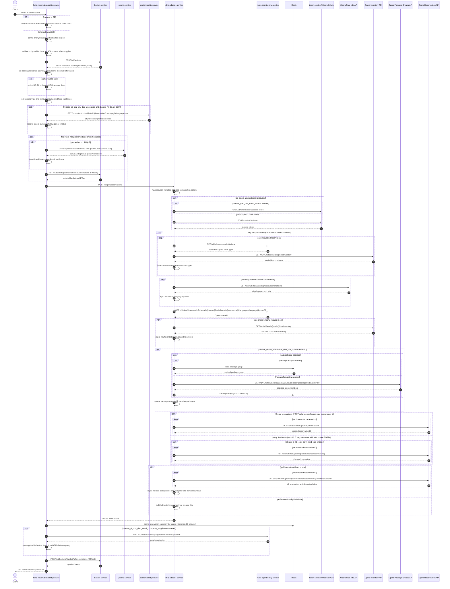

# Hotel Reservation Entity Service: createReservation Flow

This endpoint creates one or more on-hold hotel reservations, records them in a basket, and returns the basket reference and Opera reservation details.

```http
POST /v1/reservations
Host: hotel-reservation-entity-service:9103
Content-Type: application/json
Authorization: Bearer {token}   # required for BB; optional for other channels
```

## Flow

The controller validates and maps the request. The `BB` channel must be authenticated, and the user's access level must allow the requested room count. The service then creates an empty basket in `basket-service`, uses its booking reference as the external reference for every requested reservation, and enriches authenticated BB, PI, or CCUI requests with account identifiers.

Before creating the Opera reservations, the service removes unauthorized fixed prices, optionally resolves city-tax purpose-of-stay data through `content-entity-service`, and processes a promotion from the first room. A unique promotion is validated and translated through `promo-service`; every valid promotion is also written to the basket.

The request is sent to `ohip-adapter-service`. OHIP validates every requested room's rate with Opera, optionally substitutes Whitbread room types, resolves the channel source code through `rules-agent-entity-service`, checks cot inventory, expands soft-bundle package groups, and creates each Opera reservation. Depending on `getReservationsByIds`, it may read the newly created reservations back to return full details and validate their deposit policies.

After OHIP succeeds, hotel reservation stores a 30-minute reservation summary in Redis. When occupancy supplements are enabled, it also loads the hotel's supplement price from rules-agent. Finally, it adds the created reservation IDs to the basket using the latest ETag and returns `201 Created`.

## Mermaid Flow



## Features

- Multi-room on-hold reservation creation under one basket
- BB room-count authorization and authenticated account enrichment for BB, PI, and CCUI
- Opera rate validation before reservation creation
- Client promotion storage plus unique-promotion validation and Opera-code resolution
- Optional city-tax purpose-of-stay conversion for PI, BB, and CCUI
- Optional cot inventory validation and attachment
- Optional Whitbread-to-Opera room substitution for amend-style room types
- Fixed-rate input protection for authenticated DISTR callers with `SCOPE_RATE_PRICE::WRITE`
- Redis reservation summary with a 30-minute TTL
- ETag-protected basket promotion and item updates

## Feature Flags

| Flag | Effect when enabled |
| --- | --- |
| `release_ccui_agent_id_log` | Stops adding the authenticated CCUI user's email to the legacy `ccuiUserEmailId` field during create-reservation enrichment |
| `release_pi_ccui_city_tax_uk` | For PI, BB, and CCUI, loads hotel city-tax dates from content and may convert leisure purpose of stay from `LEI` to Opera code `NTLEI` |
| `release_pi_ccui_distr_web3_occupancy_supplement` | Forces full reservation retrieval for multi-room requests, loads the hotel's occupancy-supplement rule, and marks basket items using OTA/adult-occupancy rules |
| `release_create_reservation_with_soft_bundles` | Resolves selected Opera package groups and replaces them with their member packages before creation |
| `release_set_default_payment_method_DS` | Owned by ohip-adapter-service on the downstream create call: switches the Opera reservation's default payment method from `CA` to `DS` |
| `release_distr_booking_fee` | For priced soft-bundle selections, carries the price in the intermediate package-group tuple; the current member mapping does not consume that value |
| `release_pi_bb_ccui_distr_fixed_rate` | Sends an Opera change-reservation request after each create to apply fixed rate details |
| `consumption_details_default_quantity` | Copies each package consumption `totalQuantity` into `defaultQuantity` while OHIP maps the request |
| `release_ohip_use_token_service` | Obtains credentials through token-service instead of direct Opera OAuth for Opera calls |
| `release_ohip_use_token_refresh_skew` | Refreshes Opera access tokens early using the configured clock skew |

## Request

Important JSON body fields:

| Field | Required | Effect |
| --- | --- | --- |
| `reservations` | Yes | Non-empty list of rooms to create; the first room's `hotelId` drives basket, promotion, city-tax, occupancy-rule, and response-level hotel data |
| `reservations[].hotelId` | Yes | Six alphabetic characters |
| `reservations[].arrival`, `departure` | Yes | Present or future stay dates |
| `reservations[].roomRates` | Yes | Includes `startDate`, `endDate`, `pmsRoomType`, and `ratePlanCode` |
| `reservations[].roomRates.ratePrices` | No | Retained only for an authenticated DISTR caller with fixed-rate write permission |
| `reservations[].roomRates.promoKind`, `promotionCode` | No | Only the first room determines basket-level promotion handling; a resolved Opera code is applied to all rooms |
| `reservations[].adultsNumber` | Yes | One or two adults; affects occupancy-supplement basket flags |
| `reservations[].childrenNumber` | No | Zero to three children |
| `reservations[].cotRequired` | No | Triggers Opera item-inventory validation when true |
| `reservations[].distributionIATANumber` | No | Must be exactly eight characters after trimming; written to Opera UDFC16 |
| `reservations[].reservationPackages` | No | Packages sent to Opera; may be expanded from soft-bundle groups |
| `bookingChannel.channel`, `subchannel` | Yes | Drives authorization, account enrichment, booking type, basket metadata, and rules-agent source mapping |
| `bookingChannel.language` | No | Upper-cased for rules-agent channel-info |
| `getReservationsByIds` | No | When true, OHIP fetches full created reservations and validates deposit-policy consistency; occupancy supplement forces it true for more than one room |
| `isOta` | No | When true and occupancy supplement applies, every created basket item is marked as having the supplement |
| `bookingFlowId` | No | Stored in the 30-minute reservation cache entry |

## Branches

| Trigger | Behavior |
| --- | --- |
| `channel=BB` | Requires authentication and an account access level whose maximum reservations covers the requested room count |
| Authenticated BB / PI / CCUI | Adds company/employee, customer, or legacy CCUI email identifiers respectively |
| Anonymous PI | Sets booking type to `ANON`; CCUI uses an empty booking type for negotiated rates and `ANON` otherwise |
| Fixed `ratePrices` without authorized DISTR scope | Clears the supplied prices before forwarding to OHIP |
| First room has `promoKind` and `promotionCode` | Adds the promotion to the basket; `UNIQUE` also calls promo-service and rejects missing, redeemed, or expired codes |
| PI / BB / CCUI with city-tax flag | Content hotel-information lookup may change purpose of stay to `NTLEI` based on booking, effective, and arrival dates |
| Cot requested | Opera item inventory must contain enough cots for all requested rooms |
| Any room uses a configured Whitbread room type | OHIP resolves substitutions through rules-agent and intersects them with Opera hotel inventory |
| `getReservationsByIds=true` | Reads every created reservation back from Opera, rejects multiple distinct deposit policy codes, and computes total cost from `amountDue` (zero when no policies exist) |
| Occupancy-supplement flag + multiple rooms | Forces `getReservationsByIds=true` so adult counts are available per created reservation |
| Package-groups cache hit | Skips the Opera package-groups call while expanding soft bundles |
