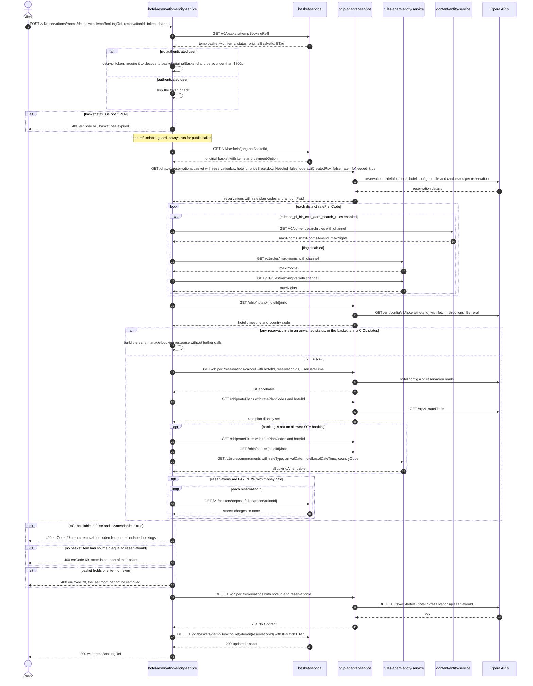

# Hotel Reservation Entity Service: removeRoom Flow

Removes one room from an amend ("temp") basket: validates the caller's token against the
basket's *original* basket id, refuses the removal for a non-refundable booking, deletes the
room's Opera reservation through `ohip-adapter-service`, and drops the matching basket item.

```http
POST /v1/reservations/rooms/delete?tempBookingRef={tempBookingRef}&reservationId={reservationId}&token={token}&channel={channel}&subchannel={subchannel}&language={language}
Host: hotel-reservation-entity-service:9103
Accept: application/json
WB-Authorization: Bearer {token}   # optional; when absent the `token` query parameter is validated instead
```

`HotelReservationController` is mapped at `/v1` and the service has no servlet context path, so
the public path is `/v1/reservations/rooms/delete`. The controller method is `removeRoom`. All
four inputs are query parameters; there is no request body. The controller always passes
`checkLastRoom = true` and `isNonRefundable = null`, so both guards below are always evaluated
for public callers.

## Flow

The controller maps `BookingChannelDto` and calls `HotelReservationInPortImpl.removeRoom`.

The service first reads the basket named by `tempBookingRef` from `basket-service`. When no
authenticated user is present, `ManageBookingUtils.validateToken` decrypts the `token` query
parameter and requires it to decode to **`basket.originalBasketId`** — not to `tempBookingRef` —
and to be younger than 1800 seconds. A basket whose status is not `OPEN` is rejected.

Because the controller passes `isNonRefundable = null`, the service then runs the full
non-refundable guard: `ManageBookingInPortImpl.getManageBookingInformation` is invoked with
`basket.originalBasketId` as its basket reference. That lookup re-reads the *original* basket from
`basket-service`, reads its reservations through `ohip-adapter-service`'s basket endpoint, resolves
max-rooms / max-nights rules (from `rules-agent-entity-service`, or from `content-entity-service`
when `release_pi_bb_ccui_aem_search_rules` is on), reads hotel info and cancellation information
from `ohip-adapter-service`, reads the rate plan's display set, and asks
`rules-agent-entity-service` whether the booking is amendable. A booking is treated as
non-refundable when the resulting `isCancellable` is `false` **and** `isAmendable` is `true`; that
combination fails the request with error code 67. (When the caller supplies `isNonRefundable`
internally — only `amendDistribution`'s room-removal loop does — the whole lookup is skipped and a
`true` value fails with error code 68.)

Only then does the service resolve the basket item whose `sourceId` equals `reservationId`,
reject a basket that holds one item or fewer, delete the Opera reservation through
`ohip-adapter-service` (`DELETE /ohip/v1/reservations`), and remove the basket item with the
basket's ETag as `If-Match`. The response carries only `tempBookingRef`.

There is no asynchronous post-response work on this path: no email, no basket confirmation, no
re-read after the response.

**Reachability note.** `originalBasketId` is set only by the copy-booking (amend) flow, where
`POST /v1/reservations/copy` creates the temp basket with the original basket's reference as
`originalBasketId`. A basket created by `POST /v1/reservations` has `originalBasketId = null`, so
the token check fails (`DIGITAL_INVALID_TOKEN2`) for an unauthenticated caller, and an
authenticated caller instead fails inside the non-refundable guard, which reads a basket by that
null reference. This endpoint is therefore only usable on an amend/copy temp basket.

## Mermaid Flow



## Features

- Single-room removal from an amend temp basket, addressed by the room's Opera reservation id
  (`basketItem.sourceId`), not by a basket item id.
- Token authorization for unauthenticated callers, validated against the temp basket's
  `originalBasketId`; authenticated callers skip it entirely.
- Basket freshness guard: only an `OPEN` basket may lose a room.
- Non-refundable guard reusing the whole manage-booking orchestration (basket, OHIP reservation
  read, search rules, hotel info, cancel information, rate plans, amendment rules), evaluated on
  the *original* basket.
- Last-room guard: the public endpoint always passes `checkLastRoom = true`, so the basket must
  hold at least two items.
- Opera-first ordering: the Opera reservation is deleted before the basket item is removed, so an
  Opera failure leaves the basket untouched while a basket failure leaves the Opera reservation
  already deleted.
- Optimistic concurrency on the basket item removal via the `If-Match` ETag read at the start.
- No email, no payment and no asynchronous follow-up work.

## Feature Flags

Every flag below is evaluated inside hotel-reservation-entity-service on the inbound request
thread, except `mobile_accepts_ota_booking` inside the OHIP reservation read. This service has a
`BaggageFeatureFlagOverrideResolver` and `integration-tests.feature-flag-overrides.enabled`, so all
of its own flags are baggage-pinnable.

| Flag | Effect when enabled |
| --- | --- |
| `release_pi_bb_ccui_aem_search_rules` | Search rules come from `content-entity-service` (`GET /v1/content/searchrules`) instead of two `rules-agent-entity-service` calls, and a distinct `maxRoomsAmend` value becomes available. |
| `release_pi_bb_ccui_maxrooms_amend` | Only effective together with the AEM search-rules flag and a non-OTA booking: a basket holding more rooms than `maxRoomsAmend` produces a manage-booking response with `isAmendable` forced to `false` (and `isCancellable` straight from cancel information), so the non-refundable guard cannot fire and the removal proceeds. |
| `mobile_accepts_ota_booking` | Classifies a `3rd Party` basket as an allowed OTA booking, which forces `isAmendable` to `false` (the guard then cannot fire) and skips the amendment-rules leg; also consumed by `ohip-adapter-service` when validating deposit-policy codes during the reservation read. |
| `mobile_preRegistered_repurpose` | Evaluated in the reservation read out-port. When disabled, `deRegCardCompleted` is forced to `false` on every reservation. Nothing on this path reads that field, so the observable response and downstream call set are identical in both states. |
| `release_pi_bb_mobile_de_reg_card`, `release_pi_bb_mobile_check_out`, `mobile_ciol_piba`, `mobile_ciol_piba_cnp`, `mobile_ciol_prepaid_3rdparty`, `mobile_digital_key` | Evaluated while building the manage-booking response's CIOL / COOL / digital-key fields. They change no downstream call and no field this endpoint consumes: only `isCancellable` and `isAmendable` are read. |
| `release_ccui_cyan_amend-piba-uk` | CCUI channel only. Disabled plus a PIBA card type yields `isAmendable = false`, so the guard cannot fire. Unreachable on a `PI` request. |

`release_pi_ccui_distr_web3_occupancy_supplement` (`applyOccupancySupplement`) and
`release_amend_distribution_single_call` (`amendDistributionSingleCall`) are **not** evaluated
anywhere on this path — they belong to the copy/amend-distribution endpoints that call `removeRoom`
internally. Opera token-service flags are evaluated inside `ohip-adapter-service` outside the
request context and are not part of this endpoint's behavior.

## Request

| Query parameter | Required | Purpose |
| --- | --- | --- |
| `tempBookingRef` | Yes | Basket read at the start, item removed from, and echoed in the response. |
| `reservationId` | Yes | Matched against each basket item's `sourceId`; the matching room's Opera reservation is deleted. |
| `token` | Yes (parameter is mandatory; value validated only when unauthenticated) | Encrypted `originalBasketId\|epochSeconds` string, valid for 1800 seconds, as minted by `GET /v1/reservations/find`. |
| `channel` / `subchannel` / `language` | `channel` and `subchannel` non-empty | Drive rule lookups, the OTA allowance check and the CCUI/BB/PI branches inside the non-refundable guard. `BB` additionally makes the token mandatory inside that guard. |

## Branches

| Trigger | Behavior |
| --- | --- |
| Authenticated caller | The `token` value is not validated; the guard's own token check is also skipped unless the channel is `BB`. |
| Unauthenticated caller with a missing, foreign or expired token, or a basket with no `originalBasketId` | `InvalidTokenException` / `DIGITAL_INVALID_TOKEN2` (errCode 120), mapped to `400`. |
| Basket status is not `OPEN` | `DIGITAL_BASKET_REMOVE_RELOAD_EXCEPTION` (errCode 66, `400`), before any Opera call. |
| Guard reports `isCancellable=false` and `isAmendable=true` | `DIGITAL_NULL_ROOM_REMOVAL_EXCEPTION` (errCode 67, `400`), after the whole read orchestration but before any write. |
| Internal caller passing `isNonRefundable=true` (amend-distribution loop only) | `DIGITAL_ROOM_REMOVAL_EXCEPTION` (errCode 68, `400`); the guard orchestration is skipped entirely. |
| `reservationId` matches no basket item `sourceId` | `DIGITAL_ROOM_NOT_IN_BASKET_REMOVAL` (errCode 69, `400`). |
| Basket holds one item or fewer | `DIGITAL_LAST_ROOM_REMOVAL` (errCode 70, `400`). |
| Any reservation in an unwanted Opera status, or basket in a CIOL status | The guard returns early without the cancel-information, rate-plan and amendment-rules calls; those responses report `isCancellable=false, isAmendable=false`, so the guard passes and the removal proceeds. |
| Rules non-compliance (more rooms than `maxRooms`, or more nights than `maxNights`) | The guard returns a non-compliant response with both flags false, so the removal proceeds. |
| Original basket `paymentOption` is `PAY_NOW` with money paid | The guard adds one `GET /v1/baskets/deposit-folios/{reservationId}` per reservation while deciding amendability. |
| Opera delete fails | `ohip-adapter-service` maps it to `OHIP_DELETE_RESERVATION_EXCEPTION` (938, `500`) and the basket item is left in place. |
| Basket item removal fails after the Opera delete | The Opera reservation is already gone; the endpoint surfaces the basket error. |
