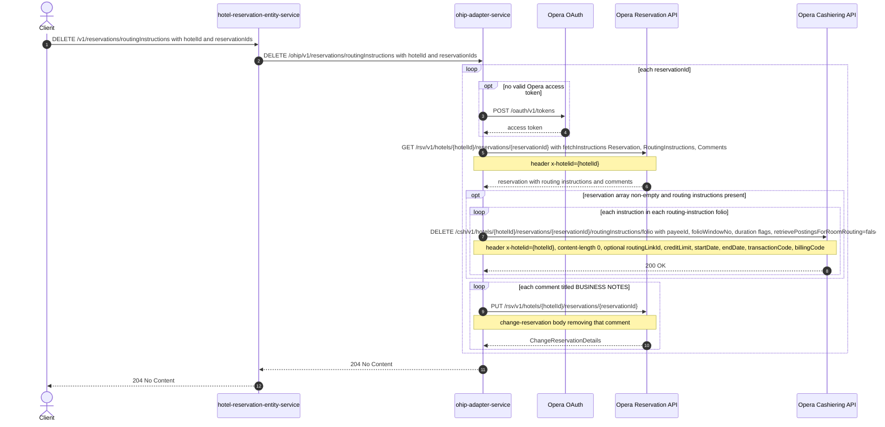

# Hotel Reservation Entity Service: deleteRoutingInstructions Flow

Removes every charge-routing instruction and every `BUSINESS NOTES` comment from one or more Opera reservations at a hotel, by delegating to ohip-adapter-service.

```http
DELETE /v1/reservations/routingInstructions?hotelId={hotelId}&reservationIds={reservationId[,reservationId...]}
Host: hotel-reservation-entity-service:9103
Accept: application/json
```

The controller class is mapped under `/v1` and the service declares no servlet context path, so the public path is `/v1/reservations/routingInstructions`. The endpoint is permit-all and takes no authorization header and no request body.

## Flow

`HotelReservationController.deleteRoutingInstructions` binds `hotelId` and `reservationIds` (a `Set<String>`) and calls `HotelReservationInPortImpl.deleteRoutingInstruction`, which is a pure delegate: no validation, no business rule, no basket hop, no feature-flag check. The out-port implementation logs the sanitized inputs and forwards them unchanged to ohip-adapter-service as `DELETE /ohip/v1/reservations/routingInstructions?hotelId=..&reservationIds=..`.

Inside ohip-adapter-service the work happens per reservation id, sequentially. For each id the adapter reads the reservation from the Opera reservation API with fetch instructions `Reservation`, `RoutingInstructions`, and `Comments`. If the reservation exists and carries routing instructions, then for every routing-instruction folio and every instruction inside that folio the adapter issues one Opera cashiering DELETE on the routing-instructions `/folio` sub-resource, identifying the instruction entirely through query parameters (payee id, folio window number, duration flags, optional credit limit, routing link id, dates, transaction codes, billing codes). Afterwards — or immediately, when the reservation has no routing instructions — the adapter removes every comment titled `BUSINESS NOTES` from the same reservation with one Opera change-reservation PUT per matching comment.

On success hotel-reservation-entity-service returns `204 No Content` with no body. Any downstream error is deserialized into `HotelReservationOhipException` (carrying the adapter's `errCode` and `debugMessage`) and surfaced as a 5xx error envelope; reservation ids after the failing one are not processed.

## Mermaid Flow



## Features

- Batch operation: `reservationIds` binds as a set and each reservation is processed independently and sequentially by the adapter.
- Removes both charge-routing instructions (Opera cashiering API) and `BUSINESS NOTES` comments (Opera change-reservation PUT) in one call.
- hotel-reservation-entity-service adds no orchestration of its own: no basket-service hop, no persistence, no response mapping. It is a one-hop pass-through onto ohip-adapter-service.
- No request body; a successful response is always an empty `204 No Content`.
- Comment matching is exact on the title `BUSINESS NOTES`; other comment titles are left alone.

## Feature Flags

None. This endpoint does not gate behavior on feature flags: neither the hotel-reservation-entity-service chain (controller, `HotelReservationInPortImpl.deleteRoutingInstruction`, `HotelReservationOhipOutPortImpl.deleteRoutingInstructions`, `OhipAdapterClient.deleteRoutingInstructions`) nor the ohip-adapter-service chain (`HotelReservationInPortImpl.deleteRoutingInstruction`, `HotelReservationOutPortImpl.deleteRoutingInstruction`, `OhipReservationClient`) contains an `unleashWrapper` check.

Only the global Opera token-acquisition flags apply, and they are evaluated outside the request context:

| Flag | Effect when enabled |
| --- | --- |
| `release_ohip_use_token_service` | ohip-adapter-service obtains Opera bearer tokens from opera-token-service instead of authenticating directly with Opera OAuth. |
| `release_ohip_use_token_refresh_skew` | Applies the configured early-refresh clock skew to directly acquired Opera OAuth tokens. |

## Request

| Query parameter | Required | Purpose |
| --- | --- | --- |
| `hotelId` | Yes | Opera hotel id; used in every downstream path and in the `x-hotelid` header. |
| `reservationIds` | Yes | Comma-separated Opera reservation ids bound as a `Set<String>`; each is processed in turn. |

## Branches

- **Reservation with routing instructions and Business Notes:** the full path — one reservation GET, one cashiering DELETE per instruction, one change-reservation PUT per matching comment.
- **Reservation with no routing instructions:** the cashiering fan-out is skipped entirely; the Business Notes removal still runs.
- **Reservation with no Business Notes comment:** no change-reservation PUT is issued; the response is still 204.
- **Reservation Opera holds nothing for (empty `reservations.reservation` array):** the routing-instruction block is guarded, but `deleteBusinessNotes` dereferences `.get(0)` unguarded, so the request fails with a 500 instead of a graceful skip. Documented in `backend/integration-tests-kotlin/bug/delete-routing-instructions-empty-reservation-500.md`.
- **Reservation payload with a null `comments` block:** `deleteBusinessNotes` iterates the comments list directly and throws an NPE. Real Opera always reports the comments block, empty when there are none.
- **Downstream error on any Opera call:** ohip-adapter-service maps it to `OHIP_GET_RESERVATION_ROUTING_INSTRUCTION_EXCEPTION`, `OHIP_DELETE_ROUTING_INSTRUCTIONS_EXCEPTION`, or `OHIP_CHANGE_RESERVATION_EXCEPTION`; hotel-reservation-entity-service deserializes the adapter's error body into `HotelReservationOhipException` and returns a 5xx envelope carrying that `errCode`. Reservation ids after the failing one are not processed.
