# Hotel Reservation Entity Service: findBooking Flow

Finds a booking from an existing basket or imports an eligible Opera booking into basket-service before returning its manage-booking reference and redirect metadata.

```http
GET /v1/reservations/find?resNo={resNo}&arrivalDate={arrivalDate}&lastName={lastName}&channel={channel}&subchannel={subchannel}
Host: hotel-reservation-entity-service:9103
```

## Flow

The controller validates the booking reference, arrival date, and surname, maps the query parameters, defaults a missing or empty channel to `PI`, and removes a leading six-letter hotel code from Opera-style confirmation numbers.

Digital references are first looked up in basket-service. When `release_pi_search_opera_conf_number` is enabled, all reference formats are eligible for this basket lookup. A usable basket is enriched with its reservations from ohip-adapter-service. The service reconciles cancelled basket state, checks third-party eligibility and the supplied arrival date and surname, optionally persists missing PAY_NOW deposit folios, then reads redirect configuration from content-entity-service and returns the booking response.

If the basket path does not produce a response, the service asks ohip-adapter-service for a reservation by external reference. An eligible migrated or third-party reservation is validated and imported into basket-service. If no external-reference reservation exists and confirmation-number search is enabled, a numeric confirmation number or `isOldBooking=true` activates a CDH search. A matching CDH result is re-read through ohip-adapter-service, converted into a basket, linked back to the Opera reservation, and returned. Paths with no eligible match return `200` with an empty body.

## Mermaid Flow

```mermaid
sequenceDiagram
    autonumber
    actor Client
    participant Reservation as hotel-reservation-entity-service
    participant Basket as basket-service
    participant Ohip as ohip-adapter-service
    participant Cdh as cdh-adapter-service
    participant Rules as rules-agent-entity-service
    participant Content as content-entity-service

    Client->>Reservation: GET /v1/reservations/find with query parameters
    Reservation->>Reservation: validate request, default channel to PI, normalize resNo
    Reservation->>Reservation: evaluate release_pi_search_opera_conf_number

    opt digital reference, or confirmation search flag enabled
        Reservation->>Basket: GET /v1/baskets?bookingReference={resNo}
        Basket-->>Reservation: optional basket

        alt basket is COMPLETED with no items
            Reservation->>Basket: DELETE /v1/baskets/{basketReference} with If-Match
            Reservation->>Reservation: continue to external-reference search
        else basket is absent, empty, FAILED, or OPEN
            Reservation->>Reservation: continue to external-reference search
        else basket is usable
            Reservation->>Ohip: GET /ohip/v1/reservations/basket with reservationIds, hotelId, priceBreakdownNeeded=false, operaUiCreatedRsv=false, rateInfoNeeded=true
            Ohip-->>Reservation: reservation details
            opt mobile_preRegistered_repurpose is disabled
                Reservation->>Reservation: force deRegCardCompleted to false
            end
            opt every Opera reservation is cancelled and basket is not CANCELLED
                Reservation->>Basket: PUT /v1/baskets/{basketReference}/cancel
            end
            opt eligible third-party booking needs an idContext update
                Reservation->>Basket: PUT /v1/baskets/{bookingReference}/changeIdContext
            end
            Reservation->>Content: GET /v1/content/header/data with country and language
            Content-->>Reservation: optional dashboard redirect configuration

            alt arrival date and surname match the Opera details
                opt PAY_NOW with zero guest-pay candidate
                    loop reservation ids until stored charges are found
                        Reservation->>Basket: GET /v1/baskets/deposit-folios/{reservationId}
                        Basket-->>Reservation: stored charges or no charges on client error
                    end
                    opt no stored charges exist
                        Reservation->>Ohip: GET /ohip/v1/reservations/amend/getDetailsForAmend with hotelId and reservationIds
                        Ohip-->>Reservation: guest-pay total
                        opt guest-pay total is zero
                            Reservation->>Ohip: GET /ohip/v1/reservations/deposit-folios with hotelId and reservationIds
                            Ohip-->>Reservation: generated deposit folios
                            Reservation->>Basket: POST /v1/baskets/deposit-folios
                        end
                    end
                end
                Reservation-->>Client: 200 booking response
            else OTA details mismatch
                Reservation-->>Client: 400 error code 292
            else non-OTA details mismatch or disallowed booking
                Reservation-->>Client: 200 empty body, or 400 error code 291
            end
        end
    end

    opt no response was returned from the basket path
        Reservation->>Ohip: GET /ohip/v1/reservations/external with externalReferenceId
        Ohip-->>Reservation: external reservation, not found, or error

        alt eligible external reservation found and request details match
            opt imported PAY_NOW reservation
                Reservation->>Ohip: GET /ohip/v1/reservations/deposits with hotelId and reservationId
                Ohip-->>Reservation: payment reference if present
            end
            Reservation->>Basket: POST /v1/baskets/reservations
            Basket-->>Reservation: imported basket
            opt imported PAY_NOW basket
                loop reservation ids until stored charges are found
                    Reservation->>Basket: GET /v1/baskets/deposit-folios/{reservationId}
                    Basket-->>Reservation: stored charges or no charges on client error
                end
                opt no stored charges exist
                    Reservation->>Ohip: GET /ohip/v1/reservations/amend/getDetailsForAmend with hotelId and reservationIds
                    Ohip-->>Reservation: guest-pay total
                    opt guest-pay total is zero
                        Reservation->>Ohip: GET /ohip/v1/reservations/deposit-folios with hotelId and reservationIds
                        Ohip-->>Reservation: generated deposit folios
                        Reservation->>Basket: POST /v1/baskets/deposit-folios
                    end
                end
            end
            Reservation->>Content: GET /v1/content/header/data with country and language
            Content-->>Reservation: optional dashboard redirect configuration
            Reservation-->>Client: 200 booking response
        else external reservation is an ineligible OTA booking or details mismatch
            Reservation-->>Client: 400 error code 291 or 292
        else no external reservation, and flag enabled with numeric resNo or isOldBooking=true
            Reservation->>Cdh: POST /v1/cdh/reservation/search with booking reference
            Cdh-->>Reservation: first matching hotel and reservation id, or no result
            opt CDH returned a result
                Reservation->>Ohip: GET /ohip/v1/reservations/basket with reservationIds, hotelId, priceBreakdownNeeded=false, operaUiCreatedRsv=true, rateInfoNeeded=true
                Ohip-->>Reservation: reservation details
                opt mobile_preRegistered_repurpose is disabled
                    Reservation->>Reservation: force deRegCardCompleted to false
                end
                opt arrival date and surname match
                    Reservation->>Rules: GET /v1/rules/source-info with sourceId
                    Rules-->>Reservation: channel for the Opera source
                    Reservation->>Basket: POST /v1/baskets
                    Basket-->>Reservation: new basket and ETag
                    Reservation->>Basket: POST /v1/baskets/{basketReference}/items with If-Match
                    Basket-->>Reservation: basket with reservation items
                    opt PAY_NOW response includes deposit folios
                        Reservation->>Basket: POST /v1/baskets/deposit-folios
                    end
                    opt response includes booking allowances
                        Reservation->>Basket: PUT /v1/baskets/{basketReference}/allowances with If-Match
                    end
                    opt eligible OTA booking
                        Reservation->>Basket: PUT /v1/baskets/{bookingReference}/changeIdContext
                    end
                    Reservation->>Ohip: PUT /ohip/v1/reservations/externalRef with hotelId, reservationIds, externalReference
                    Reservation->>Content: GET /v1/content/header/data with country and language
                    Content-->>Reservation: optional dashboard redirect configuration
                    Reservation-->>Client: 200 booking response
                end
            end
        else no eligible match
            Reservation-->>Client: 200 empty body
        end
    end
```



## Features

- Searches an existing basket by booking reference before attempting an Opera import
- Supports digital references, Opera confirmation numbers, old bookings, migrated BART references, and permitted third-party OTA bookings
- Validates the requested arrival date and surname against Opera reservation details
- Normalizes references matching six letters followed by digits to their numeric confirmation number
- Synchronizes cancelled Opera reservations back to basket-service
- Creates baskets for eligible migrated, OTA, and Opera-UI-created reservations
- Restores missing PAY_NOW deposit folios when the reservation has no stored charges and a zero guest-pay total
- Adds an encrypted, timestamped basket token and optional dashboard redirect and cookie metadata to the response
- Does not require controller-level authentication or authorization

## Feature Flags

| Flag | Effect when enabled |
| --- | --- |
| `release_pi_search_opera_conf_number` | Makes every reference eligible for the initial basket lookup and permits CDH fallback for numeric confirmation numbers or requests with `isOldBooking=true`. Digital references use the basket path independently of this flag. |
| `mobile_accepts_ota_booking` | Allows configured channel and subchannel combinations to import supported third-party OTA bookings, subject to the excluded-provider configuration. Eligible baskets receive `idContext=3rd Party`; disallowed or mismatched OTA bookings return error code 291 or 292. |
| `mobile_preRegistered_repurpose` | Preserves `deRegCardCompleted` values returned by the OHIP reservation-by-ids calls. When disabled, the service forces the value to `false`. |

## Request

All inputs are query parameters.

| Parameter | Required | Effect |
| --- | --- | --- |
| `resNo` | Yes | Booking reference or Opera confirmation number. Length must be 4 to 20 characters. A value matching six letters followed by digits is reduced to its numeric portion before downstream searches. |
| `arrivalDate` | Yes | Date matched against the Opera reservation after passing the custom date-format validation. |
| `lastName` | Yes | Surname matched against the Opera reservation; maximum length is 30 characters. |
| `country` | No | Content lookup country; defaults to `gb`. |
| `language` | No | Content lookup language; defaults to `en`. |
| `isOldBooking` | No | When true and confirmation-number search is enabled, allows CDH fallback even when `resNo` is not numeric. Defaults to `false`. |
| `channel` | No | Booking channel used for business-booker filtering and OTA eligibility. Missing or empty values are normalized to `PI`. |
| `subchannel` | No | Used with `channel` to decide OTA eligibility. |
| booking-channel `language` | No | Mapped into the booking-channel model; it does not select the content lookup language. |

## Branches

| Trigger | Behavior |
| --- | --- |
| Digital `resNo` matching three uppercase letters and seven digits | Attempts basket-service before the Opera external-reference lookup, regardless of the confirmation-search flag. |
| Basket lookup returns no basket, an empty non-COMPLETED basket, or status `FAILED` or `OPEN` | Continues to the Opera external-reference lookup. |
| Empty `COMPLETED` basket | Deletes it with its ETag, then continues to the Opera external-reference lookup. |
| Existing PI basket contains only business-booker source codes `42`, `91`, `92`, or `93` | Rejects that basket path and continues to the Opera external-reference lookup. |
| Every reservation returned for a usable basket is cancelled | Cancels the basket if it is not already `CANCELLED`. |
| Existing basket request details do not match | OTA mismatch code 292 is propagated. Other basket matching failures are caught and produce an empty response; disallowed OTA code 291 is propagated. |
| OHIP external-reference lookup returns 404 | Treats it as no external reservation and evaluates the confirmation-number fallback. |
| OHIP external-reference lookup is unavailable | Propagates `HotelReservationOhipException`; other runtime failures are logged and treated as no external reservation. |
| Confirmation search enabled and `resNo` is numeric or `isOldBooking=true` | Searches CDH with `bookingsDatabaseSearch=true`, page 1, and requested page size 10; the CDH client raises its downstream page size to 50 and the flow uses the first result and room. |
| CDH or Opera confirmation result does not match arrival date and surname | Returns `200` with an empty body without creating a basket. |
| Content header lookup returns no data or a content error | Still returns the booking response, without dashboard redirect or cookie metadata. |
| PAY_NOW imported booking has no stored charges and OHIP reports zero guest pay | Reads generated deposit folios from OHIP and saves them in basket-service. |
