# Hotel Reservation Entity Service: findBookingForKiosk Flow

Finds a booking by reference for the kiosk client, returning its manage-booking reference and
redirect metadata, and importing an eligible Opera booking into basket-service when no usable
basket exists.

```http
GET /v1/reservations/find/kiosk?resNo={resNo}&country={country}&language={language}
Host: hotel-reservation-entity-service:9103
```

No authentication or authorization is applied at the controller.

## Flow

`ManageBookingController.findBookingForKiosk` accepts only `resNo`, `country`, and `language`.
It maps them onto the same `FindBookingRequest` the `/v1/reservations/find` endpoint uses -
leaving `arrivalDate`, `lastName`, and `isOldBooking` unset - and hard-codes the booking channel
to `channel=KIOSK`, `subchannel=WEB`. It then calls the same `ManageBookingInPort.findBooking`
orchestration, so the downstream chain is identical to `findBooking`; see
`FindBooking.md` for the shared shape.

The one behavioral difference is the matching bypass. `ManageBookingLogic.shouldBypassMatchesOpera`
returns true only for `KIOSK` + `WEB`, which is exactly what this controller supplies, so all three
Opera-detail matching gates - `ManageBookingUtils.requestMatchesOperaResDetails` on the existing
basket path, `requestMatchesResDetails` on the external-reference import path, and
`requestMatchesOperaResDetails` on the CDH confirmation path - short-circuit to true as soon as the
Opera response carries at least one reservation. Kiosk requests therefore never compare arrival date
or surname, and the mismatch outcomes those comparisons produce on `/v1/reservations/find` (error
code 292, the basket error code 103, and the "empty body on CDH mismatch" outcome) are unreachable
here.

The service normalizes `resNo` by stripping a leading six-letter hotel code from an Opera-style
confirmation number. Digital references (three uppercase letters plus seven digits) always go to the
basket-service lookup first; when `release_pi_search_opera_conf_number` is enabled every reference
format becomes eligible for that lookup. A usable basket is enriched from ohip-adapter-service,
cancelled reservations are synchronized back to basket-service, missing PAY_NOW deposit folios are
restored, and content-entity-service supplies the dashboard redirect configuration.

If the basket path yields nothing, ohip-adapter-service is asked for a reservation by external
reference. A BART-migrated reservation, or an OTA reservation permitted by
`mobile_accepts_ota_booking` (the configured subchannel set contains `KIOSK.WEB`), is imported into a
new basket. Any other third-party reservation raises error code 291. If no external reservation
exists and `release_pi_search_opera_conf_number` is enabled with a numeric `resNo`, the CDH search
runs, the result is re-read through ohip-adapter-service, converted into a basket, and linked back to
the Opera reservation. Paths with no eligible match return `200` with an empty body.

## Mermaid Flow

```mermaid
sequenceDiagram
    autonumber
    actor Client
    participant Reservation as hotel-reservation-entity-service
    participant Basket as basket-service
    participant Ohip as ohip-adapter-service
    participant Cdh as cdh-adapter-service
    participant Rules as rules-agent-entity-service
    participant Content as content-entity-service

    Client->>Reservation: GET /v1/reservations/find/kiosk with resNo, country, language
    Reservation->>Reservation: force channel KIOSK and subchannel WEB, normalize resNo
    Reservation->>Reservation: shouldBypassMatchesOpera is true, arrival date and surname are never compared
    Reservation->>Reservation: evaluate release_pi_search_opera_conf_number

    opt digital reference, or confirmation search flag enabled
        Reservation->>Basket: GET /v1/baskets?bookingReference={resNo}
        Basket-->>Reservation: optional basket

        alt basket is COMPLETED with no items
            Reservation->>Basket: DELETE /v1/baskets/{basketReference} with If-Match
            Reservation->>Reservation: continue to external-reference search
        else basket is absent, empty, FAILED, or OPEN
            Reservation->>Reservation: continue to external-reference search
        else basket is usable
            Reservation->>Ohip: GET /ohip/v1/reservations/basket with reservationIds, hotelId, priceBreakdownNeeded=false, operaUiCreatedRsv=false, rateInfoNeeded=true
            Ohip-->>Reservation: reservation details
            opt mobile_preRegistered_repurpose is disabled
                Reservation->>Reservation: force deRegCardCompleted to false
            end
            opt every Opera reservation is cancelled and basket is not CANCELLED
                Reservation->>Basket: PUT /v1/baskets/{basketReference}/cancel
            end
            opt basket channel resolves to PI and only business-booker source codes remain
                Reservation->>Reservation: abandon the basket path
            end
            opt eligible third-party booking needs an idContext update
                Reservation->>Basket: PUT /v1/baskets/{bookingReference}/changeIdContext
            end
            Reservation->>Content: GET /v1/content/header/data with country and language
            Content-->>Reservation: optional dashboard redirect configuration
            opt PAY_NOW with zero guest-pay candidate
                loop reservation ids until stored charges are found
                    Reservation->>Basket: GET /v1/baskets/deposit-folios/{reservationId}
                    Basket-->>Reservation: stored charges or no charges on client error
                end
                opt no stored charges exist
                    Reservation->>Ohip: GET /ohip/v1/reservations/amend/getDetailsForAmend with hotelId and reservationIds
                    Ohip-->>Reservation: guest-pay total
                    opt guest-pay total is zero
                        Reservation->>Ohip: GET /ohip/v1/reservations/deposit-folios with hotelId and reservationIds
                        Ohip-->>Reservation: generated deposit folios
                        Reservation->>Basket: POST /v1/baskets/deposit-folios
                    end
                end
            end
            Reservation-->>Client: 200 booking response
        end
    end

    opt no response was returned from the basket path
        Reservation->>Ohip: GET /ohip/v1/reservations/external with externalReferenceId
        Ohip-->>Reservation: external reservation, not found, or error

        alt BART-migrated or permitted OTA external reservation
            opt imported PAY_NOW reservation
                Reservation->>Ohip: GET /ohip/v1/reservations/deposits with hotelId and reservationId
                Ohip-->>Reservation: payment reference if present
            end
            Reservation->>Basket: POST /v1/baskets/reservations
            Basket-->>Reservation: imported basket
            opt imported PAY_NOW basket
                loop reservation ids until stored charges are found
                    Reservation->>Basket: GET /v1/baskets/deposit-folios/{reservationId}
                    Basket-->>Reservation: stored charges or no charges on client error
                end
                opt no stored charges exist
                    Reservation->>Ohip: GET /ohip/v1/reservations/amend/getDetailsForAmend with hotelId and reservationIds
                    Ohip-->>Reservation: guest-pay total
                    opt guest-pay total is zero
                        Reservation->>Ohip: GET /ohip/v1/reservations/deposit-folios with hotelId and reservationIds
                        Ohip-->>Reservation: generated deposit folios
                        Reservation->>Basket: POST /v1/baskets/deposit-folios
                    end
                end
            end
            Reservation->>Content: GET /v1/content/header/data with country and language
            Content-->>Reservation: optional dashboard redirect configuration
            Reservation-->>Client: 200 booking response
        else external reservation is a disallowed third-party booking
            Reservation-->>Client: 400 error code 291
        else no external reservation, and flag enabled with numeric resNo
            Reservation->>Cdh: POST /v1/cdh/reservation/search with booking reference
            Cdh-->>Reservation: first matching hotel and reservation id, or no result
            opt CDH returned a result
                Reservation->>Ohip: GET /ohip/v1/reservations/basket with reservationIds, hotelId, priceBreakdownNeeded=false, operaUiCreatedRsv=true, rateInfoNeeded=true
                Ohip-->>Reservation: reservation details
                opt mobile_preRegistered_repurpose is disabled
                    Reservation->>Reservation: force deRegCardCompleted to false
                end
                Reservation->>Rules: GET /v1/rules/source-info with sourceId
                Rules-->>Reservation: channel for the Opera source
                Reservation->>Basket: POST /v1/baskets
                Basket-->>Reservation: new basket and ETag
                Reservation->>Basket: POST /v1/baskets/{basketReference}/items with If-Match
                Basket-->>Reservation: basket with reservation items
                opt PAY_NOW response includes deposit folios
                    Reservation->>Basket: POST /v1/baskets/deposit-folios
                end
                opt response includes booking allowances
                    Reservation->>Basket: PUT /v1/baskets/{basketReference}/allowances with If-Match
                end
                opt eligible OTA booking
                    Reservation->>Basket: PUT /v1/baskets/{bookingReference}/changeIdContext
                end
                Reservation->>Ohip: PUT /ohip/v1/reservations/externalRef with hotelId, reservationIds, externalReference
                Reservation->>Content: GET /v1/content/header/data with country and language
                Content-->>Reservation: optional dashboard redirect configuration
                Reservation-->>Client: 200 booking response
            end
        else no eligible match
            Reservation-->>Client: 200 empty body
        end
    end
```



## Features

- Kiosk-only entry point: the channel is fixed to `KIOSK` and the subchannel to `WEB` by the
  controller, and cannot be supplied by the caller
- Skips all Opera arrival-date and surname matching, because the kiosk request carries neither
- Searches an existing basket by booking reference before attempting an Opera import
- Supports digital references, Opera confirmation numbers, migrated BART references, and permitted
  third-party OTA bookings (`KIOSK.WEB` is in the configured OTA subchannel set)
- Normalizes references matching six letters followed by digits to their numeric confirmation number
- Synchronizes cancelled Opera reservations back to basket-service
- Restores missing PAY_NOW deposit folios when the reservation has no stored charges and a zero
  guest-pay total
- Adds an encrypted, timestamped basket token and optional dashboard redirect and cookie metadata to
  the response, and echoes `operaConfNumber` for Opera-UI-style references
- Does not require controller-level authentication or authorization

## Feature Flags

| Flag | Effect when enabled |
| --- | --- |
| `release_pi_search_opera_conf_number` | Makes every reference eligible for the initial basket lookup and permits the CDH fallback for a numeric `resNo`. Digital references use the basket path independently of this flag. Because the kiosk request has no `isOldBooking`, only a numeric `resNo` can reach the CDH fallback. |
| `mobile_accepts_ota_booking` | Allows import of supported third-party OTA bookings for this channel, since the configured subchannel set contains `KIOSK.WEB`, subject to the excluded-provider configuration. Eligible baskets receive `idContext=3rd Party`. When disabled, a third-party reservation on the external-reference path returns error code 291. |
| `mobile_preRegistered_repurpose` | Preserves `deRegCardCompleted` values returned by the OHIP reservation-by-ids calls. When disabled, the service forces the value to `false`. |

## Request

All inputs are query parameters. There is no channel or subchannel parameter.

| Parameter | Required | Effect |
| --- | --- | --- |
| `resNo` | Yes | Booking reference or Opera confirmation number. Length must be 4 to 20 characters. A value matching six letters followed by digits is reduced to its numeric portion before downstream searches. |
| `country` | No | Content lookup country; defaults to `gb`. |
| `language` | No | Content lookup language; defaults to `en`. |

## Branches

| Trigger | Behavior |
| --- | --- |
| Digital `resNo` matching three uppercase letters and seven digits | Attempts basket-service before the Opera external-reference lookup, regardless of the confirmation-search flag. |
| Basket lookup returns no basket, an empty non-COMPLETED basket, or status `FAILED` or `OPEN` | Continues to the Opera external-reference lookup. |
| Empty `COMPLETED` basket | Deletes it with its ETag, then continues to the Opera external-reference lookup. |
| Basket channel resolves to `PI` and only business-booker source codes `42`, `91`, `92`, `93` remain | Rejects that basket path and continues to the Opera external-reference lookup. |
| Every reservation returned for a usable basket is cancelled | Cancels the basket if it is not already `CANCELLED`. |
| Opera returns an empty reservation list | The matching bypass does not apply - the empty list still fails the guard, so the basket path raises error code 103 and the external path yields no import. |
| OHIP external-reference lookup returns 404 | Treats it as no external reservation and evaluates the confirmation-number fallback. |
| OHIP external-reference lookup is unavailable | Propagates `HotelReservationOhipException`; other runtime failures are logged and treated as no external reservation. |
| External reservation is third-party and not permitted by `mobile_accepts_ota_booking` | Returns `400` with error code 291. |
| Confirmation search enabled and `resNo` is numeric | Searches CDH with `bookingsDatabaseSearch=true`, page 1, and requested page size 10; the CDH client raises its downstream page size, and the flow uses the first result and room. |
| CDH search returns no result | Returns `200` with an empty body without creating a basket. |
| Content header lookup returns no data or a content error | Still returns the booking response, without dashboard redirect or cookie metadata. |
| PAY_NOW booking has no stored charges and OHIP reports zero guest pay | Reads generated deposit folios from OHIP and saves them in basket-service. |
