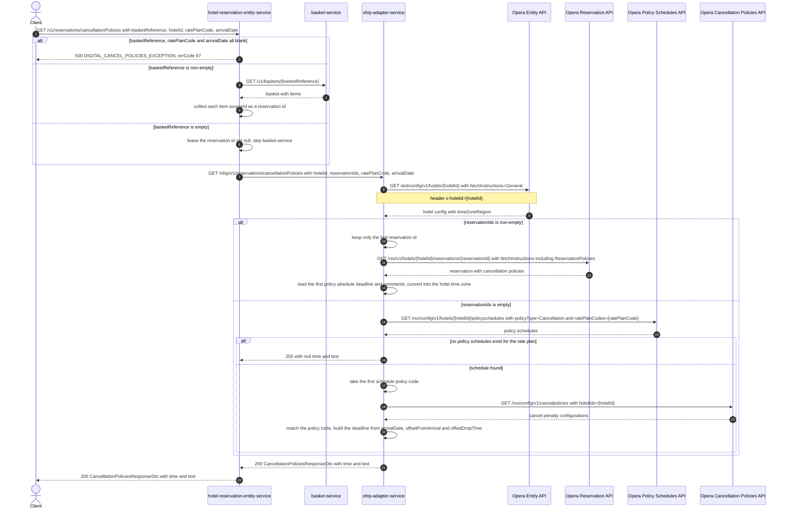

# Hotel Reservation Entity Service: getCancellationPolicies Flow

Returns the cancellation deadline and its penalty text for a booking, resolved either from the
reservations held in a basket or from a rate plan plus arrival date, read through
ohip-adapter-service.

```http
GET /v1/reservations/cancellationPolicies?basketReference={basketReference}&hotelId={hotelId}&ratePlanCode={ratePlanCode}&arrivalDate={arrivalDate}
Host: hotel-reservation-entity-service:9103
Accept: application/json
```

The service declares no servlet context path and the reservation controller is mapped under
`/v1`, so the public path is `/v1/reservations/cancellationPolicies`. All four query parameters
are required by the controller, but `basketReference` may be sent empty, which is what selects
the rate-plan branch. No authentication or authorization is applied at the controller.

## Flow

`HotelReservationInPortImpl.getCancellationPolicies` first rejects the request when
`basketReference`, `ratePlanCode` and `arrivalDate` are *all* blank, raising
`DIGITAL_CANCEL_POLICIES_EXCEPTION` (`errCode` `97`, HTTP `500`). Otherwise it branches on
`basketReference`: a non-empty reference is loaded from basket-service
(`GET /v1/baskets/{basketReference}`) and every basket item's `sourceId` becomes a reservation
id; an empty reference leaves the reservation id set null and skips basket-service entirely.

The OHIP out-port then issues one HTTP GET to ohip-adapter-service at
`/ohip/v1/reservations/cancellationPolicies`, forwarding `hotelId`, `ratePlanCode`,
`arrivalDate` and the reservation ids. A null id set is serialized by Spring's URI builder as a
valueless `reservationIds` query parameter, which ohip-adapter-service binds to an **empty**
`Set`, so the empty-basket case reaches the rate-plan branch downstream. A non-empty set is
serialized as one repeated `reservationIds` parameter per id.

ohip-adapter-service always reads the hotel's configuration from the Opera Entity API first to
obtain the hotel time zone. With reservation ids present it keeps only the **first** id, reads
that reservation from the Opera Reservation API with `ReservationPolicies` among its fetch
instructions, and returns the first cancellation policy's absolute deadline (converted into the
hotel time zone) plus its comment text. With no reservation ids it reads the hotel's cancellation
policy schedules for `ratePlanCode` from the Opera Policy Schedules API, takes the first
schedule's policy code, reads the hotel's cancel-policy configurations from the Opera
Cancellation Policies API, matches the entry with that policy code, and computes the deadline
from `arrivalDate` plus the entry's offset-from-arrival and offset-drop-time, returning the
entry's penalty description as the text.

hotel-reservation-entity-service maps the returned DTO straight into its own
`CancellationPoliciesResponseDto` (`time`, `text`) and answers `200`.

## Mermaid Flow



## Features

- One endpoint, two resolution modes: by the reservations in a basket, or by rate plan plus
  arrival date.
- The rate-plan mode touches no basket-service, and the basket mode ignores `ratePlanCode` and
  `arrivalDate` downstream.
- The deadline is always expressed in the hotel's own time zone, read from Opera hotel
  configuration on every call.
- Only the first reservation id of a multi-item basket is used downstream.
- Returns `time` (the cancellation deadline) and `text` (the policy description or Opera
  comment); both are null when the hotel has no policy schedule for the rate plan.
- Requires no authentication and touches no content, CDH, AEM, or payment upstream.

## Feature Flags

None. This endpoint does not gate behavior on feature flags in either service. The Opera OAuth
token-acquisition flags evaluated inside ohip-adapter-service sit outside this endpoint's request
logic and are pinned off in the integration environment.

## Request

| Query parameter | Required | Purpose |
| --- | --- | --- |
| `basketReference` | Yes (may be empty) | Non-empty: read from basket-service and turned into the reservation id set. Empty: skips basket-service and selects the rate-plan branch. |
| `hotelId` | Yes | Forwarded downstream, then used as the Opera hotel path value, `hotelIds` query value, and `x-hotelid` header. |
| `ratePlanCode` | Yes | Used only in the rate-plan branch, as the Opera `ratePlanCodes` policy-schedule filter. |
| `arrivalDate` | Yes | Used only in the rate-plan branch, combined with the matched policy offsets to compute the deadline. |

Example:

```http
GET /v1/reservations/cancellationPolicies?basketReference=&hotelId=HEAPTI&ratePlanCode=SEMIFLEX&arrivalDate=2026-09-01
Accept: application/json
```

Response body: `{"time": "2026-08-30T18:00:00Z", "text": "Cancel by 6pm the day before arrival"}`.

## Branches

| Trigger | Behavior |
| --- | --- |
| `basketReference`, `ratePlanCode` and `arrivalDate` all blank | `500` `DIGITAL_CANCEL_POLICIES_EXCEPTION`, `errCode` `97`; nothing downstream is called. |
| `basketReference` non-empty | basket-service is called, and the ids of its items drive the by-reservation branch downstream. |
| `basketReference` empty | basket-service is not called, and the by-rate-plan branch runs downstream. |
| basket-service returns 4xx or 5xx for the reference | The basket client raises `BasketNotFoundException` or `BasketInternalException` and the request fails before ohip-adapter-service is called. |
| Opera hotel config call fails | ohip-adapter-service raises `OHIP_RETRIEVE_HOTEL_CONFIG_EXCEPTION` (`errCode` `949`), propagated by this service as `500` with the same code. |
| By-reservation branch and Opera returns no reservation | ohip-adapter-service raises `DIGITAL_NO_CANCELLATION_POLICIES_EXCEPTION` (`errCode` `39`), propagated as `500` with the same code. |
| By-rate-plan branch and Opera returns no policy schedules | `200` with `time` and `text` both null; the cancel-policies call is skipped. |
| By-rate-plan branch and the policy-schedules call fails | ohip-adapter-service raises `OHIP_GET_POLICY_SCHEDULES_EXCEPTION` (`errCode` `943`), propagated as `500` with the same code. |
| By-rate-plan branch and no cancel-policy configuration matches the schedule's policy code, or the cancel-policies call fails | ohip-adapter-service raises `OHIP_GET_CANCELLATION_POLICY_EXCEPTION` (`errCode` `942`), propagated as `500` with the same code. |
