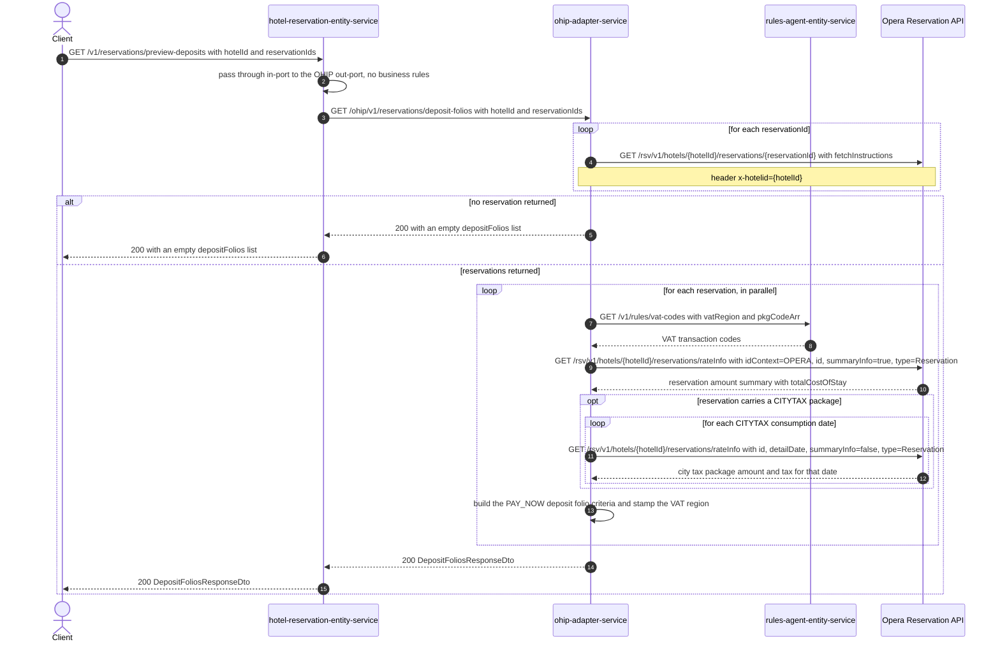

# Hotel Reservation Entity Service: getDepositFolioForReservations Flow

Previews the deposit folio that would be posted for one or more Opera reservations, computed
read-only by ohip-adapter-service. Nothing is written to Opera.

```http
GET /v1/reservations/preview-deposits?hotelId={hotelId}&reservationIds={id1},{id2}
Host: hotel-reservation-entity-service:9103
Accept: application/json
```

The service declares no servlet context path and the reservation controller is mapped under
`/v1`, so the public path is `/v1/reservations/preview-deposits`. `SecurityConfig` permits every
request, so no authentication or authorization is applied.

## Flow

The controller reads the required `hotelId` and `reservationIds` query parameters and calls
`HotelReservationInPortImpl.getGeneratedDepositFolios`, which is a straight pass-through: it adds
no validation, enrichment, or business rule of its own and delegates to the OHIP out-port. The
out-port issues one HTTP GET to ohip-adapter-service at `/ohip/v1/reservations/deposit-folios`
with the same two query parameters and maps the returned DTO into the response body.

ohip-adapter-service does the real work in `HotelReservationOutPortImpl.getDepositFolioForReservations`.
It first reads every requested reservation from Opera, one GET per reservation id. If no
reservation comes back it returns an empty `depositFolios` list. Otherwise it builds one deposit
folio per reservation, in parallel, and for each reservation it:

- takes the VAT region from the reservation's `cashiering.taxType.code` and the package codes to
  price for VAT (always `__ACCMOD__`, plus every reservation package with a non-zero computed
  price that is not added to the rate), and asks rules-agent-entity-service for the matching VAT
  transaction codes;
- reads the reservation's amount summary from the Opera reservation-scoped rateInfo call to get
  `totalCostOfStay`, which becomes the deposit request total under a fixed `PAY_NOW` payment
  option;
- if, and only if, the reservation carries a `CITYTAX` package, reads Opera rateInfo again once
  per CITYTAX consumption date to recover that day's city-tax VAT amount.

The per-reservation criteria are then mapped to the response deposit folios, and each folio is
stamped with the VAT region of its own reservation before the list is returned.

Note that rules-agent-entity-service is a real service in this stack, not an Opera mock, so its
VAT-code response comes from the rules database rather than from scenario-controlled data.

Opera errors on any of the three calls surface as ohip-adapter-service internal errors:
`OHIP_GET_RESERVATION_EXCEPTION` (`errCode` 960) for the reservation read,
`OHIP_GET_RESERVATION_AMOUNTS_EXCEPTION` (`errCode` 946) for the amounts read, and
`OHIP_GET_RATE_INFO_EXCEPTION` (`errCode` 900) for the city-tax rateInfo read.
hotel-reservation-entity-service deserializes that error envelope into
`HotelReservationOhipException` and rethrows it, so the caller sees `500` with the same `errCode`
propagated unchanged.

## Mermaid Flow



## Features

- Multi-reservation preview: one deposit folio is computed per requested reservation id
- Read-only. No Opera write, no deposit-folio POST, no basket, CDH, AEM, or payment upstream
- Deposit total is always computed under a fixed `PAY_NOW` payment option
- VAT enrichment from rules-agent-entity-service keyed on the reservation's Opera VAT region
- City-tax VAT is recovered per consumption date only when the reservation carries a `CITYTAX`
  package
- Empty `depositFolios` list when Opera returns no reservations
- A reservation whose Opera id list carries no `Reservation`-typed id is skipped
- Adds no validation, enrichment, or orchestration in hotel-reservation-entity-service itself
- Propagates the downstream `errCode` unchanged as a `500`

## Feature Flags

None. This endpoint does not gate behavior on feature flags. No `unleashWrapper.isEnabled(...)`
check sits on any method of this path in either service. The Opera OAuth token-acquisition flags
evaluated inside ohip-adapter-service sit outside the request path and are pinned off in the
integration environment.

## Request

| Query parameter | Required | Purpose |
| --- | --- | --- |
| `hotelId` | Yes | Forwarded to ohip-adapter-service, then used as the Opera hotel path value and `x-hotelid` header on every Opera call |
| `reservationIds` | Yes | Set of Opera reservation ids; one Opera reservation read, one VAT-code lookup, and one amounts read per id |

Example:

```http
GET /v1/reservations/preview-deposits?hotelId=HEAPTI&reservationIds=6004202
Accept: application/json
```

Response body: `{"depositFolios": [{"hotelId": "...", "reservationId": "...", "vatRegion": "...",
"paymentId": "...", "defaultPaymentMethod": "...", "charges": [{"transactionCode": "...",
"quantity": 1, "reference": "...", "currencyAmount": {"amount": 0.0, "currencyCode": "GBP"}}]}]}`.

## Branches

| Trigger | Behavior |
| --- | --- |
| Opera returns no reservation for the requested ids | `200` with an empty `depositFolios` list, and no VAT-code, amounts, or city-tax call is made |
| Reservation carries a `CITYTAX` package | One extra Opera rateInfo call per CITYTAX consumption date, with `detailDate` set to that date and `summaryInfo=false` |
| Reservation carries no `CITYTAX` package | No detail rateInfo call; the folio carries no city-tax VAT lines |
| Reservation has non-rate packages with a non-zero computed price | Their package codes are added to the `pkgCodeArr` sent to rules-agent-entity-service alongside `__ACCMOD__` |
| Opera reservation read fails | `500` with `errCode` 960 (`OHIP_GET_RESERVATION_EXCEPTION`) |
| Opera reservation-amounts rateInfo read fails | `500` with `errCode` 946 (`OHIP_GET_RESERVATION_AMOUNTS_EXCEPTION`) |
| Opera city-tax rateInfo read fails | `500` with `errCode` 900 (`OHIP_GET_RATE_INFO_EXCEPTION`) |
