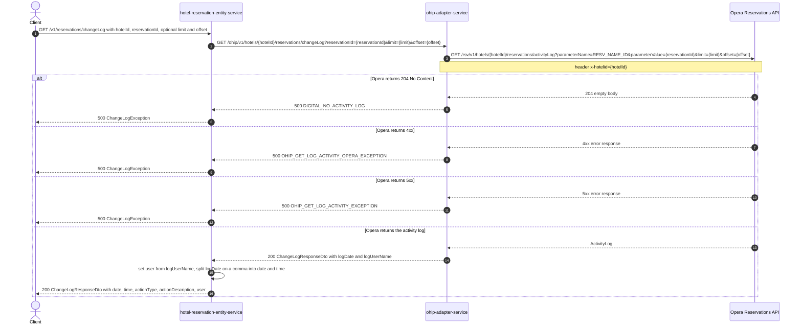

# Hotel Reservation Entity Service: getChangeLog Flow

Returns the Opera activity/change log entries for one reservation, reshaped so each entry
carries a separate `date`, `time`, and `user`.

```http
GET /v1/reservations/changeLog?hotelId={hotelId}&reservationId={reservationId}&limit={limit}&offset={offset}
Host: hotel-reservation-entity-service:9103
Accept: application/json
```

`ChangeLogController` is mapped at `/v1` and the service has no servlet context path, so the
public path is `/v1/reservations/changeLog`.

## Flow

`ChangeLogController.getChangeLog` reads `hotelId` and `reservationId` (both required) plus the
optional `limit` and `offset` query parameters and passes them straight to `ChangeLogInPort`.
`ChangeLogInPortImpl` applies no business rules at all - it delegates directly to
`ChangeLogOutPort`.

`ChangeLogOutPortImpl` calls ohip-adapter-service once
(`GET {ohip.host}/v1/hotels/{hotelId}/reservations/changeLog?reservationId=&limit=&offset=`,
`ohip.host` = `http://${OHIP_HOST:localhost:9100}/ohip`), maps the adapter DTO to the domain
`ChangeLogResponse`, then post-processes every entry in `activityLog.activityLog`: it copies
`logUserName` into `user` and splits `logDate` on a comma, putting the first part into `date`
and the second into `time`. The controller mapper then narrows each entry to
`date`, `time`, `actionType`, `actionDescription`, `user` - `logDate` and `logUserName` are
dropped from the public response.

ohip-adapter-service in turn performs a single Opera Reservations API call for the
reservation's activity log, identifying the reservation with
`parameterName=RESV_NAME_ID` / `parameterValue={reservationId}` and passing `limit`/`offset`
through unchanged. No other upstream is touched: no basket-service, no content-entity-service,
no CDH.

Note the post-processing is unguarded: a `logDate` without a comma would make
`splitDateTime[1]` throw `ArrayIndexOutOfBoundsException` and surface as a 500. In practice it
does not fire, because ohip-adapter parses Opera's ISO-8601 `date-time` and re-serializes it in
the JVM's localized short form (`1/15/26, 12:00 AM`), which carries a comma. `date` and `time`
are therefore locale-formatted values, not Opera's ISO string. See
`backend/integration-tests-kotlin/bug/changelog-logdate-comma-split-500.md`.

The adapter's error body is deserialized into `ChangeLogException`, whose single-argument
constructor hard-codes `errCode = 0`, so the adapter's 204 / 916 / 917 never reaches the
caller: every downstream failure surfaces as HTTP 500 `{"errCode":0}`. See
`backend/integration-tests-kotlin/bug/changelog-adapter-errcode-swallowed.md`.

## Mermaid Flow



## Features

- Single-reservation change log lookup by hotel id and Opera reservation id
- Optional `limit`/`offset` paging passed through unchanged to Opera; the paging envelope
  fields (`totalPages`, `offset`, `limit`, `hasMore`, `totalResults`, `count`) are returned
  from Opera as-is
- Exactly one ohip-adapter-service call and one Opera Reservations API call per request
- No authentication, no basket lookup, no enrichment from any other service
- Response reshaping only: `logUserName` becomes `user`, `logDate` is split into `date` and
  `time`, and both source fields are dropped by the controller mapper
- No caching on this path

## Feature Flags

None. This endpoint does not gate behavior on feature flags. The only flags anywhere on the
chain are ohip-adapter-service's Opera token-service flags
(`release_ohip_use_token_service`, `release_ohip_use_token_refresh_skew`), which are
infrastructure flags outside the request context and are pinned off in the integration
environment.

## Request

| Parameter | Location | Required | Purpose |
| --- | --- | --- | --- |
| `hotelId` | query | Yes | Supplies the ohip-adapter path segment, the Opera hotel path value, and the `x-hotelid` header |
| `reservationId` | query | Yes | Supplies the Opera `parameterValue` for the `RESV_NAME_ID` lookup |
| `limit` | query | No | Passed through to ohip-adapter and on to the Opera `limit` query parameter |
| `offset` | query | No | Passed through to ohip-adapter and on to the Opera `offset` query parameter |

Example:

```http
GET /v1/reservations/changeLog?hotelId=HEAPTI&reservationId=6004202&limit=20&offset=0
Accept: application/json
```

## Branches

| Trigger | Behavior |
| --- | --- |
| `limit`/`offset` omitted | The query parameters are dropped from the ohip-adapter and Opera requests; Opera applies its own defaults |
| ohip-adapter returns 204 | The out-port raises `ChangeLogException`, surfaced as a 500 with `errCode` 0 |
| ohip-adapter returns any 4xx or 5xx | The out-port raises `ChangeLogException`, surfaced as a 500 with `errCode` 0 |
| Opera `logDate` contains no comma | Unguarded split would throw `ArrayIndexOutOfBoundsException`; unreachable while ohip-adapter emits the localized comma-bearing form (see bug doc) |
