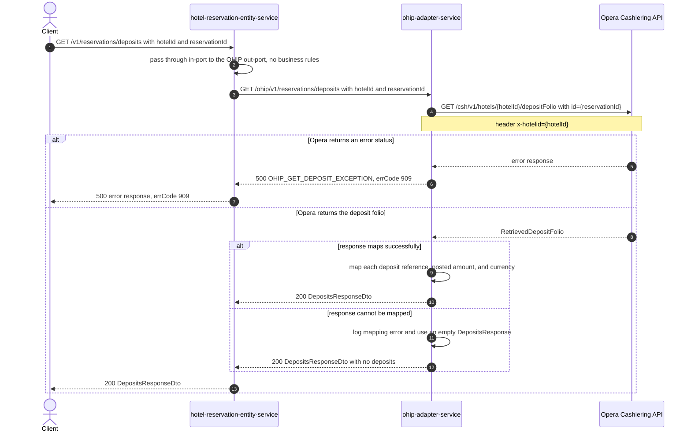

# Hotel Reservation Entity Service: getDepositsForReservationId Flow

Returns the deposits posted against one Opera reservation, read through ohip-adapter-service.

```http
GET /v1/reservations/deposits?hotelId={hotelId}&reservationId={reservationId}
Host: hotel-reservation-entity-service:9103
Accept: application/json
```

The service declares no servlet context path and the reservation controller is mapped under
`/v1`, so the public path is `/v1/reservations/deposits`. No authentication or authorization is
applied at the controller.

## Flow

The controller takes the required `hotelId` and `reservationId` query parameters and calls the
reservation in-port, which is a straight pass-through: `HotelReservationInPortImpl` delegates to
the OHIP out-port with no validation, enrichment, or business rule of its own. The out-port issues
one HTTP GET to ohip-adapter-service at `/ohip/v1/reservations/deposits` with the same two query
parameters, and maps the returned DTO into the response body.

ohip-adapter-service is itself a pass-through onto Opera: it reads the reservation deposit folio
from the Opera Cashiering API at `/csh/v1/hotels/{hotelId}/depositFolio?id={reservationId}` with an
`x-hotelid` header, and maps each deposit to its payment reference, posted amount, and currency. A
reservation with no posted deposits yields an empty `deposits` list.

An Opera error status makes ohip-adapter-service return internal error `OHIP_GET_DEPOSIT_EXCEPTION`
with code `909`. hotel-reservation-entity-service deserializes that error envelope into
`HotelReservationOhipException` and rethrows it, so the caller sees `500` with the same `errCode`
`909` propagated unchanged. If the Opera response succeeds but cannot be mapped,
ohip-adapter-service logs the mapping error and returns an empty deposit model with `200`, which
this service passes through as an empty `deposits` list.

## Mermaid Flow



## Features

- Single-reservation deposit lookup by hotel id and Opera reservation id
- Exactly one downstream service call, ohip-adapter-service, and exactly one Opera call behind it
- Returns each deposit's payment reference, posted amount, and currency code
- Returns an empty `deposits` list when the reservation has no posted deposits
- Adds no validation, enrichment, or orchestration of its own over the OHIP response
- Propagates the downstream error code `909` unchanged as a `500`
- Requires no authentication and touches no basket, content, CDH, or payment upstream

## Feature Flags

None. This endpoint does not gate behavior on feature flags. The Opera OAuth token-acquisition
flags evaluated inside ohip-adapter-service sit outside the request path of this endpoint and are
pinned off in the integration environment.

## Request

| Query parameter | Required | Purpose |
| --- | --- | --- |
| `hotelId` | Yes | Forwarded to ohip-adapter-service, then used as the Opera hotel path value and `x-hotelid` header |
| `reservationId` | Yes | Forwarded to ohip-adapter-service, then used as the Opera Cashiering `id` query parameter |

Example:

```http
GET /v1/reservations/deposits?hotelId=HEAPTI&reservationId=6004202
Accept: application/json
```

Response body: `{"deposits": [{"paymentReference": "...", "postedAmount": {"amount": 0.0, "currencyCode": "GBP"}}]}`.

## Branches

| Trigger | Behavior |
| --- | --- |
| Reservation has no posted deposits in Opera | `200` with an empty `deposits` list |
| Opera returns an error status | ohip-adapter-service raises `OHIP_GET_DEPOSIT_EXCEPTION`; this service rethrows it as `500` with `errCode` `909` |
| Opera response cannot be mapped by ohip-adapter-service | Mapping error is logged downstream and a `200` with an empty `deposits` list is returned |
