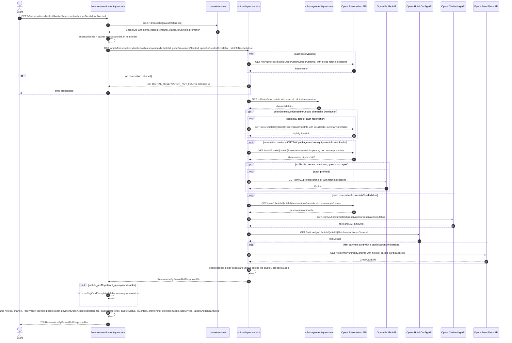

# Hotel Reservation Entity Service: getAllReservationsJustByBasketReference Flow

Returns every reservation held in a basket, enriched with Opera rate amounts, folio/ACI
deposits, hotel configuration, guest profiles and credit-card metadata, and decorated with
basket-level context (booking reference, status, channel, promotion, payment option).

```http
GET /v1/reservations/basket/{basketReference}?priceBreakdownNeeded=false
Host: hotel-reservation-entity-service:9103
Accept: application/json
```

The service declares no servlet context path and `HotelReservationController` is mapped under
`/v1`, so the public path is `/v1/reservations/basket/{basketReference}`. No authentication or
authorization is applied at the controller: this is the anonymous sibling of
`/v1/reservations/basket/{bookingReference}/authenticated`, which adds a customer-account check.

## Flow

`HotelReservationController.getAllReservationsJustByBasketReference` parses
`priceBreakdownNeeded` from its string query parameter (default `false`) and calls
`HotelReservationInPortImpl.getAllReservationsJustByBasketReference(basketReference,
priceBreakdownNeeded)`, which delegates to the three-argument overload with
`rateInfoNeeded = true` always. `rateInfoNeeded` is never `false` on this public path; only
internal amend callers pass `false`.

The in-port reads the basket from basket-service (`GET /v1/baskets/{basketReference}`) through
`BasketOutPortImpl.getBasketById`, and takes each basket item's `sourceId` as an Opera
reservation id, in basket-item order.

`HotelReservationOhipOutPortImpl.getReservationsByIds` then makes exactly one HTTP GET to
ohip-adapter-service at `/ohip/v1/reservations/basket`, forwarding the reservation ids as a
single comma-joined `reservationIds` parameter plus `hotelId` (from the basket),
`priceBreakdownNeeded`, `operaUiCreated=false` and `rateInfoNeeded=true`. After mapping the
response it clears `deRegCardCompleted` on every reservation unless
`mobile_preRegistered_repurpose` is enabled — the only feature flag hotel-reservation-entity-service
evaluates on this path.

Inside ohip-adapter-service the fan-out is the shared `getReservationsByIds` orchestration
documented in
[../ohip-adapter-service/GetReservationsByIds.md](../ohip-adapter-service/GetReservationsByIds.md).
For `N` reservation ids on the default path (`priceBreakdownNeeded=false`, `rateInfoNeeded=true`)
it issues: `N` Opera reservation reads, one rules-agent channel lookup, `N` Opera
reservation-amount `rateInfo` reads, `N` Opera cashiering folio reads, one Opera hotel-config
read, one Opera profile read per distinct reservation-contact / guest / stayer profile id, and
**one** Opera credit-card-info read (the first payment card found across all reservations, not
one per reservation). It throws `DIGITAL_RESERVATION_NOT_FOUND` (errCode `16`) when Opera returns
no reservation, and `DIGITAL_POLICY_CODE_NOT_UNIQUE_EXCEPTION` (errCode `19`) when deposit policy
codes differ across the basket and the booking is not treated as third-party.

Back in hotel-reservation-entity-service, `getReservationByBasketRefResponse` decorates the
ohip-adapter response in process, with no further downstream calls: it stamps `hotelId` and
`channel` from the basket, rewrites each reservation's `reservationId` positionally from the
basket item order, derives `paymentOption` from the first reservation's payment-card
`paymentMethod` + `folioView` (`CC`, `PIBA_CP`, `PIBA_CNP`), copies `bookingReference`,
`basketReference`, `basketStatus`, `idContext`, `promoKind` and `promotionCode` from the basket,
computes `hasCityTax` from any reservation package coded `CITYTAX` with a positive unit price,
and sets `upsellsAddonsEnabled` (false when the basket `idContext` is the CIOL context or any
reservation carries a PIBA UK/EURO card type). The controller maps the model to
`ReservationByBasketRefResponseDto` and answers `200`.

## Mermaid Flow



## Features

- Basket-scoped multi-reservation read: one basket-service lookup, one ohip-adapter call, no
  per-room hop from hotel-reservation-entity-service
- Reservation ids come from basket item `sourceId` values and are re-stamped positionally onto
  the response, so response order follows basket item order
- Always requests `rateInfoNeeded=true` and `operaUiCreatedRsv=false` downstream
- Optional `priceBreakdownNeeded` nightly price breakdown, effective only for a Distribution
  channel booking
- Basket-derived response fields: `hotelId`, `channel`, `bookingReference`, `basketReference`,
  `basketStatus`, `idContext`, `promoKind`, `promotionCode`
- `paymentOption` derived from the first reservation's payment card: `PIBA_CP` / `PIBA_CNP` for
  `BU`/`BD` payment methods with folio view 1 / 2, otherwise `CC`
- `hasCityTax` true when any reservation package is `CITYTAX` with a positive unit price
- `upsellsAddonsEnabled` false for the CIOL `idContext` or when any reservation holds a PIBA
  UK/EURO card type
- `deRegCardCompleted` suppression unless `mobile_preRegistered_repurpose` is enabled

## Feature Flags

| Flag | Effect when enabled |
| --- | --- |
| `mobile_preRegistered_repurpose` | hotel-reservation-entity-service keeps the `deRegCardCompleted` value returned by ohip-adapter-service. When disabled, every reservation's `deRegCardCompleted` is forced to `false` in `HotelReservationOhipOutPortImpl.getReservationsByIds`. |
| `mobile_accepts_ota_booking` | ohip-adapter-service only. Enables third-party booking detection, which suppresses the `DIGITAL_POLICY_CODE_NOT_UNIQUE_EXCEPTION` raised when deposit policy codes differ across the basket's reservations. No effect when all reservations share one policy code. |

Both flags are evaluated inside the request in services that install
`BaggageFeatureFlagOverrideResolver`, so both are pinnable from a journey through baggage
overrides. `release_ohip_use_token_service` and the rest of the Opera token-service flags are
environment-pinned off and out of scope.

`applyOccupancySupplement` (`release_pi_ccui_distr_web3_occupancy_supplement`),
`amendDistributionSingleCall` (`release_amend_distribution_single_call`) and `maxRoomsAmend`
(`release_pi_bb_ccui_maxrooms_amend`) are **not** on this path: they are evaluated only in the
amend orchestrations (`amendDistribution`, `editRoom`, occupancy update), never in
`getAllReservationsJustByBasketReference` or in the ohip-adapter `getReservationsByIds` chain.

## Request

| Parameter | In | Required | Default | Purpose |
| --- | --- | --- | --- | --- |
| `basketReference` | path | Yes | n/a | Basket to read; its items' `sourceId`s are the Opera reservation ids |
| `priceBreakdownNeeded` | query | No | `false` | Parsed with `Boolean.parseBoolean`, so any non-`true` value is `false`. Forwarded to ohip-adapter-service, where it only adds nightly rate-info calls when the resolved channel is Distribution |

## Branches

| Trigger | Behavior |
| --- | --- |
| Basket not found or basket-service 4xx | `BasketNotFoundException` from the basket-service error body, surfaced as a not-found error to the caller; ohip-adapter-service is never called |
| Basket-service 5xx | `BasketInternalException` |
| Opera returns no reservation for the ids | ohip-adapter-service 404 `DIGITAL_RESERVATION_NOT_FOUND` errCode `16`, mapped by the out-port's 4xx handler to `HotelReservationNotFoundException` |
| ohip-adapter-service 5xx | `HotelReservationOhipException` carrying the downstream `errCode` |
| Deposit policy codes differ across basket reservations | ohip-adapter-service errCode `19`, unless `mobile_accepts_ota_booking` is on and the booking resolves as third-party |
| `priceBreakdownNeeded=true`, non-Distribution channel | No extra Opera rate-info calls; the parameter is inert |
| Reservation carries a `CITYTAX` package | ohip-adapter-service reads Opera rate-info per city-tax consumption date to add VAT, reusing the nightly rate-info map when the price-breakdown branch already filled it |
| No profile ids on any reservation | Opera profile reads are skipped entirely |
| No payment card with a card id anywhere in the basket | Front-desk credit-card lookup is skipped |
| Basket item count differs from the reservations ohip-adapter returns | The positional `reservationId` re-stamp loop indexes the response by basket item index and throws `IndexOutOfBoundsException` (HTTP 500) when the response list is shorter — reachable when a basket holds duplicate `sourceId`s, since ohip-adapter binds `reservationIds` into a `Set` |
