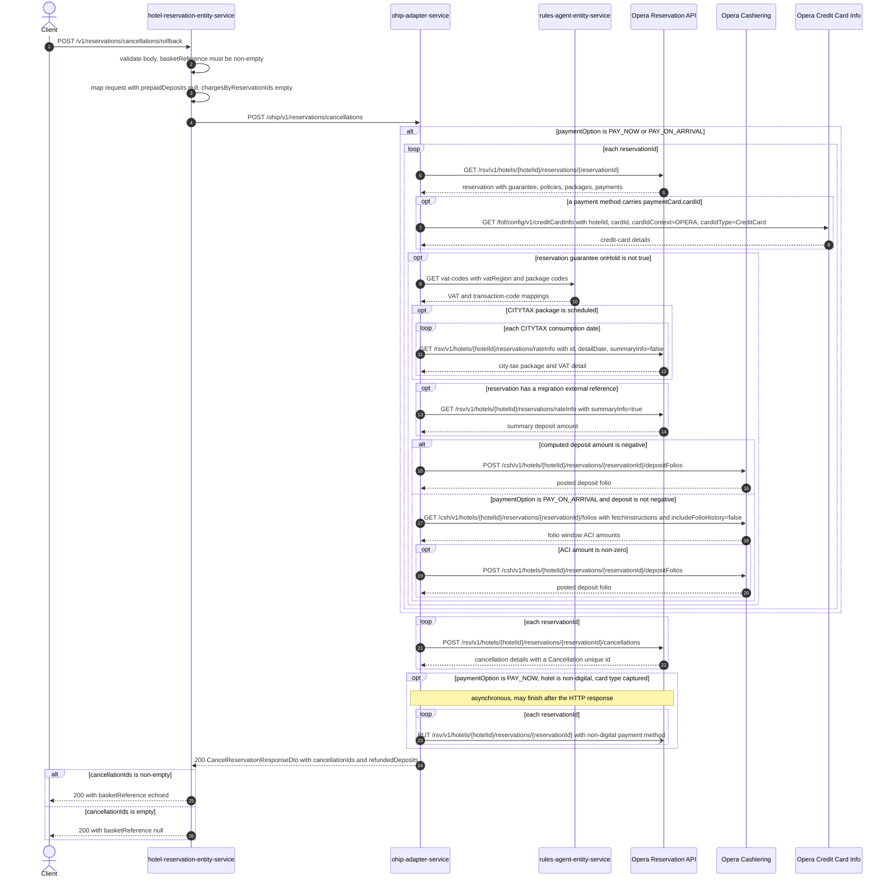

# Hotel Reservation Entity Service: rollbackReservation Flow

Rolls back a reservation by cancelling its Opera reservations, delegating the whole operation to ohip-adapter-service without any basket, refund, or notification work of its own.

```http
POST /v1/reservations/cancellations/rollback
Host: hotel-reservation-entity-service:9103
Content-Type: application/json
```

`HotelReservationController` is mapped under `/v1`, so the public path is `/v1/reservations/cancellations/rollback`. No authentication and no manage-booking token check happens on this path.

## Flow

The controller validates the JSON body (`basketReference` must be non-empty) and maps it to the domain request. `HotelReservationInPortImpl.rollbackReservation` is a single delegation: it calls `hotelReservationOhipOutPort.cancelReservation(request, null)` with a `null` prepaid-deposit list, which maps to `chargesByReservationIds = {}` on the outgoing DTO, and returns the mapped response.

The out-port posts the request to ohip-adapter-service at `POST /ohip/v1/reservations/cancellations` (`config.service.ohip.host` + `cancelReservationEndpoint`). The response is mapped back to `CancelReservationResponseDto`, whose only field is `basketReference`: it is set to the request's `basketReference` when ohip-adapter returned at least one cancellation id, and `null` when the returned `cancellationIds` list is empty. `refundedDeposits` and `cancellationIds` are internal to the domain model and are not exposed on the HTTP response.

Everything else on the path happens inside ohip-adapter-service and is documented in the [OHIP cancelReservation flow](../ohip-adapter-service/CancelReservation.md). In short: with `paymentOption` absent, `RESERVE_WITHOUT_CARD`, or `ACCOUNT_COMPANY`, ohip-adapter posts exactly one Opera cancellation per reservation id and touches nothing else. With `paymentOption` `PAY_NOW` or `PAY_ON_ARRIVAL` it first reads each reservation, may read credit-card details, resolves VAT codes from rules-agent-entity-service, and may post a reversing deposit folio before the cancellation; `PAY_NOW` additionally schedules an asynchronous non-digital payment-method `PUT`.

Unlike `POST /v1/reservations/cancellations` (`cancelReservation`), this endpoint performs **no** basket read, **no** basket state or charge updates, **no** Opera reservation-status guard, **no** CCUI agent-id write, **no** refund through payment-orchestration/ThreeC, and **no** email confirmation trigger. The basket is left untouched; the reference is only echoed back.

## Mermaid Flow



## Features

- Pure delegation of a rollback-style cancellation to ohip-adapter-service; the entity service adds no orchestration.
- Sends `chargesByReservationIds` as an empty map, because rollback passes a `null` prepaid-deposit list; no basket charges are read or reversed at this layer.
- Cancels every id in `reservationIds`, one Opera cancellation POST per id inside ohip-adapter-service.
- Opera cancellation reason defaults to code `CXL` / description `Trip Cancelled`, or `reasonCode` plus `reasonName, callerName, managerName` when `reservationOverrideReason` is supplied.
- Response exposes only `basketReference`, echoed back as a success signal when ohip-adapter returned cancellation ids.
- No authentication, no manage-booking token validation, no basket read or write, no email confirmation, and no payment-orchestration or ThreeC refund call on this path.
- The deposit-reversal, credit-card, VAT, city-tax and non-digital-payment work only exists when the caller supplies `paymentOption` `PAY_NOW` or `PAY_ON_ARRIVAL`; it is skipped entirely otherwise.

## Feature Flags

None. `rollbackReservation` and the out-port call it makes evaluate no feature flags; the flags used by `cancelReservation` (CCUI agent-id logging, allowances) are on the other endpoint's path only. The downstream ohip-adapter call evaluates its own Opera token-acquisition flags (`release_ohip_use_token_service`, `release_ohip_use_token_refresh_skew`); see the linked OHIP flow.

## Request

JSON body (`CancelReservationRequestDto`):

| Field | Required | Effect |
| --- | --- | --- |
| `basketReference` | Yes (`@NotEmpty`) | Not used to look up a basket. Forwarded to ohip-adapter and echoed back in the response when cancellation ids are returned. |
| `reservationIds` | Yes in practice | Opera reservation ids to cancel; one Opera cancellation POST each. A null list makes the downstream fail. |
| `hotelId` | Yes in practice | Opera hotel used in every downstream path and in the `x-hotelid` header. |
| `paymentOption` | No | `PAY_NOW` or `PAY_ON_ARRIVAL` activate the deposit-reversal, credit-card, VAT, and folio work in ohip-adapter. Absent, `RESERVE_WITHOUT_CARD`, or `ACCOUNT_COMPANY` reduce the path to the cancellation POSTs. |
| `reservationOverrideReason` | No | `reasonCode`, `reasonName`, `callerName`, `managerName` replace the default Opera cancellation reason. |
| `token` | No | Accepted by the DTO but never validated on this path; `ManageBookingUtils.validateToken` is only called by `cancelReservation`. |

## Branches

| Trigger | Behavior |
| --- | --- |
| `basketReference` missing or empty | Bean Validation returns `400`; nothing is called downstream. |
| `paymentOption` absent, `RESERVE_WITHOUT_CARD`, or `ACCOUNT_COMPANY` | Only `POST /rsv/v1/hotels/{hotelId}/reservations/{reservationId}/cancellations` runs, once per reservation id. No reservation read, no credit-card, VAT, folio, deposit-folio, or `PUT` reservation call. |
| `paymentOption` is `PAY_ON_ARRIVAL` | Reads each reservation, resolves VAT codes from rules-agent-entity-service, and, when the computed deposit is not negative, reads cashiering folios and posts a deposit folio only if the ACI amount is non-zero. This branch is entered even though nothing was prepaid. |
| `paymentOption` is `PAY_NOW` | Same reservation and deposit work, plus an asynchronous non-digital payment-method `PUT` per reservation after the cancellations when the hotel matches the non-digital hotel list and a card type was captured. |
| Reservation guarantee `onHold` is true | VAT, rate-info, folio and deposit-folio work is skipped for that id; the cancellation POST still happens. |
| ohip-adapter returns an empty `cancellationIds` list | `200` with `basketReference` `null`. |
| ohip-adapter returns any error status | The error body is deserialized into `HotelReservationOhipException` and rethrown; the shared `BusinessExceptionHandler` maps it to `500` with the downstream `errCode` preserved (`950`, `OHIP_CANCEL_RESERVATION_EXCEPTION`, for a failing Opera cancellation POST). |
