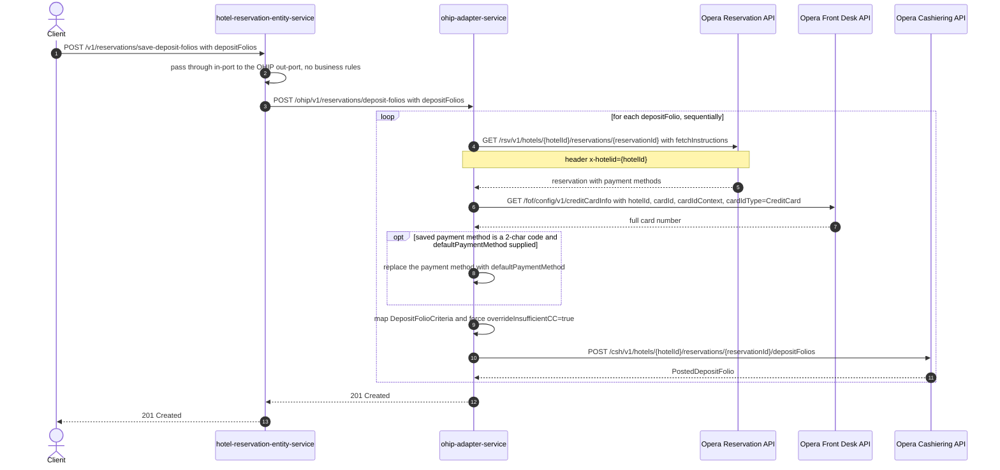

# Hotel Reservation Entity Service: saveDepositFolios Flow

Posts one deposit folio per entry in the request body to Opera cashiering, via
ohip-adapter-service. This is the write sibling of the read-only
[GetPreviewDeposits.md](GetPreviewDeposits.md) preview: the caller sends back the folios it
wants posted and nothing is recomputed here.

```http
POST /v1/reservations/save-deposit-folios
Host: hotel-reservation-entity-service:9103
Content-Type: application/json
```

The service declares no servlet context path and `HotelReservationController` is mapped under
`/v1`, so the public path is `/v1/reservations/save-deposit-folios`. `SecurityConfig` permits
every request, so no authentication or authorization is applied.

## Flow

`HotelReservationController.saveDepositFolios` maps the request DTO to the domain
`DepositFoliosRequest` and calls `HotelReservationInPortImpl.saveDepositFolios`, which is a
one-line pass-through to `HotelReservationOhipOutPortImpl.saveDepositFolios` - no validation,
no business rule, no basket read or write, no feature-flag check. The out-port maps the model
back to the ohip-adapter DTO and `OhipAdapterClient.saveCharges` issues a single
`POST http://{OHIP_HOST}/ohip/v1/reservations/deposit-folios` carrying the same folio list.
On success the endpoint returns `201 Created` with no body.

ohip-adapter-service does the work in `HotelReservationOutPortImpl.createDepositFolios`,
looping over the folios in the request body. For each folio it:

1. reads the reservation from Opera with the broad fetch-instruction set
   (`Reservation,InventoryItems,ReservationPolicies,Packages,ReservationPaymentMethods,RoutingInstructions,Comments,Preferences,LinkedReservations,Alerts`);
2. takes the first reservation payment method that carries a `paymentCard` and fetches the
   full card number from the Opera front-desk credit-card-info API, writing it onto that
   payment method;
3. for migrated bookings whose saved payment method is a bare two-character code, replaces it
   with the folio's `defaultPaymentMethod` when one is supplied (DNRQ-57778, guards against
   multiple refunds);
4. maps the folio to a `DepositFolioCriteria`, forces `overrideInsufficientCC=true` on the
   first payment, and posts it to the Opera cashiering deposit-folios API.

The loop is sequential, so with N folios the Opera call count is 3N and a failure on folio *k*
leaves folios *k+1..N* unposted.

There is no payment-service, ThreeC/Worldline, Datatrans, basket, CDH, AEM, or email/notification
hop anywhere on this path in either service: the endpoint's only collaborators are
ohip-adapter-service and Opera. It also performs no basket-state transition - the deposit folio
is written to Opera cashiering only.

Opera errors surface as ohip-adapter-service internal errors:
`OHIP_GET_RESERVATION_EXCEPTION` (`errCode` 960) for the reservation read,
`OHIP_FRONT_DESK_EXCEPTION` (`errCode` 957) for the credit-card-info read, and
`OHIP_SEND_DEPOSIT_FOLIOS_EXCEPTION` (`errCode` 951) for the cashiering POST.
hotel-reservation-entity-service deserializes that error envelope into
`HotelReservationOhipException` and rethrows it, so the caller sees `500` with the same
`errCode` propagated unchanged.

## Mermaid Flow



## Features

- Batch write: one Opera reservation read, one credit-card-info read, and one cashiering POST
  per folio in the body, in request order
- Each folio carries its own `hotelId`/`reservationId`, so a batch may span hotels
- Card enrichment: the reservation's first carded payment method gets its full card number from
  Opera front desk before the folio is posted
- Migrated-booking fallback: a two-character saved payment method is replaced by the folio's
  `defaultPaymentMethod`
- Always posts with `overrideInsufficientCC=true`
- `201 Created` with an empty body; nothing about the posted folio is returned
- hotel-reservation-entity-service adds no validation, enrichment or orchestration of its own
- No refund, payment-provider, basket, CDH, AEM, or notification side effect
- Propagates the downstream `errCode` unchanged as a `500`

## Feature Flags

None. This endpoint does not gate behavior on feature flags. No `unleashWrapper.isEnabled(...)`
check sits on any method of this path in either service - controller, in-port, out-port, OHIP
in-port, OHIP out-port, or either Opera client. The Opera OAuth token-acquisition flags
evaluated inside ohip-adapter-service sit outside the request path and are pinned off in the
integration environment.

## Request

Body: `DepositFoliosRequestDto` - `{"depositFolios": [ ... ]}`. No Bean Validation constraint is
declared on the DTO or its members beyond `@Valid` on the parameter.

| Body field (per folio) | Purpose |
| --- | --- |
| `hotelId` | Opera hotel for this folio: path value and `x-hotelid` header on all three Opera calls |
| `reservationId` | Opera reservation read, then the cashiering POST path value |
| `paymentId` | Carried into the mapped `DepositFolioCriteria` |
| `defaultPaymentMethod` | Replacement payment method used only when the reservation's saved method is a bare 2-char code |
| `charges[]` | `transactionCode`, `quantity`, `reference`, `currencyAmount{amount,currencyCode}` - become the folio postings |

Example:

```http
POST /v1/reservations/save-deposit-folios
Content-Type: application/json

{"depositFolios":[{"hotelId":"HEAPTI","reservationId":"6010001","paymentId":"1",
"defaultPaymentMethod":"VA","charges":[{"transactionCode":"9000","quantity":1,
"reference":"deposit","currencyAmount":{"amount":10.0,"currencyCode":"GBP"}}]}]}
```

Response: `201 Created`, no body.

## Branches

| Trigger | Behavior |
| --- | --- |
| Reservation has no payment method carrying a card | NullPointerException in the card-enrichment step surfaces as a raw `500`; no cashiering POST is attempted (see `bug/save-deposit-folios-cardless-npe.md`) |
| Saved payment method is a 2-char code and `defaultPaymentMethod` is set | Payment method replaced before the criteria are mapped |
| Several folios in one request | Calls repeat per folio in order; a failure aborts the remaining folios |
| Opera reservation read fails | `500` with `errCode` 960 (`OHIP_GET_RESERVATION_EXCEPTION`), no card or cashiering call |
| Opera credit-card-info read fails | `500` with `errCode` 957 (`OHIP_FRONT_DESK_EXCEPTION`), no cashiering call |
| Opera cashiering POST fails | `500` with `errCode` 951 (`OHIP_SEND_DEPOSIT_FOLIOS_EXCEPTION`) |
