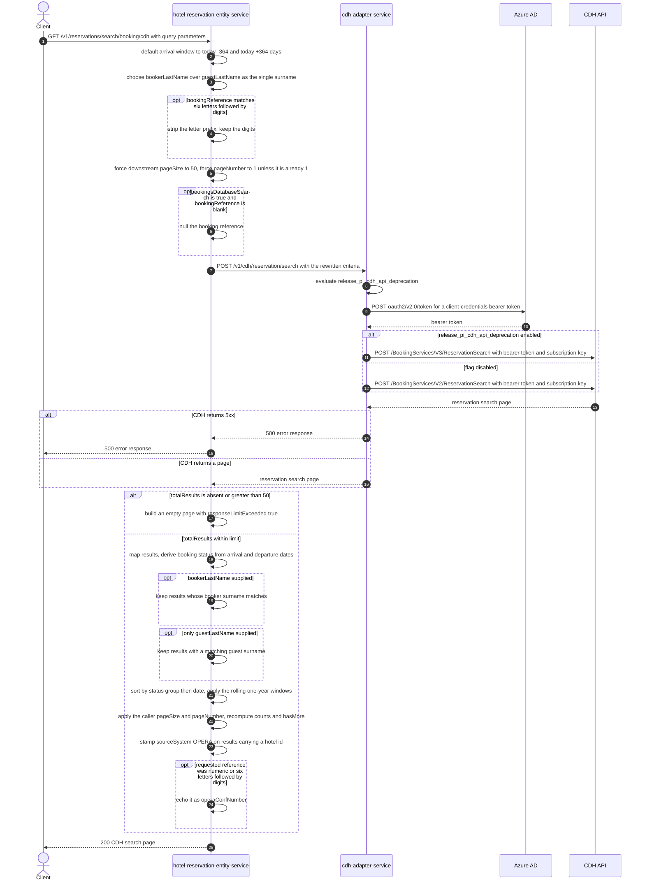

# Hotel Reservation Entity Service: searchBookingFromCdh Flow

Searches the Customer Data Hub booking store through cdh-adapter-service and returns a
re-sorted, re-paginated page of matching bookings.

```http
GET /v1/reservations/search/booking/cdh?bookingReference={bookingReference}&bookingsDatabaseSearch={bookingsDatabaseSearch}&pageSize={pageSize}&pageNumber={pageNumber}
Host: hotel-reservation-entity-service:9103
```

## Flow

The controller binds every input as a query-parameter object, maps it to the search model and
defaults the arrival window: a missing `arrivalDateFrom` becomes today minus 364 days, a missing
`arrivalDateTo` becomes today plus 364 days, a blank `cancellationDate` becomes null, and a
`bookerPhone` beginning with whitespace is re-prefixed with `+`. `bookerLastName` wins over
`guestLastName` when both are supplied - only one surname reaches the downstream criteria.

The out-port then rewrites the criteria before the call. A `bookingReference` matching six letters
followed by digits is reduced to its digits, so `LONEUS1391808` is searched as `1391808`. The page
size sent downstream is always forced to 50 and the page number is forced to 1 for every request
other than page 1, so CDH always returns the widest single page; the caller's own `pageSize` and
`pageNumber` are kept aside for the response. When `bookingsDatabaseSearch` is true and the
reference is blank, the reference is nulled out so the criteria become a pure attribute search.

The rewritten criteria are POSTed to cdh-adapter-service, which selects a CDH BookingServices
version by feature flag and POSTs the PascalCase criteria to the CDH API with an Azure AD bearer
token and a subscription key. Results come back as one search page.

hotel-reservation-entity-service maps the CDH page. When CDH reports no total or more than 50
total results, the mapping short-circuits to an empty result list with `responseLimitExceeded` set.
Otherwise each result is converted: the CDH reservation status is collapsed to `Checked-In`,
`Upcoming`, `Past`, `Cancelled`, or `Undefined` using the arrival and departure dates, the first
room's reservation id is kept, and the guest list is flattened. The list is then filtered by
`bookerLastName`, or by `guestLastName` when no booker surname was given.

Finally the out-port re-sorts the surviving results by status group (Checked-In, Upcoming, Past,
Undefined, Cancelled) and by date within each group, filters Upcoming, Past, and Cancelled results
to a rolling one-year window, applies the caller's original page size and number by skip/limit,
recomputes `searchResults`, `pageResults`, and `hasMore`, stamps `sourceSystem` to `OPERA` on every
result carrying a hotel id, and echoes the original reference back as `operaConfNumber` when it was
numeric or six letters followed by digits. The controller returns `200` with that page.

## Mermaid Flow



## Features

- Searches CDH by booking reference, surname, postcode, email, phone, hotel code, company name,
  third-party reference, and arrival-date range
- Normalizes Opera-style references of six letters followed by digits to their numeric part before
  searching
- Always requests the maximum CDH page (size 50, page 1) and paginates the caller's page locally
- Defaults an absent arrival range to a 364-day window either side of today
- Filters results by booker surname, or by guest surname when no booker surname is supplied
- Groups results as Checked-In, Upcoming, Past, Undefined, Cancelled, sorting Checked-In and
  Upcoming by ascending arrival date, Past by descending departure date, and Cancelled by
  descending arrival date
- Restricts Upcoming to arrivals within the next year, Past to departures within the last year, and
  Cancelled to cancellations within the last year
- Reports `searchResults`, `pageResults`, `hasMore`, and `responseLimitExceeded` for the caller's
  page, and marks results with a hotel id as `sourceSystem` `OPERA`
- Echoes a numeric or Opera-style requested reference back as `operaConfNumber`
- Requires no authentication at the controller; the CDH hop is authenticated inside
  cdh-adapter-service

## Feature Flags

hotel-reservation-entity-service evaluates no feature flag on this path.

| Flag | Effect when enabled |
| --- | --- |
| `release_pi_cdh_api_deprecation` | Evaluated in cdh-adapter-service. Sends the search to `POST /BookingServices/V3/ReservationSearch` instead of `POST /BookingServices/V2/ReservationSearch`. The request body and the mapped response are the same on both routes. cdh-adapter-service has no baggage feature-flag override resolver, so a caller cannot select the route per request. |

## Request

All inputs are query parameters bound into `CdhSearchBookingsRequestDto`.

| Parameter | Required | Effect |
| --- | --- | --- |
| `bookingReference` | Effectively yes | Searched reference. A value of six letters followed by digits is reduced to its digits. A numeric or six-letters-plus-digits value is echoed back as `operaConfNumber`. The out-port dereferences it without a null check, so an absent value fails the request. |
| `pageSize` | Effectively yes | Size of the page returned to the caller, applied locally after the CDH call. Dereferenced without a null check. |
| `pageNumber` | Effectively yes | Page returned to the caller, applied locally as a skip over the sorted results. Dereferenced without a null check. |
| `bookingsDatabaseSearch` | No | Sent to CDH as `BookingsDatabaseSearch`. When true together with a blank reference, the reference is dropped from the criteria. Defaults to false. |
| `bookerLastName` | No | Sent to CDH as `Lastname` and used to filter results on the booker surname. Takes precedence over `guestLastName`. |
| `guestLastName` | No | Sent as `Lastname` only when `bookerLastName` is absent, and filters results on any guest surname. |
| `bookerPostcode` | No | Sent as `PostalCode`. |
| `bookerEmail` | No | Sent as `EmailAddress`. |
| `bookerPhone` | No | Sent as `Telephone`. A leading whitespace is replaced by `+`. |
| `hotelId` | No | Sent as `HotelCode`. |
| `companyName` | No | Sent as `CompanyName`; validated by the shared company-name constraint. |
| `thirdPartyBookingReferenceNumber` | No | Sent as `ThirdPartyReference`. |
| `arrivalDateFrom` | No | Start of the CDH arrival window; defaults to today minus 364 days. |
| `arrivalDateTo` | No | End of the CDH arrival window; defaults to today plus 364 days. |
| `cancellationDate` | No | Sent as `CancellationDate`; blank is treated as absent. |
| `continuationToken` | No | Passed through to CDH. |

## Branches

| Trigger | Behavior |
| --- | --- |
| `bookingReference` matches six letters followed by digits | Only the digits are sent downstream, while the full original value is echoed as `operaConfNumber`. |
| `pageNumber` is not 1 | The downstream call is still made for page 1, size 50; the requested page is cut out of the sorted results locally. |
| `bookingsDatabaseSearch` true with a blank `bookingReference` | The reference is removed from the criteria and the search runs on the remaining attributes. |
| CDH reports `TotalResults` absent or greater than 50 | Returns an empty result list with `responseLimitExceeded=true`, `searchResults=0`, `pageResults=0`, `hasMore=false`, and `cdhSearchResults` carrying the reported total or 0. |
| CDH returns no results array | Maps to an empty result list; counts come from the reported totals. |
| Result carries a hotel code | `sourceSystem` is overwritten with `OPERA` regardless of the value CDH returned. |
| Result status is Upcoming, Past, or Cancelled outside its one-year window | The result is dropped from the response even though CDH returned it. |
| `bookerLastName` supplied but CDH results carry no booker | The booker filter dereferences the missing booker and the request fails with `500`. |
| CDH returns 5xx | cdh-adapter-service raises its CDH exception and answers `500`; hotel-reservation-entity-service propagates a `500` error response. |
| CDH returns 404 | cdh-adapter-service treats the body as empty and dereferences a null search result, answering `500`. |
