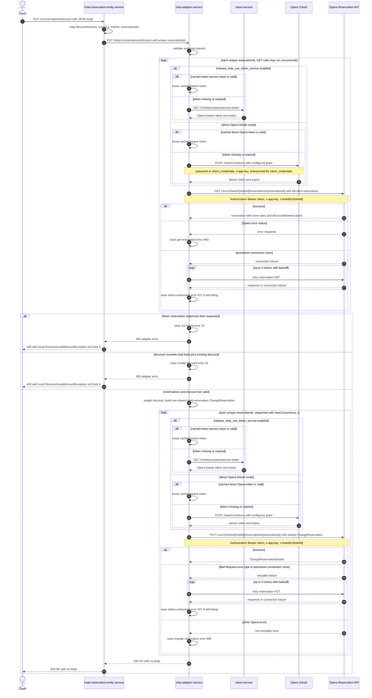

# Hotel Reservation Entity Service: updateDiscount Flow

Distributes a requested discount across the eligible room rates of one or more Opera reservations through ohip-adapter-service.

```http
PUT /v1/reservations/discount
Host: hotel-reservation-entity-service:9103
Content-Type: application/json
```

The service declares no servlet context path and the controller is mapped under `/v1`, so the effective public path is `/v1/reservations/discount`. The endpoint is permit-all and does not require an authorization header.

## Flow

`HotelReservationController.updateDiscount` maps the request with `UpdateDiscountRequestMapper` and delegates through `HotelReservationInPortImpl` and `HotelReservationOhipOutPortImpl`. Those domain layers add no business rule or downstream lookup. The OHIP out-port converts the reservation-id list to a set, collapsing duplicates, and `OhipAdapterClient` sends `PUT /ohip/v1/reservations/discount`. A successful public response is `200 OK` with no body.

ohip-adapter-service validates the non-null request DTO and maps it through a self-validating domain builder, which rejects an empty reservation set, empty hotel or currency, and a negative discount. It then loads every unique reservation concurrently from the Opera Reservation API. Each prerequisite request is `GET /rsv/v1/hotels/{hotelId}/reservations/{reservationId}` with fetch instructions for `Reservation`, `InventoryItems`, `ReservationPolicies`, `Packages`, `ReservationPaymentMethods`, `RoutingInstructions`, `Comments`, `Preferences`, `LinkedReservations`, and `Alerts`. No Opera write occurs unless the adapter receives exactly one outer response per requested id.

The adapter totals every fetched room-rate amount as base amount before tax plus any existing discount. A requested discount above that total is rejected. Otherwise it calculates weighted discount amounts from the fetched rates, correcting rounding remainder onto the earliest rate amounts that can absorb it. The generated room-rate updates retain only entries whose Opera `discountAllowed` value is true, set discount code `PR`, reason `Promotion`, and the requested currency, and set market code `OTH` and source code `00`. Promotion names longer than 20 characters are shortened to 17 characters plus `...`.

One shared `ChangeReservation` body is built with an instruction for every fetched reservation. The implementation then reuses that complete body for a reservation-specific Opera PUT for each requested id. These writes run with configured `maxConcurrency: 1`, currently `1`, so they are issued sequentially. After all writes succeed, ohip-adapter-service returns `200 OK`, which hotel-reservation-entity-service converts to its own empty `200 OK`.

## Mermaid Flow



## Features

- Batch discount update with duplicate reservation ids collapsed before ohip-adapter-service.
- Prerequisite Opera reservation GET for every target before any write.
- Rejects incomplete reservation retrieval and discounts above the aggregate base-before-tax plus existing-discount amount.
- Weighted allocation uses all fetched rate amounts and corrects rounding remainder without assigning more than a rate amount.
- Sends updated rates only for room-rate entries where Opera reports `discountAllowed=true`.
- Applies Opera discount code `PR`, reason `Promotion`, the caller's currency, market code `OTH`, and source code `00`.
- Preserves selected room-stay data and truncates promotion names longer than 20 characters.
- Reuses one multi-reservation change body across sequential reservation-specific Opera PUTs.
- Uses no basket, content, CDH, payment, or endpoint-specific cache.

## Feature Flags

| Flag | Effect when enabled |
| --- | --- |
| `release_ohip_use_token_service` | Selects token-service for Opera bearer-token acquisition. On a cache miss or expiry, the adapter calls `GET /v1/tokens/opera/access-token`; when disabled it authenticates directly against Opera OAuth. |
| `release_ohip_use_token_refresh_skew` | Applies the configured early-refresh clock skew to tokens acquired directly from Opera OAuth. The token-service provider instead uses the reported token expiry. |

## Request

| Body field | Required | Effect |
| --- | --- | --- |
| `discountAmount` | Yes, non-null and at least `0.0` | Total discount to distribute. Values above the fetched aggregate room-rate total are rejected. |
| `currency` | Yes, non-empty | Written as the currency code on every generated Opera discount. Whitespace-only text passes the current `@NotEmpty` validation. |
| `hotelId` | Yes, non-empty | Used in every Opera URL, `x-hotelid` header, and change-reservation instruction. Whitespace-only text passes the current `@NotEmpty` validation. |
| `reservationIds` | Yes, non-null and non-empty | Opera reservation ids. The public DTO accepts a list, which the entity service maps to a set before the adapter call. |

The hotel-reservation-entity-service DTO has no field-level constraints, so malformed fields are first forwarded. The ohip-adapter-service DTO rejects nulls, and its self-validating mapped domain object enforces non-empty identifiers and strings plus the minimum discount.

## Branches

| Trigger | Behavior |
| --- | --- |
| Null field | ohip-adapter-service rejects the request with `400 Bad Request` at DTO validation. |
| Empty reservation ids, empty hotel or currency, or negative discount | The adapter's mapped domain constructor raises a validation error before any Opera call. |
| Zero discount | Accepted and distributed as zero-valued discounts. |
| Cached Opera bearer token is valid | Token acquisition is skipped for that GET or PUT. |
| `release_ohip_use_token_service` enabled and token missing or expired | Calls token-service. A token-service error prevents the affected Opera call and raises internal error code `971`. |
| Token-service flag disabled and direct token missing or expired | Calls Opera OAuth. `ENABLE_CLIENT_CREDENTIALS` chooses `client_credentials`; otherwise the password grant is used. Authentication failure prevents the affected Opera call. |
| Opera GET returns an error status | Fails with `OHIP_GET_RESERVATION_EXCEPTION`, error code `960`; no PUT is attempted. |
| Opera GET connection closes prematurely | The WebClient GET filter retries up to three times; exhaustion raises error code `971`; no PUT is attempted. |
| Opera returns fewer outer reservation responses than requested | Raises adapter `HotelReservationNotFound`, error code `23`, before any write. The entity-service client deserializes every adapter 4xx as its local `DiscountInvalidAmountException`; that exception's public constructor fixes the public error code to `0`, so the adapter code is not retained. |
| Requested discount exceeds all fetched base-before-tax amounts plus existing discounts | Raises adapter `DiscountInvalidAmountException`, error code `22`, before any write. HRE reshapes it to HTTP 400 with public error code `0`. |
| A fetched room-rate omits `discountAllowed` | The generated nullable Boolean reaches `.filter(RoomRateType::getDiscountAllowed)` and is unboxed, causing a mapper `NullPointerException`; HRE surfaces the adapter's generic HTTP 500 with error code `400`. The generic integration response now emits an explicit data-driven Boolean, so reaching this malformed-response branch requires a deliberately malformed response. |
| Fetched rate total is zero while rate entries exist | Weighted division by zero fails during mapping; no PUT is attempted. |
| Fetched reservation shape lacks room-stay, rate, base, or inner reservation data required by the mapper | Mapping can fail with a runtime exception before any PUT. |
| Opera PUT returns an error body whose `type` is `Bad Request`, or the connection closes prematurely | Retries the same PUT up to three times with backoff; exhaustion raises `OHIP_RETRIES_EXHAUSTED_EXCEPTION`, error code `971`. |
| Other Opera PUT error status | Does not retry and raises `OHIP_CHANGE_RESERVATION_EXCEPTION`, error code `958`. |
| A later sequential PUT fails | Earlier successful Opera calls remain committed, subsequent path calls are not started, and there is no rollback. The same body contains instructions for all fetched reservations, so the implementation does not isolate the payload to the current path id. |
