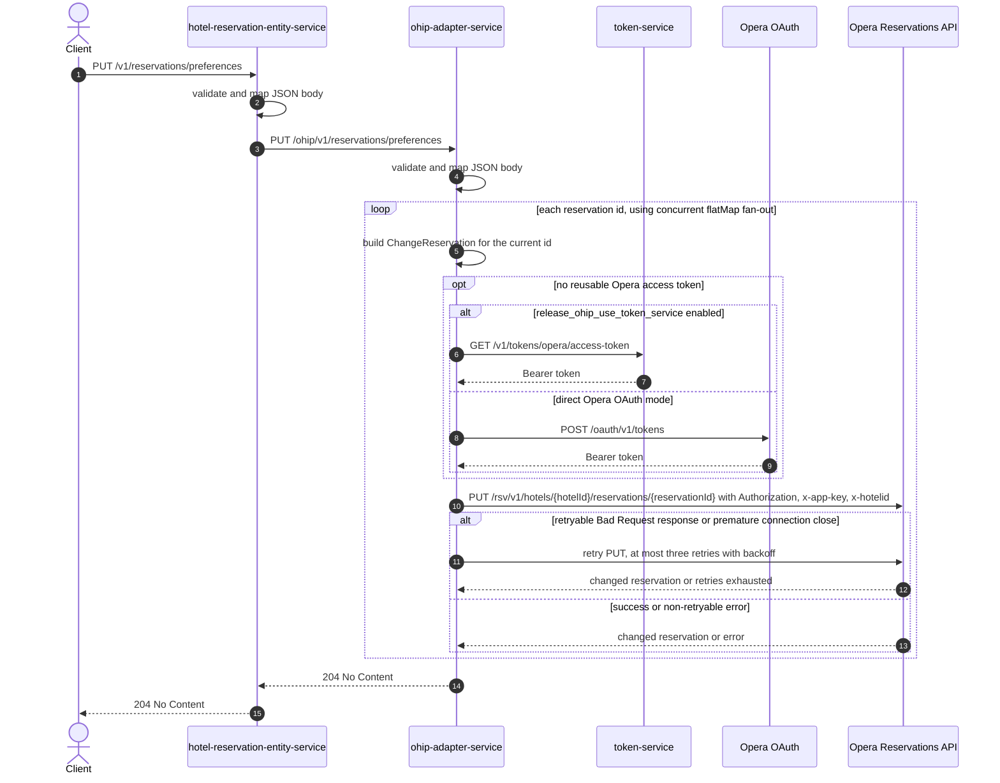

# Hotel Reservation Entity Service: updatePreferences Flow

Updates the preference collections on one or more Opera reservations.

```http
PUT /v1/reservations/preferences
Host: hotel-reservation-entity-service:9103
Content-Type: application/json
```

The endpoint is permit-all and does not require an authorization header.

## Flow

hotel-reservation-entity-service validates the JSON body, maps it without changing its fields, and forwards it to `ohip-adapter-service` at `PUT /ohip/v1/reservations/preferences`. Its domain logic adds no lookup, validation, cache, or feature-flag branch.

ohip-adapter-service validates and maps the same fields, then uses a reactive `flatMap` fan-out over `reservationsIds`. For each id it creates an Opera `ChangeReservation` containing one reservation instruction: the request hotel id, that current reservation id with type `Reservation`, and every requested preference type and value. It sends one authenticated Opera change-reservation PUT per id and waits for all of them to finish.

On success, both services discard the downstream response bodies and return `204 No Content`. There is no compensating action if one call fails after another reservation has already been changed.

## Mermaid Flow



## Features

- Updates multiple reservations from one request, with one Opera PUT for every list entry
- Concurrent reservation fan-out through Reactor `flatMap`
- Preserves each preference type and maps every preference string to an Opera `preferenceValue`
- Sends the hotel id in the Opera path, `x-hotelid` header, and change-reservation body
- Uses Opera OAuth Bearer authorization and the configured `x-app-key`
- Requires no caller authentication and performs no basket or reservation read first
- Uses no Redis or application-data cache; only the OAuth authorized-client token cache can skip credential acquisition
- Retries a change call only for an Opera response body whose `type` is `Bad Request`, or for a premature connection close

## Feature Flags

| Flag | Effect when enabled |
| --- | --- |
| `release_ohip_use_token_service` | Obtains a missing or expired Opera Bearer token with `GET /v1/tokens/opera/access-token` from token-service instead of calling Opera OAuth directly |
| `release_ohip_use_token_refresh_skew` | Refreshes directly acquired Opera tokens early using `config.service.ohip.tokenRefreshClockSkew`, 15 minutes by default; this does not alter token-service token expiry handling |

Neither flag changes preference mapping or the number of Opera reservation calls.

## Request

Important JSON body fields:

| Field | Required | Effect |
| --- | --- | --- |
| `hotelId` | Yes, non-null and non-empty | Used in the OHIP path, `x-hotelid` header, and reservation instruction body for every Opera call |
| `reservationsIds` | Yes, non-null and non-empty, with no empty-string element | Produces one Opera PUT per list entry; duplicate ids therefore produce duplicate calls |
| `preferencesCollections` | Not constrained as non-null, but required for successful mapping | Supplies the Opera preference collection; a null value reaches the OHIP mapper and fails before an Opera call |
| `preferencesCollections[].preferenceType` | Yes, non-null and non-empty | Becomes the Opera preference type |
| `preferencesCollections[].preferences` | Yes, non-null, with no empty-string element | Each value becomes an Opera `preferenceValue`; an empty list is accepted |

There are no path or query parameters.

## Branches

| Trigger | Behavior |
| --- | --- |
| Valid cached OAuth token | Reuses the token and skips both credential endpoints |
| `release_ohip_use_token_service` enabled with no reusable token | Gets a token from token-service; a token-service error stops the Opera request |
| `release_ohip_use_token_service` disabled with no reusable token | Calls the configured Opera OAuth endpoint using client credentials or password grant according to `ENABLE_CLIENT_CREDENTIALS` |
| Empty `preferencesCollections` list | Still sends one Opera PUT per reservation id, with an empty Opera preference collection |
| Null `preferencesCollections` | Passes request validation but fails when the OHIP mapper calls `stream()`, so no Opera PUT is made |
| Opera error body has `type: Bad Request`, or connection closes prematurely | Retries with three-second exponential backoff, at most three retries; exhaustion uses internal error code `971` |
| Other Opera error | Fails without the application-level retry using change-reservation internal error code `958` |
| Any fan-out call fails | The endpoint does not return 204; already completed reservation changes are not rolled back |
