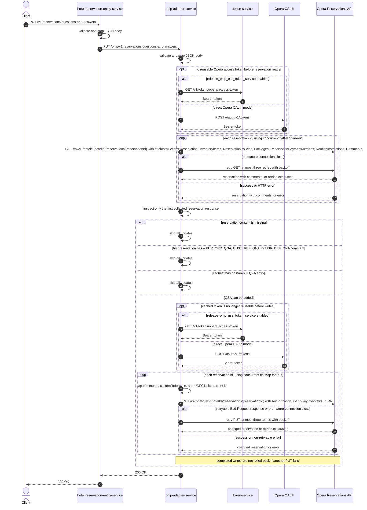

# Hotel Reservation Entity Service: updateQuestionsAndAnswers Flow

Adds company purchase-order, customer-reference, and user-defined questions and answers to one or more Opera reservations when no company Q&A comment already exists.

```http
PUT /v1/reservations/questions-and-answers
Host: hotel-reservation-entity-service:9103
Content-Type: application/json
```

The endpoint is permit-all and does not require an authorization header.

## Flow

hotel-reservation-entity-service validates the top-level request, maps its fields unchanged, and forwards it to `ohip-adapter-service` at `PUT /ohip/v1/reservations/questions-and-answers`. Its domain logic performs no lookup or additional business rule.

ohip-adapter-service first reads every named reservation from the Opera Reservations API, including comments and other full-reservation fetch instructions. After every concurrent GET completes, it inspects only the first response emitted into the collected list. It silently skips all writes if that response contains no reservation, already has a `PUR_ORD_QNA`, `CUST_REF_QNA`, or `USR_DEF_QNA` comment, or if both named Q&A objects are null and the user-defined list is null or empty.

When the guard passes, OHIP builds a separate `ChangeReservation` for each reservation id and concurrently PUTs all of them to Opera. It maps each Q&A to a typed Opera comment whose title is `question|questionHeader` and whose text is the answer. The customer-reference answer also becomes `customReference`, and the purchase-order answer also becomes character UDF `UDFC11`. On success, OHIP and hotel-reservation-entity-service both return `200 OK` with no body.

## Mermaid Flow



## Features

- Multi-reservation prerequisite read followed by an all-reservation conditional update
- Concurrent GET and PUT fan-out through Reactor `flatMap`
- Existing-Q&A protection based on Opera comment types `PUR_ORD_QNA`, `CUST_REF_QNA`, and `USR_DEF_QNA`
- Purchase-order, customer-reference, and repeated user-defined Q&A comment mapping
- Customer-reference duplication into Opera `customReference`
- Purchase-order duplication into Opera character UDF `UDFC11`
- Opera comment titles formatted as `question|questionHeader`, with the answer as comment text
- No caller authentication, basket access, Redis lookup, or application-data cache
- OAuth authorized-client caching can skip credential acquisition while a token remains reusable

The prerequisite GET uses `fetchInstructions` values `Reservation`, `InventoryItems`, `ReservationPolicies`, `Packages`, `ReservationPaymentMethods`, `RoutingInstructions`, `Comments`, `Preferences`, `LinkedReservations`, and `Alerts`. Both Opera methods send `Authorization: Bearer ...`, `x-app-key`, and `x-hotelid`; the PUT also sends JSON content type.

## Feature Flags

| Flag | Effect when enabled |
| --- | --- |
| `release_ohip_use_token_service` | Obtains a missing or expired Opera Bearer token with `GET /v1/tokens/opera/access-token` from token-service instead of calling Opera OAuth directly |
| `release_ohip_use_token_refresh_skew` | Refreshes directly acquired Opera tokens early using `config.service.ohip.tokenRefreshClockSkew`, 15 minutes by default; this does not alter token-service token expiry handling |

Neither flag changes Q&A validation, mapping, prerequisite reads, or reservation fan-out.

## Request

Important JSON body fields:

| Field | Required | Effect |
| --- | --- | --- |
| `reservationIds` | Yes, non-null and non-empty set | Selects the reservations read and, if the guard passes, updated; JSON duplicates collapse in the set |
| `hotelId` | Yes, non-null | Used in every Opera path, `x-hotelid` header, comment, and reservation instruction; an empty string is not rejected by validation |
| `companyQuestionAndAnswerDetails` | Yes, non-null | Holds the optional purchase-order, customer-reference, and user-defined entries |
| `companyQuestionAndAnswerDetails.purchaseOrderQuestionAndAnswer` | No | Adds a `PUR_ORD_QNA` comment; a non-null answer also sets `UDFC11` |
| `companyQuestionAndAnswerDetails.customerReferenceQuestionAndAnswer` | No | Adds a `CUST_REF_QNA` comment and maps its answer to `customReference` |
| `companyQuestionAndAnswerDetails.userDefinedQuestionAndAnswers` | No | Adds one `USR_DEF_QNA` comment for every non-null list entry |
| Q&A `question` | No validation constraint | Contributes the first part of the comment title |
| Q&A `questionHeader` | No validation constraint | Contributes the second part of the comment title |
| Q&A `answer` | No validation constraint | Becomes comment text and, for special entries, the custom reference or purchase-order UDF |

There are no path or query parameters.

## Branches

| Trigger | Behavior |
| --- | --- |
| Valid cached OAuth token | Reuses the token and skips both credential endpoints |
| `release_ohip_use_token_service` enabled with no reusable token | Gets a token from token-service; a token-service failure stops the pending Opera call with internal error code `971` |
| `release_ohip_use_token_service` disabled with no reusable token | Calls `/oauth/v1/tokens` using client credentials or password grant according to `ENABLE_CLIENT_CREDENTIALS` |
| Prerequisite GET ends with a premature connection close | Retries that GET at most three times with three-second exponential backoff; exhausted retries use internal error code `971` |
| Any prerequisite GET returns an HTTP error | Fails the whole read phase without any PUT; the Opera read error is mapped to internal error code `960` |
| First collected GET response has no reservation content | Returns `200 OK` without sending a PUT |
| First collected reservation has any protected Q&A comment type | Returns `200 OK` without sending a PUT to any reservation, even if other reservations have no Q&A |
| Other reservations have protected Q&A but the first collected reservation does not | The guard passes and PUTs all reservations; only the first concurrently emitted GET response is inspected |
| Purchase-order, customer-reference, and user-defined entries are all absent or empty | Returns `200 OK` without sending a PUT |
| User-defined list contains only null entries while both named entries are absent | The guard treats the list as non-empty, but the mapper emits no Q&A comments and still sends every reservation PUT |
| PUT receives an Opera body whose `type` is `Bad Request`, or the connection closes prematurely | Retries with three-second exponential backoff, at most three retries; exhaustion uses internal error code `971` |
| Other Opera PUT error | Fails without the application-level retry using change-reservation internal error code `958` |
| Any concurrent PUT fails after another succeeds | The endpoint fails and performs no rollback, so Opera can retain a partial multi-reservation update |
| OHIP returns a 5xx response to hotel-reservation-entity-service | HRE decodes the response as `HotelReservationOhipException`; OHIP 4xx responses use WebClient's default error mapping |
