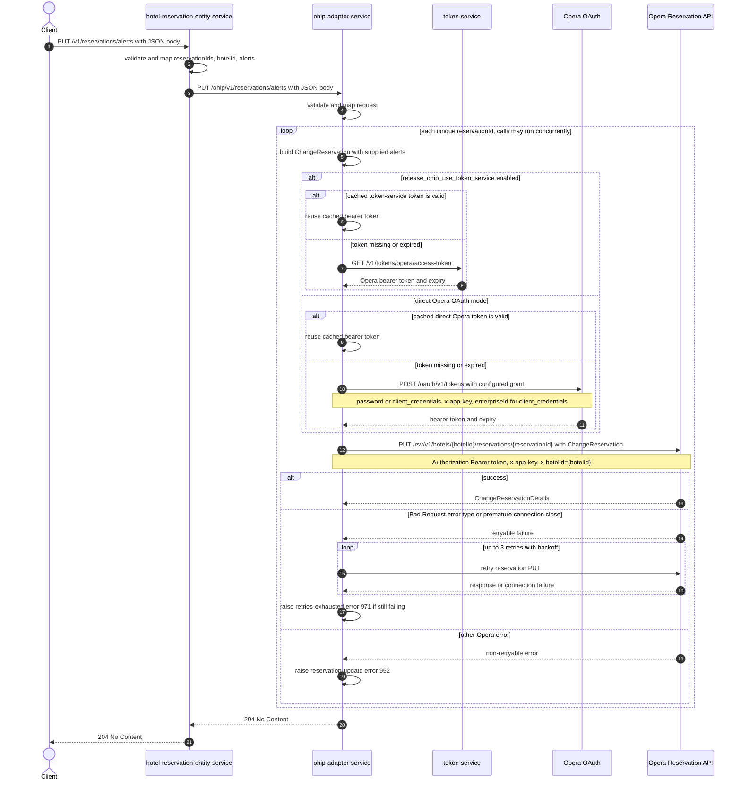

# Hotel Reservation Entity Service: updateReservationAlerts Flow

Applies the supplied Opera alert instructions to one or more reservations at a hotel by delegating through ohip-adapter-service.

```http
PUT /v1/reservations/alerts
Host: hotel-reservation-entity-service:9103
Content-Type: application/json
```

The service has no servlet context path and the controller is mapped under `/v1`, so the effective public path is `/v1/reservations/alerts`. The endpoint is permit-all and does not require an authorization header.

## Flow

`HotelReservationController.updateReservationAlerts` validates the JSON body and uses `ReservationRequestMapper` to map it to `UpdateReservationAlertsRequest`. `HotelReservationInPortImpl` and `HotelReservationOhipOutPortImpl` are pure delegates: they add no validation, feature check, cache lookup, or business rule. `OhipAdapterClient` sends the same alert model to ohip-adapter-service as `PUT /ohip/v1/reservations/alerts` and waits for its empty response.

ohip-adapter-service validates and maps the body again, then delegates through its reservation in-port to `HotelReservationOutPortImpl`. For every unique `reservationId`, the out-port builds a `ChangeReservation` containing one `HotelReservationInstructionType`: the instruction carries type `Reservation`, the current reservation id, the request's `hotelId`, and the caller-supplied alerts. The per-reservation work is merged with Reactor `flatMap`, so multiple Opera writes may run concurrently and set iteration order is not significant.

Before each Opera request, the shared OHIP WebClient obtains or reuses a bearer token. With `release_ohip_use_token_service` enabled, a missing or expired cached token is fetched from token-service. Otherwise, the adapter obtains a token directly from Opera OAuth using either the configured password grant or client-credentials grant. It then sends `PUT /rsv/v1/hotels/{hotelId}/reservations/{reservationId}` to the Opera Reservation API with `Authorization: Bearer ...`, `x-app-key`, and `x-hotelid: {hotelId}`. The response body is ignored. Once every write completes, both services return `204 No Content`.

## Mermaid Flow



## Features

- Batch alert application to every unique reservation id supplied in the request.
- Concurrent Opera change-reservation writes, one independently constructed body per reservation id.
- Preserves every supplied alert field: `id`, `area`, `code`, `description`, `screenNotification`, and `printerNotification`.
- Uses the Opera reservation id as a `UniqueIDType` with type `Reservation` inside each change payload.
- Returns no response body and waits until all downstream writes complete.
- Performs no basket, profile, CDH, or other downstream lookup and uses no endpoint-specific cache.
- Requires no caller authentication; Opera authentication is handled internally by ohip-adapter-service.

## Feature Flags

| Flag | Effect when enabled |
| --- | --- |
| `release_ohip_use_token_service` | Selects token-service for Opera bearer-token acquisition. On a token cache miss or expiry, ohip-adapter-service calls `GET /v1/tokens/opera/access-token`; when disabled it authenticates directly against Opera OAuth. |
| `release_ohip_use_token_refresh_skew` | Applies the configured early-refresh clock skew to tokens acquired directly from Opera OAuth. It does not alter the alert payload or add another reservation call, and the token-service provider uses the token's reported expiry instead. |

## Request

| Body field | Required | Effect |
| --- | --- | --- |
| `reservationIds` | Yes, non-null and non-empty | Set of Opera reservation ids. Duplicates are collapsed and one Opera PUT is issued per unique id. |
| `hotelId` | Yes, non-empty | Used in the Opera URL, the `x-hotelid` header, and the change-reservation instruction. |
| `alerts` | Yes, non-null | Alert list placed into every reservation instruction. An empty list passes validation and is forwarded as an empty alert collection. |
| `alerts[].id` | No field-level validation | Existing Opera alert identifier when the caller is targeting an identified alert. |
| `alerts[].area` | No field-level validation | Opera alert area. |
| `alerts[].code` | No field-level validation | Opera alert code. |
| `alerts[].description` | No field-level validation | Alert text. |
| `alerts[].screenNotification` | Primitive boolean | Controls the Opera screen-notification value. |
| `alerts[].printerNotification` | Primitive boolean | Controls the Opera printer-notification value. |

## Branches

| Trigger | Behavior |
| --- | --- |
| Invalid or empty `reservationIds`, or empty `hotelId`, or null `alerts` | Jakarta validation rejects the request before the domain port with `422 Unprocessable Content`. |
| Empty `alerts` list | Accepted and sent to Opera for every reservation as an empty alert collection. |
| Valid cached bearer token | Token acquisition is skipped and the adapter proceeds directly to the Opera PUT. |
| `release_ohip_use_token_service` enabled and token absent or expired | Calls token-service `GET /v1/tokens/opera/access-token`; token-service failure raises internal error code `971` and prevents the affected Opera PUT. |
| Token-service flag disabled and direct token absent or expired | Calls Opera `POST /oauth/v1/tokens`; `ENABLE_CLIENT_CREDENTIALS` selects `client_credentials`, otherwise the password grant is used. Authentication failure prevents the affected Opera PUT. |
| Opera returns an error body whose `type` is `Bad Request`, or the connection closes prematurely | Retries the same PUT up to three times with backoff; exhaustion raises `OHIP_RETRIES_EXHAUSTED_EXCEPTION` with error code `971`. |
| Other Opera error status | Does not retry and raises `OHIP_PUT_RESERVATIONS_GUEST_EXCEPTION` with error code `952`. |
| Any per-reservation operation fails | The merged operation fails and no `204` is returned. Other concurrent reservation writes may already have completed or still be in flight; there is no rollback. hotel-reservation-entity-service deserializes the adapter error as `HotelReservationOhipException` and surfaces it to the caller. |
