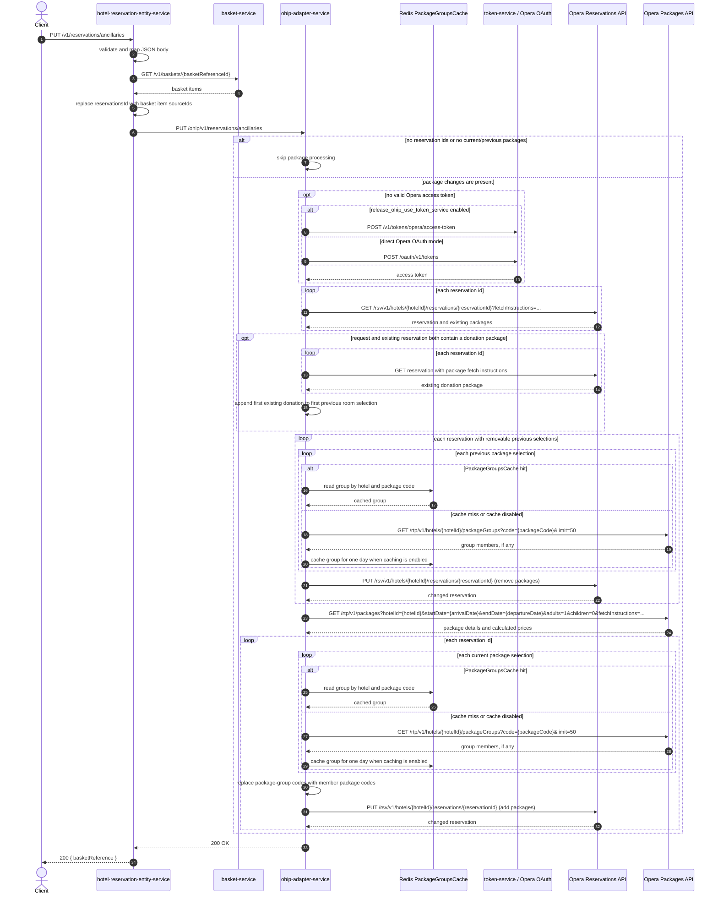

# Hotel Reservation Entity Service: updateReservationPackages Flow

Updates ancillary package selections on every Opera reservation held by a basket and returns that basket reference.

```http
PUT /v1/reservations/ancillaries
Host: hotel-reservation-entity-service:9103
Content-Type: application/json
```

The endpoint is permit-all and does not require an authorization header.

## Flow

hotel-reservation-entity-service validates and maps the request, then loads the basket from `basket-service`. It takes the Opera reservation ids from the basket items, replacing any `reservationsId` supplied by the caller, and forwards the resulting request to `ohip-adapter-service`.

OHIP does nothing when the basket has no reservation ids or neither the current nor previous room selections contain packages. Otherwise, it reads the reservations from Opera to detect replacement of an existing donation package. It removes eligible previous selections, loads current package details from Opera, expands package groups through the one-day `PackageGroupsCache`, and adds the current selections. Removal and addition are separate Opera change-reservation calls for each reservation.

After OHIP completes, hotel-reservation-entity-service returns `200 OK` with the request's basket reference. The basket is read to resolve reservation ids but is not updated by this endpoint.

## Mermaid Flow



## Features

- Basket-based reservation targeting: Opera ids come from the basket's item `sourceId` values
- Positional per-room package replacement across multiple reservations
- Separate removal of previous selections and addition of current selections
- Opera package-detail lookup for calculated prices and package metadata
- Package-group expansion backed by a one-day Redis cache
- Donation-package replacement using the package already stored on the reservation
- Early check-in and late check-out packages update expected arrival or departure times
- No authentication requirement and no basket mutation

## Feature Flags

| Flag | Effect when enabled |
| --- | --- |
| `release_distr_booking_fee` | Includes a selected package's price in the package-group expansion's intermediate tuple; the generated member selection currently does not retain that price |
| `release_ohip_use_token_service` | Obtains credentials through token-service instead of direct Opera OAuth for Opera calls |
| `release_ohip_use_token_refresh_skew` | Refreshes Opera access tokens early using the configured clock skew |

## Request

Important JSON body fields:

| Field | Required | Effect |
| --- | --- | --- |
| `basketReferenceId` | Yes | Identifies the basket whose item `sourceId` values become the Opera reservation ids; returned as `basketReference` |
| `hotelId` | No validation annotation | Used in every Opera reservation, package, and package-group request |
| `arrivalDate` | Yes | ISO date used as the package start date and to set early check-in time |
| `departureDate` | Yes | ISO date used as the package end date and to set late check-out time |
| `reservationsId` | No | Ignored at this public endpoint because ids are rebuilt from basket items |
| `roomsSelections` | No | Current selections to add; entries must align by index with basket item reservation ids |
| `roomsSelections[].packagesSelection[].id` | No | Opera package or package-group code |
| `roomsSelections[].packagesSelection[].noOfSelections` | No | Package consumption quantity |
| `roomsSelections[].packagesSelection[].price` | No | Overrides the calculated price for booking-fee package codes `ZN0000` and `ZR0000` |
| `previousRoomsSelections` | No | Previous selections to remove; entries must align by index with basket item reservation ids |

## Branches

| Trigger | Behavior |
| --- | --- |
| Empty basket reservation-id list | OHIP returns successfully without calling Opera |
| No non-empty current or previous package selection | OHIP returns successfully without calling Opera |
| Previous selection exists and does not contain `HSATWN` | Expands any package groups and sends an Opera removal PUT for that reservation |
| Previous selection contains `HSATWN` | Skips the removal PUT for that reservation |
| Current and existing selections both contain a donation code | Reads the reservations a second time and adds the first existing donation to the first room's removal set before adding the new donation |
| Package-group cache hit | Uses cached group members and skips the Opera package-groups call |
| Package-group cache miss or disabled cache | Loads group members from Opera and caches the result for one day when caching is enabled |
| Package code is early check-in (`HSCKIN`) | Sets expected arrival time to 11:00 on `arrivalDate` |
| Package code is late check-out (`HSCOU2`) | Sets expected departure time to 14:00 on `departureDate` |
| Package code is a donation package | Limits its package schedule to the first stay night |
