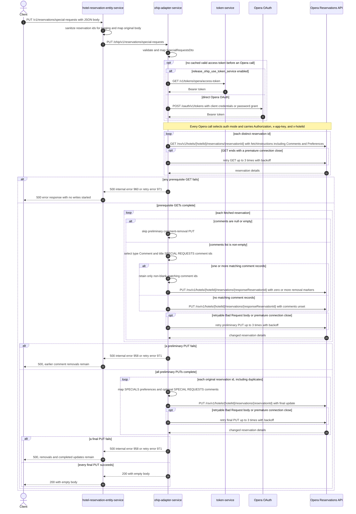

# Hotel Reservation Entity Service: updateReservationsSpecialRequests Flow

Replaces reservation special-request preferences and optionally replaces the `SPECIAL REQUESTS` booking-note comments in Opera.

```http
PUT /v1/reservations/special-requests
Host: hotel-reservation-entity-service:9103
Content-Type: application/json
```

The service has no servlet context path, this controller is mapped under `/v1`, and the permit-all endpoint requires no authorization header.

## Flow

`HotelReservationController.updateReservationsSpecialRequests` makes a sanitized copy of the reservation ids only for logging, maps the original body field-for-field, and delegates through the in-port and OHIP out-port without basket access or business rules. hotel-reservation-entity-service calls `PUT /ohip/v1/reservations/special-requests`; its WebClient adds only JSON content type and handles OHIP 5xx bodies as `HotelReservationOhipException`.

ohip-adapter-service validates and maps the request, then fetches every distinct reservation id from the Opera Reservations API with full reservation fetch instructions, including `Comments` and `Preferences`. The fetched reservations are prerequisites for comment replacement only; there is no returned-count check.

For each fetched reservation whose comments list is non-null and non-empty, OHIP performs a preliminary change-reservation PUT. It selects comment ids whose type is exactly `Comment` and whose nested title equals `SPECIAL REQUESTS` ignoring case. The guard is the presence of any comments, not the presence of a matching Special Notes comment: when no ids match, the preliminary PUT still happens but its mapped `comments` field is unset. Reservations with a null or empty comments list skip this PUT.

After all preliminary PUTs complete, OHIP sends one final change-reservation PUT for every id in the original request. Non-null special-request strings become a `SPECIALS` preference collection. Non-blank booking notes become reservation comments titled `SPECIAL REQUESTS`, typed `RESERVATION`, and located at `GENERAL`. Both services return `200 OK` with an empty body. The operations are not transactional, so earlier removals or final updates are not rolled back after a later failure.

## Mermaid Flow



## Features

- Direct request-local targeting with no basket-service call or basket mutation
- Prerequisite Opera reservation reads deduplicated with `Set.copyOf`
- Existing booking-note replacement based on Opera comment metadata
- Special-request preferences represented as Opera preference type `SPECIALS` with description `Specials`
- Booking notes represented as `SPECIAL REQUESTS` reservation comments at location `GENERAL`
- Independent final update for each original reservation id
- Permit-all public endpoint with no request token validation
- No endpoint-specific data cache and no transactional rollback

## Feature Flags

| Flag | Effect when enabled |
| --- | --- |
| `release_ohip_use_token_service` | Selects token-service rather than direct Opera OAuth as the credential provider; on a cache miss it obtains a Bearer token with `GET /v1/tokens/opera/access-token`, and the authorized client is then cached until token expiry. |
| `release_ohip_use_token_refresh_skew` | In direct Opera OAuth mode, refreshes cached access tokens early using the configured 15-minute clock skew. It does not alter special-request or comment behavior. |

`mobile_preRegistered_repurpose` is not evaluated by this endpoint. Its hotel-reservation-entity-service use is in `getReservationsByIds`, and its ohip-adapter-service use is in the pre-check-in flow; neither method is called here. No other business feature flag is evaluated on this path.

## Request

All fields are in the JSON body:

| Field | Required | Effect |
| --- | --- | --- |
| `reservationIds` | Effectively yes | Distinct values drive prerequisite GETs; the original list drives final PUTs. The public DTO has no non-null constraint and a null list fails in controller logging. OHIP requires the list to be non-empty. |
| `hotelId` | Effectively yes | Substituted into every Opera path and sent as `x-hotelid`. OHIP requires a non-empty value. |
| `specialRequests` | Effectively yes, but may be empty | Non-null entries become Opera preference values. Null entries are dropped; blank strings are retained. An empty list leaves the final PUT's preference collection unset. |
| `bookingNotes` | No | Non-blank entries become `SPECIAL REQUESTS` comments. A null or empty list leaves `comments` unset; a non-empty list containing only null or blank entries sets an empty comments list. Neither shape suppresses preliminary removal of existing matching comments. |

The hotel-reservation controller's sanitization removes control characters only from the ids written to its log. The unsanitized original ids are mapped and sent downstream.

## Branches

| Trigger | Behavior |
| --- | --- |
| `reservationIds` is null or contains a null element | hotel-reservation-entity-service throws while streaming or sanitizing ids before the downstream call; its generic handler returns `500`. |
| `reservationIds` is empty, or `hotelId` is null/empty, or `specialRequests` is null | OHIP DTO/domain validation returns `422`; the HRE client has a custom handler only for 5xx, so the public HRE boundary surfaces the 4xx WebClient failure through its generic `500` handler. |
| Duplicate reservation ids | The prerequisite GET set is deduplicated, but the final Flux iterates the original list and can update the same reservation more than once. |
| Any prerequisite Opera GET fails | No writes have started. Opera errors become internal error `960`; premature-close retry exhaustion becomes `971`. |
| Fetched comments are null or empty | Skips the preliminary removal PUT for that reservation. |
| Fetched comments are non-empty | Always sends a preliminary PUT, even if no comment has both type `Comment` and title `SPECIAL REQUESTS`. With no matching id, the removal mapper leaves `comments` unset. |
| A returned comment entry is null, or has null `type`, null nested `comment`, or null `commentTitle` | The filter dereferences those values without guards and throws; the OHIP generic handler returns `500`. The enclosing reservation and reservation-list structure is also dereferenced without null or empty guards. |
| A matching comment has a null or blank id | The removal mapper drops that id. If matching records exist but none has a usable id, it sends the preliminary PUT with an explicitly empty comments list. |
| No response id has type `Reservation` | The preliminary mapper receives a null reservation id and request construction or dispatch can fail before the intended removal. |
| `specialRequests` is empty | Sends final PUTs without a preference collection, while booking-note replacement can still occur. |
| `specialRequests` is non-empty but every element is null | Sends a `SPECIALS` preference collection whose preference list is empty. |
| `bookingNotes` is null or empty | Final PUTs leave comments unset. Any earlier matching `SPECIAL REQUESTS` comments have still been removed. |
| `bookingNotes` is non-empty but every element is null or blank | Final PUTs explicitly carry an empty comments list. Any earlier matching `SPECIAL REQUESTS` comments have still been removed. |
| A preliminary PUT fails | Stops before final updates; successful earlier removals remain. |
| A final PUT fails | Other concurrent final PUTs may already have succeeded, and all successful preliminary removals remain. There is no rollback. |
| Opera PUT error body has type `Bad Request`, or the connection closes prematurely | Retries up to three times with a three-second minimum backoff; exhaustion raises error `971`. Other PUT errors fail without retry as error `958`. |
| Opera token is cached and valid | Skips token-service and direct Opera OAuth acquisition. |
