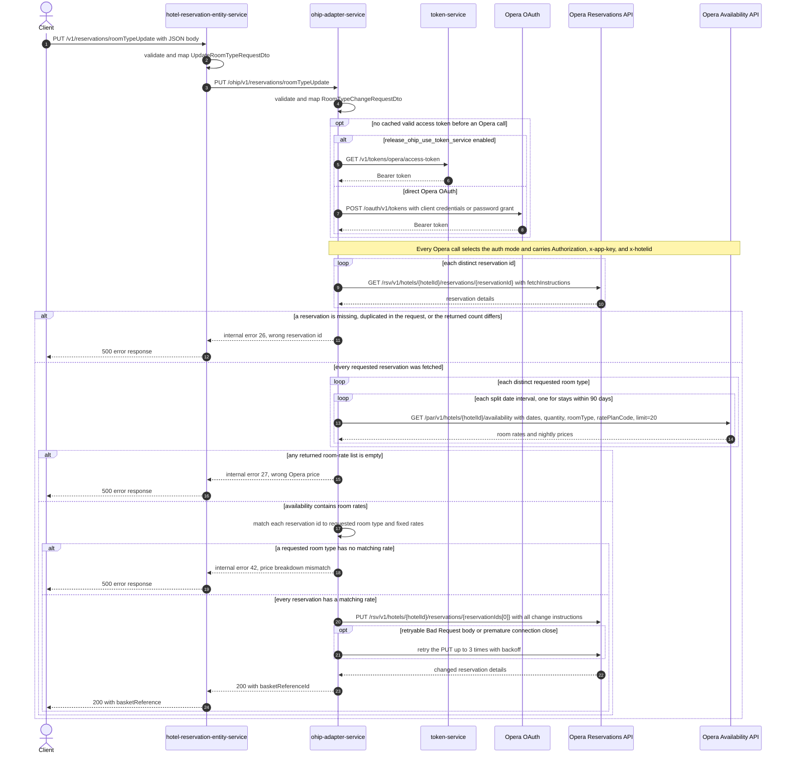

# Hotel Reservation Entity Service: updateRoomType Flow

Changes the room type and fixed nightly rates for the Opera reservations named in the request, then returns the caller's basket reference.

```http
PUT /v1/reservations/roomTypeUpdate
Host: hotel-reservation-entity-service:9103
Content-Type: application/json
```

The service has no servlet context path, the controller is mapped under `/v1`, and this method has no authentication or API-key annotation. The service security configuration permits the request without an authorization header.

## Flow

`HotelReservationController.updateRoomType` validates the JSON body and maps it field-for-field to `UpdateRequest`. `HotelReservationInPortImpl` delegates without additional validation, basket lookup, cache access, or feature-flag logic. The OHIP out-port maps the request to `RoomTypeChangeRequestDto` and calls `ohip-adapter-service` at `PUT /ohip/v1/reservations/roomTypeUpdate`.

OHIP validates and maps the same fields to `RatePlanRoomTypeChangeRequest`. It reads every distinct requested reservation from Opera, failing if the number returned does not equal the original request list size. It then groups the requested `roomTypes` by code. For each distinct room type it requests Opera availability for the requested stay, rate code, and number of rooms; stays beyond Opera's configured 90-day request window are split into overlapping date intervals and those interval calls run asynchronously.

OHIP matches each fetched reservation to its requested room type by reservation-id position, copies the matching availability rates into a fixed-rate change instruction, and uses configured market code `OTH` plus the reservation's existing source code. It sends one Opera change-reservation PUT addressed by `reservationIds[0]`; the body contains the change instructions for all fetched reservations. OHIP answers with `basketReferenceId`. hotel-reservation-entity-service ignores that downstream value and returns `200 OK` with `basketReference` copied from its original request.

## Mermaid Flow



## Features

- Direct request-local targeting: no basket-service lookup or basket mutation
- Multi-reservation change body sent through one Opera PUT addressed by the first reservation id
- Distinct reservation-id reads before mutation, with a strict returned-count check
- Availability lookup once per distinct requested room type, using that type's requested quantity
- Insufficient Opera capacity appears as an empty room-rate list and stops the update
- Automatic splitting and merging of stays longer than Opera's configured availability window
- Fixed-rate instructions built from Opera nightly prices, market code `OTH`, and each reservation's existing source code
- Permit-all public endpoint with no request token validation
- No endpoint-specific cache

## Feature Flags

| Flag | Effect when enabled |
| --- | --- |
| `release_ohip_use_token_service` | Selects token-service (`GET /v1/tokens/opera/access-token`) for Bearer credentials on Opera calls instead of direct Opera OAuth. The authorized client is cached until expiry. |
| `release_ohip_use_token_refresh_skew` | In direct Opera OAuth mode, refreshes a cached access token early using the configured 15-minute clock skew. It does not change room-type business logic. |

## Request

All fields are in the JSON body:

| Field | Required | Effect |
| --- | --- | --- |
| `basketReferenceId` | Yes, non-empty | Returned as `basketReference`; also identifies the request in the wrong-reservation error message. No basket is read. |
| `reservationIds` | Yes, non-empty | Opera reservations to read. The first element addresses the final PUT, while all fetched reservations are included in its body. |
| `hotelId` | Yes, non-empty | Substituted into every Opera path and sent as `x-hotelid`. |
| `rateCode` | Yes, non-empty | Sent as availability query parameter `ratePlanCode`. |
| `roomTypes` | Yes, non-empty | Positionally assigns a target type to each reservation; duplicate type codes are grouped and their counts become `roomStayQuantity`. |
| `startDate` | Yes, non-empty | Availability `roomStayStartDate`; parsed as `yyyy-MM-dd`. |
| `endDate` | Yes, non-empty | Availability `roomStayEndDate`; parsed as `yyyy-MM-dd`. |
| `currency` | Yes, non-empty | Mapped through both services but not read while building availability or the Opera change request. |
| `adultsNumber` | Yes, non-empty | Mapped through both services but not read by this runtime path. |
| `childrenNumber` | Yes, non-empty at the public endpoint | Mapped through both services but not read by this runtime path. |

The controller validates non-emptiness but does not validate equal list lengths. `reservationIds` and `roomTypes` must align positionally for the mapper to select a target room type for each fetched reservation.

## Branches

| Trigger | Behavior |
| --- | --- |
| Missing, null, or empty required body field | Bean validation stops the public request before any downstream call and the shared handler returns `422 Unprocessable Content`. |
| Duplicate reservation id | `Set.copyOf(reservationIds)` deduplicates the Opera GET fan-out, then the returned-count check fails because it compares against the original list size; OHIP raises internal error `26`. |
| Missing Opera reservation or returned-count mismatch | Stops before availability and raises internal error `26` (`DIGITAL_WRONG_RESERVATION_ID`). |
| Stay exceeds the configured availability request window | Splits it into intervals using `maxRequestedDays=90`; later intervals start one day before their split boundary, calls run on the API-limits executor, and their rates are merged. |
| Opera availability responds 4xx | OHIP maps it to bad-request error `913`; hotel-reservation-entity-service deserializes any OHIP error as `HotelReservationOhipException`, so the public boundary returns it as an internal error. |
| Opera reservation GET or non-4xx availability failure | Stops the flow with internal error `960` or `913`, respectively. GET requests retry only premature connection closes, up to three retries with backoff. |
| Opera cannot satisfy a grouped room quantity and returns no room rates | Stops before the change PUT with internal error `27` (`DIGITAL_WRONG_OPERA_PRICE`). |
| Any returned room-rate list is null or empty | Stops before the change PUT with internal error `27` (`DIGITAL_WRONG_OPERA_PRICE`). A structurally empty top-level availability list instead fails at the adapter's first-element access and reaches the generic internal-error handler. |
| No availability rate matches a reservation's requested room type | Stops before the change PUT with internal error `42` (`DIGITAL_MATCH_PRICE_BREAKDOWN_EXCEPTION`). |
| Final Opera PUT returns an error body whose `type` is `Bad Request`, or the connection closes prematurely | Retries up to three times with a three-second minimum backoff; exhaustion raises internal error `971`. Other PUT errors fail immediately as error `958`. |
| Access token is cached and valid | Reuses it and skips both token-service and direct Opera OAuth calls. |
| Token-service flag disabled | Uses direct Opera OAuth; `ENABLE_CLIENT_CREDENTIALS` selects client-credentials grant when true and password grant when false. |
