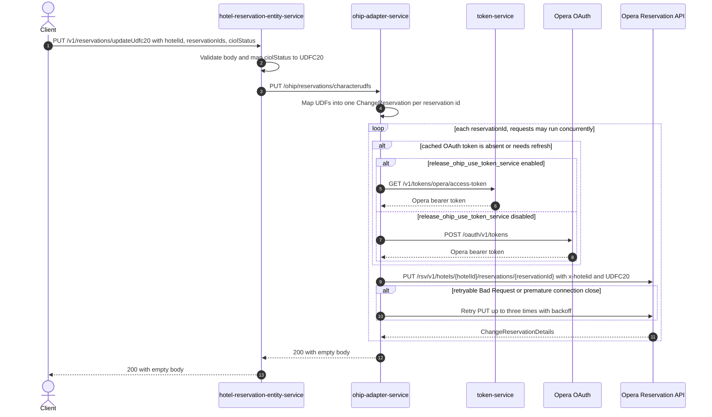

# Hotel Reservation Entity Service: updateUdfc20 Flow

Updates Opera character UDF `UDFC20` to the requested CIOL status for every reservation id in the request.

```http
PUT /v1/reservations/updateUdfc20
Host: hotel-reservation-entity-service:9103
Content-Type: application/json
Accept: application/json
```

The service has no servlet context path. `ManageBookingController` is mapped under `/v1`, and
`updateUdfc20` adds `/reservations/updateUdfc20`. The endpoint has no method-level authorization
rule, while the service security configuration permits all requests.

## Flow

`ManageBookingController.updateUdfc20` validates `UdfsRequestDto`, then `UdfsDomainMapper`
replaces `ciolStatus` with a one-element UDF list containing `UDFC20` and the enum name. The
controller calls `ManageBookingInPortImpl.updateUdfc20`, which delegates unchanged through
`HotelReservationOhipOutPortImpl` to `OhipAdapterClient`.

The client sends one `PUT /ohip/reservations/characterudfs` to ohip-adapter-service. Its
`UdfsController.updateCharacterUdfs` maps the body and delegates through `UdfsInImpl` to
`UdfsOutPortImpl`. The out-port iterates the reservation-id set with a Reactor `Flux`; for each id
it maps the UDF list into an Opera `ChangeReservation` and sends
`PUT /rsv/v1/hotels/{hotelId}/reservations/{reservationId}`. Those per-reservation requests may run
concurrently, and the adapter waits for all of them by collecting and blocking before returning.

The Opera client adds `x-hotelid`, `x-app-key`, and an OAuth bearer token. A still-valid authorized
client token is reused. Otherwise the OAuth filter obtains a token from token-service when
`release_ohip_use_token_service` is enabled, or directly from Opera when it is disabled. There are
no reads and no business-data cache on this flow.

Both controllers declare a `204` OpenAPI response but neither sets `@ResponseStatus`; their Java
`void` methods therefore complete as HTTP `200` with an empty body on the runtime happy path. This
contract defect is tracked in
[`bug/update-udfc20-success-response-status-200.md`](../../bug/update-udfc20-success-response-status-200.md).

## Mermaid Flow



## Features

- Accepts one or more reservation ids and applies the same CIOL status to every one.
- Always writes character UDF name `UDFC20`; callers cannot select a different UDF name.
- Maps `ciolStatus` with `Enum.name()`, preserving one of `CIOL_STARTED`, `WALLET_PASS`,
  `DK_ISSUED`, or `CIOL_COMPLETED` exactly.
- Makes no reservation read before writing and performs no rollback. If one concurrent Opera write
  fails, other reservation writes may already have completed.
- Adds the Opera hotel header from the request's `hotelId`; Opera authentication is handled by the
  shared ohip-adapter WebClient.
- Retries an Opera write up to three times after the initial attempt for an Opera error body whose
  `type` is `Bad Request`, or for a premature connection close. Other non-2xx responses are not
  retried by this method.

## Feature Flags

| Flag | Effect when enabled |
| --- | --- |
| `release_ohip_use_token_service` | Selects token-service `GET /v1/tokens/opera/access-token` as the source of the Opera bearer token. When disabled, ohip-adapter obtains the token from Opera OAuth directly. A valid cached token avoids either call. |
| `release_ohip_use_token_refresh_skew` | At ohip-adapter startup, configures the direct Opera OAuth providers to refresh tokens using `config.service.ohip.tokenRefreshClockSkew` minutes of clock skew. It does not change the reservation payload or call fan-out. |

No hotel-reservation or UDF business behavior is feature-gated.

## Request

| Body field | Required | Purpose |
| --- | --- | --- |
| `reservationIds` | Yes (`@NotEmpty`) | Set of Opera reservation ids. The adapter issues one Opera PUT per distinct id. |
| `hotelId` | Yes (`@NotNull`) | Substituted into every Opera path and sent as the `x-hotelid` header. An empty string is not rejected by this DTO constraint. |
| `ciolStatus` | Yes (`@NotNull`) | Enum value mapped to the value of character UDF `UDFC20`. Unknown enum text is rejected during JSON deserialization. |

## Branches

| Trigger | Behavior |
| --- | --- |
| A required field is null, or `reservationIds` is empty | Bean validation returns `422 Unprocessable Content` before calling ohip-adapter-service. |
| The JSON is malformed or `ciolStatus` is not a known enum value | Deserialization fails before the controller and returns `400 Bad Request`. |
| OAuth token is still valid | The cached authorized client is reused and no token HTTP call is made. |
| OAuth token is absent or requires refresh | The configured token source is called before the Opera reservation PUT. |
| Opera returns a retryable `Bad Request` body or the connection closes prematurely | The same reservation PUT is retried with a three-second exponential backoff, up to three retries after the initial request. Exhaustion raises `OHIP_RETRIES_EXHAUSTED_EXCEPTION`. |
| Opera returns another error | ohip-adapter raises `OHIP_CHANGE_RESERVATION_EXCEPTION` without that retry path. The error propagates through the adapter call and hotel-reservation-entity-service. |
| Any per-reservation update fails | The collected operation fails as a whole, but already-completed concurrent writes are not rolled back. |
