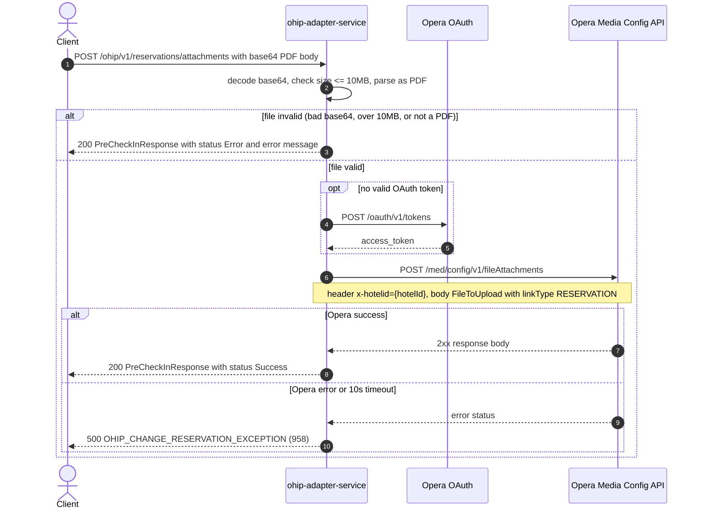

# OHIP Adapter Service: addAttachmentToReservation Flow

Uploads a base64-encoded PDF (a registration card) as a file attachment linked to an Opera reservation.

```http
POST /ohip/v1/reservations/attachments
Host: ohip-adapter-service:9100
Content-Type: application/json
Accept: application/json
```

The servlet context path is `/ohip/` and the reservation controller is mapped under `/v1`, so the public path is `/ohip/v1/reservations/attachments`. The endpoint itself requires no caller authentication; Opera calls use the service OAuth client when no valid token is present.

## Flow

ohip-adapter-service decodes the `fileAttachment` field from base64 and validates it locally: it must decode to a non-empty byte array, be at most 10MB, and parse as a valid PDF (loaded with PDFBox). Any of these three failures short-circuits with a 200 response whose body carries `status=Error` and the specific error message, without calling Opera.

When the file passes validation, the service builds an Opera `FileToUpload` payload (`linkType=RESERVATION`, `linkId=reservationId`, `globalYN`/`overwriteExistingFileYN` mapped from the booleans, `userName` from the configured OHIP username) and posts it to the Opera media-config file-attachments API. Any response body from Opera is treated as success; the caller gets a 200 `PreCheckInResponse` with `status=Success` and message "Attachment added successfully". An Opera error status or a 10s timeout maps to a 500 (`OHIP_CHANGE_RESERVATION_EXCEPTION`, code 958).

## Mermaid Flow



## Features

- Attaches a PDF file to an Opera reservation via the Opera media-config file-attachments API
- Local file validation before any Opera call: base64 decode, 10MB size cap, PDF magic check via PDFBox
- Validation failures are soft: HTTP 200 with `status=Error` and a message, no Opera call
- Optional `global` and `overwriteExistingFile` booleans mapped to Opera `Y`/`N` fields
- Opera call has a 10-second timeout mapped to a 500 error
- No caller authentication on the public endpoint

## Feature Flags

No endpoint-specific flag gates this flow. The shared Opera authentication flags apply:

| Flag | Effect when enabled |
| --- | --- |
| `release_ohip_use_token_service` | Global OAuth mode for Opera token acquisition (infrastructure flag, evaluated outside request context) |
| `release_ohip_use_token_refresh_skew` | Applies the configured early-refresh clock skew to directly acquired Opera OAuth tokens. |

## Request

JSON body (`ReservationFileAttachmentRequestDto`):

| Field | Required | Purpose |
| --- | --- | --- |
| `fileName` | Yes | Attachment file name, e.g. `REG_RES1234567_ID232323_P76767676.pdf` |
| `reservationId` | Yes | Opera reservation id the file is linked to (`linkId`) |
| `hotelId` | Yes | Opera hotel id, sent as `x-hotelid` header on the Opera call |
| `fileAttachment` | Yes | Base64-encoded PDF content |
| `description` | No | Attachment description |
| `global` | No | Mapped to Opera `globalYN` (`Y`/`N`, default `N`) |
| `overwriteExistingFile` | No | Mapped to Opera `overwriteExistingFileYN` (`Y`/`N`, default `N`) |

## Branches

| Trigger | Behavior |
| --- | --- |
| `fileAttachment` not valid base64 | 200 with `status=Error`, "File attachment is not a valid base64 string", no Opera call |
| Decoded file over 10MB | 200 with `status=Error`, "File size exceeds the maximum limit of 10MB", no Opera call |
| File not a parseable PDF | 200 with `status=Error`, "File is not a valid PDF", no Opera call |
| Opera error status | 500 `OHIP_CHANGE_RESERVATION_EXCEPTION` (958) |
| Opera call exceeds 10s | 500 `OHIP_CHANGE_RESERVATION_EXCEPTION` (958), timeout message |
