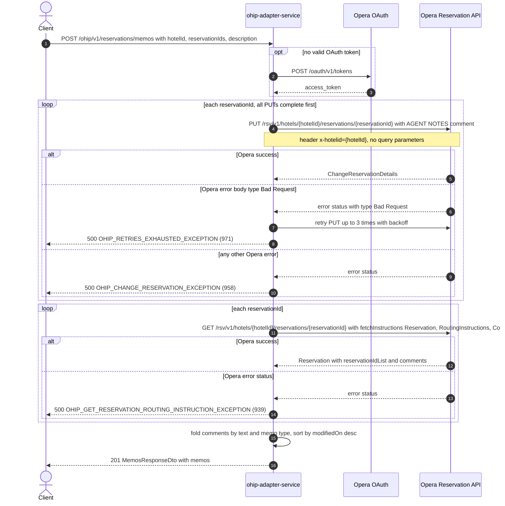

# OHIP Adapter Service: createMemo Flow

Adds one agent-notes memo (an Opera reservation comment) to each of the given reservations at
a hotel, then re-reads those reservations and returns the memos they now hold.

```http
POST /ohip/v1/reservations/memos
Host: ohip-adapter-service:9100
Content-Type: application/json
Accept: application/json

{"hotelId": "HEAPTI", "reservationIds": ["6007060"], "description": "Late arrival expected"}
```

The servlet context path is `/ohip/` and the reservation controller is mapped under `/v1`, so
the public path is `/ohip/v1/reservations/memos`. `POST` creates memos, `GET` on the same path
reads them (see `GetReservationMemos.md`). The service performs no inbound authentication
(Spring Security auto-configuration is excluded on `OhipAdapterServiceApplication`); Opera
calls use the service OAuth client when no valid token is present.

## Flow

`HotelReservationController.createMemo` binds `CreateMemoRequestDto` (`hotelId`,
`reservationIds`, `description`, all Bean-Validated), maps it to `CreateMemoRequest` and calls
the in-port. `HotelReservationInPortImpl.createMemo` is a pure delegate - it logs and forwards
to the out-port with no validation, business rule, or feature-flag check.

`HotelReservationOutPortImpl.createMemo` runs **two sequential fan-outs over the same
reservation ids, write first**:

1. For each reservation id it calls
   `OhipReservationClient.sendChangeReservationRequest(hotelId, reservationId, changeReservation)`:
   a `PUT` to the Opera reservation API at
   `/rsv/v1/hotels/{hotelId}/reservations/{reservationId}` with **no query parameters**,
   `Content-Type: application/json` and the header `x-hotelid`. The body is built by
   `MemosOhipMapper.toDto`: one `reservations` entry carrying `reservationIdList` with the
   `Reservation`-typed id, and one `comments` entry whose `comment` has
   `commentTitle = "AGENT NOTES"`, `type = "RESERVATION"`,
   `notificationLocation = "RESERVATION"` and `text.value = description`. Nothing else on the
   reservation is sent. This whole `Flux` is collected and blocked on before step 2 starts, so
   **every PUT happens before any GET** - there is no read-modify-write; the memo text comes
   straight from the request.
2. For each reservation id it then calls
   `OhipReservationClient.getReservationWithRoutingInstructions(hotelId, reservationId)`: a
   blocking `GET` against `/rsv/v1/hotels/{hotelId}/reservations/{reservationId}` with the query
   parameter `fetchInstructions` repeated three times - `Reservation`, `RoutingInstructions`,
   `Comments` - and the header `x-hotelid`. Neither leg is cached.

`MemosOhipMapper.toModel` folds the re-read reservations into the response exactly as the `GET`
endpoint does: for each reservation it reads `reservations.reservation[0].comments`, keys them by
the `Reservation`-typed entry of `reservations.reservation[0].reservationIdList`, and collapses
comments sharing (`comment.text.value`, memo type) into one `Memo` whose `ids` carry the comment
ids per reservation. Memo type comes from `comment.commentTitle` via `MemoUtils.getMemoType`
(`AGENT NOTES` -> `AGENT`, `BUSINESS NOTES` or `SPECIAL NOTES` -> `SYSTEM`, anything else ->
`OPERA`). `createdOn`/`createdBy` take the earliest `comment.createDateTime`/`creatorId` and
`modifiedOn`/`modifiedBy` the latest `comment.lastModifyDateTime`/`lastModifierId`, formatted
with the literal pattern `yyyy-MM-dd HH:mm:SS` (`MemosOhipMapper.COMMENT_DATE_PATTERN`) —
**deliberately transcribed with uppercase `SS`, not a doc typo**: commons-lang treats `SS`
as two-digit milliseconds, so seconds are dropped from memo dates (see
`bug/memo-date-format-drops-seconds.md`); memos are sorted by `modifiedOn` descending. The controller answers
`201 Created` with a `MemosResponseDto` (`{"memos": [...]}`).

Because the response is built from the re-read, the newly written memo appears only if the
re-read reports it - the endpoint returns Opera's post-write memo state, not an echo of the
request.

Error mapping: an Opera error status on the PUT goes through `WebClientUtils.getOnStatusException`.
If the error body is a JSON object whose `type` is `Bad Request`, the client raises
`OhipBadRequestRetryException` and the shared retry spec retries the PUT 3 more times with 3s
minimum exponential backoff, finally failing with `OHIP_RETRIES_EXHAUSTED_EXCEPTION`
(errCode 971, HTTP 500). Any other error body maps immediately to
`OHIP_CHANGE_RESERVATION_EXCEPTION` (errCode 958, HTTP 500). An Opera error status on the
re-read maps to `OHIP_GET_RESERVATION_ROUTING_INSTRUCTION_EXCEPTION` (errCode 939, HTTP 500).

## Mermaid Flow



## Features

- Batch write: `reservationIds` is a list, one Opera reservation PUT per id, then one Opera
  reservation GET per id. Two Opera calls per reservation id in total.
- Write-then-read, never read-then-write: the PUT body is composed only from the request, so no
  reservation read precedes it.
- The memo written is always an agent note: `commentTitle = "AGENT NOTES"`,
  `type = "RESERVATION"`, `notificationLocation = "RESERVATION"`, text = `description`. There is
  no way to request another memo type through this endpoint, so a memo created here classifies
  as `AGENT` when read back.
- The PUT carries only the reservation id list and the new comment; existing comments are not
  resent, and no other reservation field is touched.
- The response is the post-write memo state of every requested reservation, folded and sorted
  exactly like the `GET` endpoint: identical (description, memo type) pairs collapse across
  reservations, `ids` carries one entry per reservation, order is `modifiedOn` descending.
- Success status is `201 Created`.
- No inbound authentication on the public endpoint; outbound Opera calls carry a bearer token
  obtained from Opera OAuth when none is cached.
- No caching on either leg: every request hits Opera twice per reservation id.
- Only the PUT leg retries (shared retry spec, `Bad Request`-typed error bodies only); the
  re-read has no retry spec.

## Feature Flags

None. This endpoint does not gate behavior on feature flags - the controller, the in-port
(`HotelReservationInPortImpl.createMemo`), the out-port
(`HotelReservationOutPortImpl.createMemo`), both client methods
(`sendChangeReservationRequest`, `getReservationWithRoutingInstructions`) and both mapper
methods contain no `unleashWrapper` checks. Only the global Opera token-acquisition flags
(`release_ohip_use_token_service`, `release_ohip_use_token_refresh_skew`, evaluated in
`WebClientAuthConfig`) touch the path, and they are infrastructure flags evaluated outside the
request context.

## Request

| Body field | Required | Purpose |
| --- | --- | --- |
| `hotelId` | Yes (`@NotBlank`) | Opera hotel id used in both downstream paths and the `x-hotelid` header. |
| `reservationIds` | Yes (`@NotEmpty`) | Reservation ids; one Opera PUT and one Opera GET per id, in list order. |
| `description` | Yes (`@NotBlank`) | Memo text, sent as the comment's `text.value` and returned as the memo `description`. |

No path or query parameters. The response is `201 Created` with
`{"memos": [{ "ids": [{"reservationId", "memoIds"}], "description", "createdOn", "createdBy", "modifiedOn", "modifiedBy", "memoType" }]}`.

## Branches

- **Reservation whose re-read reports no comments:** the mapper skips it, so it contributes no
  memos; with no commented reservation in the set the response is `201` with an empty `memos`
  array - even though the PUT succeeded.
- **Reservation whose `reservationIdList` has no `Reservation`-typed entry:** its comments are
  dropped silently, because the mapper only records comments it can key to a reservation id.
- **Opera error status on any PUT:** the whole request fails before any re-read happens - `500`
  with errCode `958`, or `971` after the retry window when the error body's `type` is
  `Bad Request`. No GET leg is reached.
- **Opera error status on any re-read:** the whole request fails with errCode `939` (HTTP 500);
  the memos were already written.
- **Empty Opera 200 body on the re-read:** the client decodes nothing, `Mono.just(null)` throws
  inside the flux, and the request fails with a 500 - there is no reservation-not-found branch
  on this endpoint.
- **Re-read reporting an empty `reservations.reservation` list:** the mapper indexes `get(0)`
  unguarded, so the request fails with a 500.
- **Comment without audit fields:** the mapper formats `comment.createDateTime` and
  `comment.lastModifyDateTime` with no null guard, so a re-read comment missing either date
  raises an NPE (500). Real Opera always sends them.
- **Non-JSON-object Opera error body on the PUT:** `getOnStatusException` casts the decoded body
  to a map, so a non-object error body raises a `ClassCastException` (500) instead of the mapped
  958.
