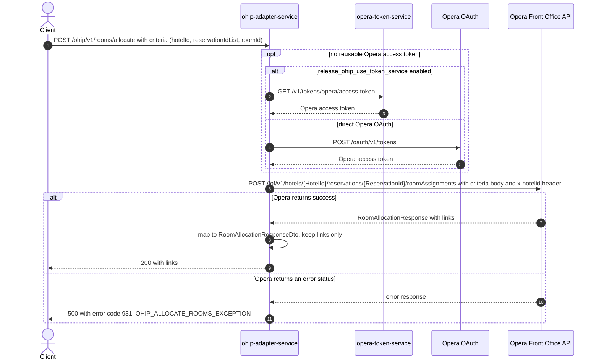

# OHIP Adapter Service: allocateRooms Flow

Assigns a specific Opera room to a reservation (kiosk room allocation) by posting a room
assignment to the Opera Front Office API.

```http
POST /ohip/v1/rooms/allocate
Host: ohip-adapter-service:9100
Content-Type: application/json
Accept: application/json
```

The servlet context path is `/ohip/`. The endpoint itself requires no inbound
authentication; the outbound Opera request carries an OAuth bearer token, the configured
`x-app-key`, and the requested hotel id in the `x-hotelid` header.

## Flow

The controller accepts a JSON body whose single `criteria` object carries the hotel id,
the reservation id list, the room id, and two booleans (`updateRoomTypeCharged`,
`roomNumberLocked`). The body is mapped to the domain `RoomAllocationRequest` and passed
straight through the room-allocation domain port; there is no business logic in between.

The out-port implementation makes one Opera Front Office API request,
`POST /fof/v1/hotels/{HotelId}/reservations/{ReservationId}/roomAssignments`, where
`{HotelId}` is `criteria.hotelId` and `{ReservationId}` is the id of the **first** entry
in `criteria.reservationIdList`. The entire domain `RoomAllocationRequest` (the
`criteria` wrapper included) is serialized as the Opera request body. Opera's success
response is mapped to a response DTO exposing only `links` (each with `href`, `rel`,
`templated`, `method`, `operationId`).

Every Opera request reuses a valid OAuth token when one is available. Otherwise,
authentication obtains a token either from `opera-token-service` or directly from Opera
OAuth according to `release_ohip_use_token_service`.

Any Opera error status is mapped to a `RoomAllocationException`
(`OHIP_ALLOCATE_ROOMS_EXCEPTION`, code 931), which the shared business exception handler
returns as HTTP 500.

## Mermaid Flow



## Features

- Allocates one room to one reservation per call; only the first entry of
  `criteria.reservationIdList` is used to build the Opera path.
- No inbound authentication or authorization on the endpoint.
- The request body is passed through to Opera essentially unchanged (mapped
  DTO-to-domain field by field), and the response exposes only Opera's `links` array.
- `criteria.reservationIdList` is the only Bean-Validation-required field (`@NotNull`);
  an empty (non-null) list is not rejected by validation and would fail at path
  construction inside the Opera client.

## Feature Flags

| Flag | Effect when enabled |
| --- | --- |
| `release_ohip_use_token_service` | Opera access tokens are fetched from `opera-token-service` instead of directly from Opera OAuth. Infrastructure-level flag on the shared `ohipWebClient`, evaluated outside the request context. |
| `release_ohip_use_token_refresh_skew` | Applies the configured early-refresh clock skew to directly acquired Opera OAuth tokens. |

No other flag gates this endpoint's behavior.

## Request

Body (`application/json`):

| Field | Required | Effect |
| --- | --- | --- |
| `criteria.hotelId` | effectively yes | Opera `{HotelId}` path segment and `x-hotelid` header value. |
| `criteria.reservationIdList` | yes (`@NotNull`) | List of `{type, id}` objects; the first entry's `id` becomes the Opera `{ReservationId}` path segment. The whole list is also sent in the Opera body. |
| `criteria.roomId` | effectively yes | Room to assign; sent in the Opera body (and used in error logging). |
| `criteria.updateRoomTypeCharged` | no (defaults false) | Passed through in the Opera body. |
| `criteria.roomNumberLocked` | no (defaults false) | Passed through in the Opera body. |
