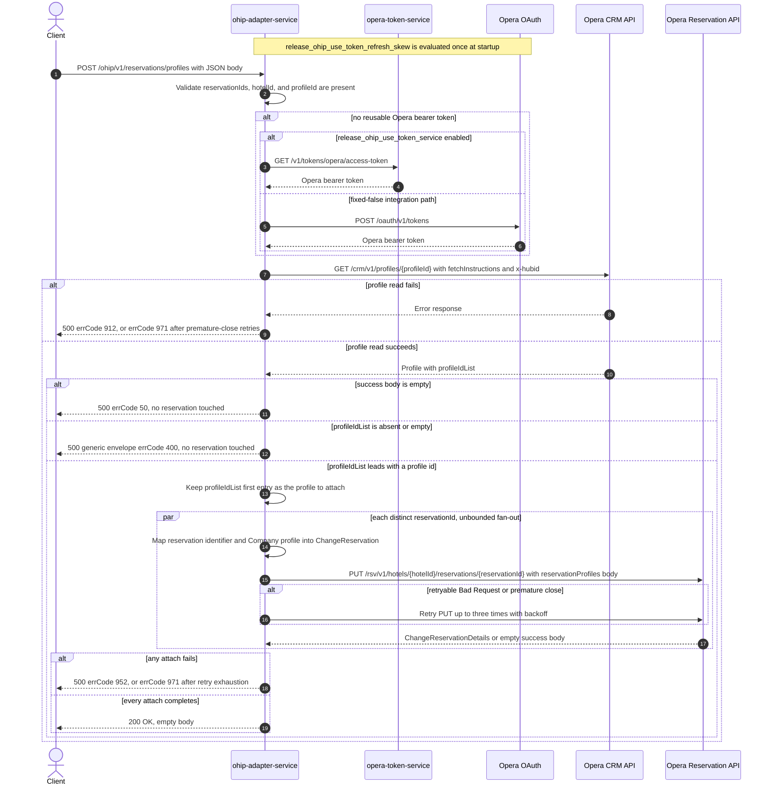

# OHIP Adapter Service: attachProfileToReservations Flow

Reads one Opera CRM profile by id and then attaches it as the `Company` reservation profile to
every distinct reservation id supplied for one hotel.

```http
POST /ohip/v1/reservations/profiles
Host: ohip-adapter-service:9100
Content-Type: application/json
```

The servlet context path is `/ohip/` and `HotelReservationController` is mapped under `/v1`, so
the effective public route is `/ohip/v1/reservations/profiles`. The controller has no
endpoint-level authentication guard. Outbound Opera requests carry a bearer token and `x-app-key`;
the profile read additionally carries `x-hubid` and the reservation writes carry `x-hotelid`.
Success is `200 OK` with an empty body: the handler is declared `ResponseEntity<Void>` and returns
`new ResponseEntity<>(HttpStatus.OK)`, which matches the `200` declared by the checked-in OpenAPI
operation `attachProfileToReservations`. Despite `produces = application/json`, no response body
is ever written.

## Flow

`HotelReservationController.attachProfileToReservations` Bean-validates
`AttachReservationProfileRequestDto` (`@NotNull` on `reservationIds`, `hotelId`, and `profileId`)
and maps it through `AttachReservationProfileRequestMapper.toModel`. **Corrected 2026-09-01
(live-verified):** the domain type's Lombok `@Builder.build()` delegates to the explicit
all-args constructor, which calls `validateSelf()`, so the `@NotEmpty` self-validation DOES run
on this path — an empty `reservationIds` array is rejected with HTTP 422
(`reservationIds: must not be empty`, envelope errCode 404) before any Opera call, and blank
`hotelId`/`profileId` fail the same self-validation. These rejections are routine input
validation, never journey scenarios. `HotelReservationInPortImpl` only
delegates to `HotelReservationOutPortImpl.attachProfileToReservations`; it adds no business guard,
read, cache, logging decision, or endpoint-specific feature-flag evaluation.

The out-port performs the profile read first and only once, regardless of how many reservation
ids were supplied. `getCompanyProfileById` calls
`OhipReservationClient.sendGetProfilesByProfileIds` with the single request `profileId`, which
issues `GET /crm/v1/profiles/{profileId}` to the Opera CRM API with
`fetchInstructions=Profile&fetchInstructions=Address&fetchInstructions=Communication&fetchInstructions=Correspondence&fetchInstructions=FutureReservation&fetchInstructions=HistoryReservation`
and the `x-hubid` header taken from `config.service.ohip.hubId`. No `x-hotelid` is sent on this
read. The response is narrowed by `CompanyProfileOhipMapper.toModel`, which keeps nothing but the
first entry of Opera's `profileIdList` as `ProfileType.profileId`. Nothing verifies that the
profile Opera returned is actually a company profile, and nothing compares Opera's returned
profile id with the requested one — the attach body uses **Opera's** returned id, so a CRM record
whose `profileIdList` leads with a different id attaches that other id.

If the mapped profile is null the out-port throws `HotelReservationException`
`DIGITAL_ATTACH_PROFILE_EXCEPTION`, so the request fails with HTTP 500 and errCode `50` before any
reservation is touched. That guard is reachable only when Opera answers the read with a 2xx and a
zero-length body: `bodyToMono(Profile.class)` then completes empty, `collectList` yields an empty
list, `findFirst` is empty, and the MapStruct null-input contract returns null. An Opera 2xx whose
body is present but carries no `profileIdList`, or carries an empty `profileIdList`, does not
reach that guard — the mapper dereferences `profile.getProfileIdList()` and the out-port
dereferences `company.getProfileId()`, so those two shapes fail with an unmapped
`NullPointerException` instead, surfacing as HTTP 500 with the generic envelope whose `errCode` is
the literal `400`.

With a profile id in hand, the out-port iterates the request's `Set<String> reservationIds`. For
each distinct id, `AttachReservationProfileRequestOhipMapper.toDto` builds a separate
`ChangeReservation` body containing exactly one reservation instruction. That instruction carries
a `reservationIdList` of one `UniqueIDType` with type `Reservation` and the reservation id, and a
`reservationProfiles.reservationProfile` collection of one entry whose `profileIdList` holds a
single `UniqueIDType` with type `Profile` and Opera's profile id, and whose
`reservationProfileType` is the `Company` wire value. The body carries no `hotelId`, no guest
data, and no other reservation field: the hotel appears only in the URL and the `x-hotelid`
header.

Each body is sent to the Opera Reservation API as
`PUT /rsv/v1/hotels/{hotelId}/reservations/{reservationId}` through
`OhipReservationClient.sendPutReservationsGuestRequest` — the same client method the reservation
alerts route uses, not the change-reservation method most other reservation mutations call.
`Flux.flatMap` is called with no concurrency argument, so Reactor's default applies and every
distinct-id PUT may be in flight at once; dispatch follows the `LinkedHashSet` insertion order the
request JSON produced, but completion order is not contractual. `collectList().block()` waits for
the whole fan-out before the controller returns. The `ChangeReservationDetails` response bodies
are never inspected, so an Opera success with an empty body is accepted and the public response is
`200` either way. There is no read of the reservation before the write, no compensating action,
and no rollback.

The shared Opera WebClient reuses a valid OAuth client token when available. Otherwise
`release_ohip_use_token_service` selects `opera-token-service` or direct Opera OAuth as the token
source. The integration workflow fixes that flag false, so its supported path is direct Opera
OAuth, using client credentials when `ENABLE_CLIENT_CREDENTIALS=true` and the password grant
otherwise.

Error mapping differs between the two legs. A failed profile read maps to HTTP 500 with errCode
`912` (`OHIP_GET_PROFILES_EXCEPTION`); that client method declares no retry spec of its own, so a
non-2xx status fails on the first response, while the shared WebClient filter that retries a
`PrematureCloseException` applies to it because it is a `GET` (exhaustion there raises
`RetriesExhaustedException`, errCode `971`). A failed reservation PUT maps to HTTP 500 with errCode
`952` (`OHIP_PUT_RESERVATIONS_GUEST_EXCEPTION`); an Opera error envelope whose `type` is
`Bad Request` is retried up to three times with backoff and exhaustion maps to errCode `971`. The
shared premature-close filter does not cover the PUT because that filter is `GET`-only, but the
client-level retry spec still retries a `PrematureCloseException` for it. Because the PUT fan-out
is unbounded, a terminal failure on one id races the PUTs already dispatched for the other ids,
and any Opera writes that already landed are not undone.

`sendPutReservationsGuestRequest` and `getCompanyProfileById` are both reused by other out-port
methods (pre-check-in, staying-guest updates, reservation alerts, CNP booker updates); none of
those callers is reachable through this public route.

## Mermaid Flow



## Features

- Bulk company-profile attach over a `Set`, so duplicate reservation ids collapse before execution
- Exactly one Opera CRM profile read per request, independent of the reservation count, and always
  before the first write
- One Opera change-reservation PUT per distinct reservation id
- A separately built body per id carrying the `Reservation`-typed reservation identifier and a
  single `Company` reservation profile; the hotel travels only in the URL and `x-hotelid`
- The attached profile id is the first entry of Opera's `profileIdList`, not necessarily the
  requested `profileId`
- No check that the read profile is a company profile, and no reservation read before the write
- Unbounded concurrent PUT fan-out, synchronously awaited at the public boundary
- Opera response bodies are never inspected, so an empty success body is accepted
- No cache on either Opera call, no downstream business collaborator other than Opera, and no
  rollback
- Shared Opera OAuth selection, `GET`-only premature-close retries, and selective three-retry
  handling on the PUT

## Feature Flags

No endpoint-specific business flag changes validation, mapping, the profile read, the fan-out, or
response shaping. The shared Opera authentication path evaluates these flags in
`ohip-adapter-service`:

| Flag | Effect when enabled | Evaluation and override reachability |
| --- | --- | --- |
| `release_ohip_use_token_service` | Selects `opera-token-service` (`GET /v1/tokens/opera/access-token`) instead of direct Opera OAuth when a bearer token is required. | Evaluated by the `ohipWebClient` filter for each outbound Opera request. The integration override wrapper can consult propagated baggage at this call site, but the integration environment fixes the flag false, so it is not an ON/OFF scenario axis. |
| `release_ohip_use_token_refresh_skew` | Applies `config.service.ohip.tokenRefreshClockSkew` to refresh directly acquired Opera OAuth tokens early. It does not change the profile read, the reservation PUT, or the public response. | Evaluated once while `WebClientAuthConfig.customAuthClientProvider` is constructed, so request baggage cannot pin it. The integration workflow treats it as fixed false. |

## Request

Body: `AttachReservationProfileRequestDto`. There are no path or query parameters.

| Field | Required | Effect |
| --- | --- | --- |
| `reservationIds` | yes, non-empty set (`@NotNull` on the DTO plus `@NotEmpty` domain self-validation; an empty array is rejected with HTTP 422 before any Opera call) | Each distinct value becomes one Opera PUT: the reservation-id path segment and the body's `reservations[0].reservationIdList[0].id` with type `Reservation`. Duplicate JSON values collapse during set deserialization. |
| `hotelId` | yes, non-blank (`@NotNull` DTO + `@NotEmpty` domain self-validation) | Supplies the Opera reservation path value and the `x-hotelid` header on every PUT. It is not sent on the profile read and does not appear in the PUT body |
| `profileId` | yes, non-blank (`@NotNull` DTO + `@NotEmpty` domain self-validation) | The `/crm/v1/profiles/{profileId}` path segment of the single profile read. It is not copied into the PUT body — the body uses the first id of Opera's `profileIdList` response |

**Corrected 2026-09-01 (live-verified):** the domain model's `@NotEmpty` constraints DO run —
Lombok's `@Builder.build()` delegates to the explicit all-args constructor, which calls
`validateSelf()`. An empty `reservationIds` was observed rejected with HTTP 422 and zero Opera
calls against the integration stack. These routine request-validation rejections stay in the
owning service's tests.

## Branches

| Trigger | Behavior |
| --- | --- |
| Duplicate ids in the JSON array | Deserialization into a `Set` collapses them, so each distinct id is attached once |
| Several distinct reservation ids | One profile read, then one PUT per id dispatched with no concurrency limit, so the PUTs may overlap in any order |
| `reservationIds` is an empty array | The profile read still happens and its failure branches still apply; no reservation PUT is sent and the response is `200 OK` |
| A valid OAuth client token is reusable | Skips both token-acquisition HTTP endpoints for that Opera call |
| No valid token and `release_ohip_use_token_service` is fixed false | Gets a token directly from configured Opera OAuth, using client credentials when `ENABLE_CLIENT_CREDENTIALS=true`, otherwise the password grant |
| Token acquisition fails | The affected Opera call is not sent and the public request fails |
| Profile read returns an error status | Returns HTTP 500 with errCode `912` immediately; the read has no status-based retry and no reservation PUT is sent |
| Profile read connection closes prematurely | The shared `GET`-only WebClient filter retries it with backoff; exhaustion returns HTTP 500 with errCode `971` |
| Profile read returns 2xx with a zero-length body | The mapped profile is null, so the request returns HTTP 500 with errCode `50` and no reservation PUT is sent |
| Profile read returns 2xx whose body has no `profileIdList`, or an empty one | Dereferencing fails with an unmapped `NullPointerException`: HTTP 500 with the generic envelope carrying the literal `400` in `errCode`, and no reservation PUT is sent |
| Profile read returns a `profileIdList` whose first entry is not the requested id | That first id is what gets attached; the requested `profileId` is used only as the read's path segment |
| Profile read returns a guest rather than a company profile | Nothing detects it; the id is attached with `reservationProfileType` `Company` anyway |
| Opera returns a successful PUT response with an empty body | The out-port does not inspect it and the request still returns `200 OK` |
| Opera returns a non-retryable PUT error | Returns HTTP 500 with errCode `952`; concurrently dispatched attaches for other ids may already have succeeded and are not rolled back |
| Opera PUT error body has `type=Bad Request`, or the PUT connection closes prematurely | Retries that PUT up to three times with backoff; exhaustion returns HTTP 500 with errCode `971` |

The controller annotations and checked-in OpenAPI also advertise HTTP 400 and 404. The 400 comes
from Bean Validation of the request body; this runtime path contains no endpoint-specific
not-found branch, so both Opera legs translate their failures to the HTTP 500 paths above.
