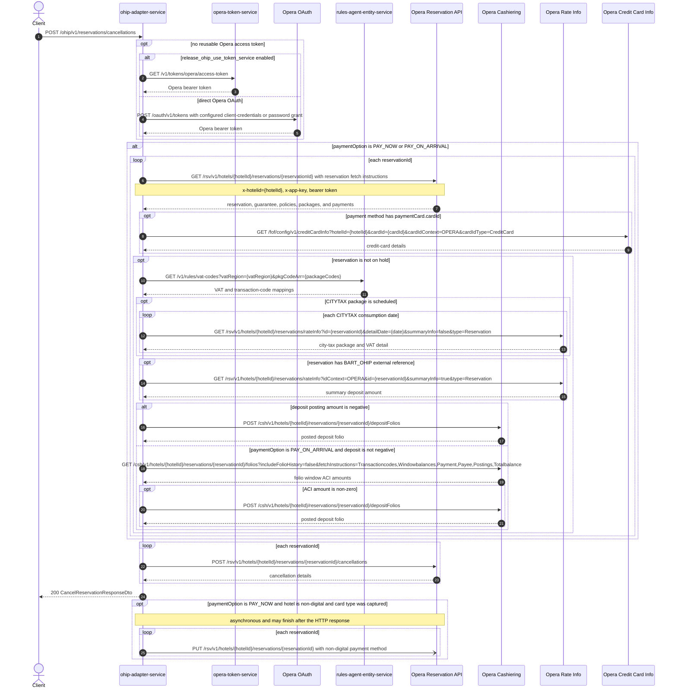

# OHIP Adapter Service: cancelReservation Flow

Cancels one or more Opera reservations at a hotel, posting Opera cancellations by id and, for `PAY_NOW` and `PAY_ON_ARRIVAL`, reversing deposits before the cancel.

```http
POST /ohip/v1/reservations/cancellations
Host: ohip-adapter-service:9100
Content-Type: application/json
Accept: application/json
```

The servlet context path is `/ohip/` and `HotelReservationController` is mapped under `/v1`, so the public path is `/ohip/v1/reservations/cancellations`. All Opera API calls carry a bearer token plus `x-app-key` and `x-hotelid` headers. A cached access token is reused until its refresh criteria require another direct Opera OAuth or token-service request.

## Flow

ohip-adapter-service maps the request body and, for the default/simple path (`paymentOption` absent, `RESERVE_WITHOUT_CARD`, or `ACCOUNT_COMPANY`), posts one Opera cancellation per requested reservation id. The Opera body uses reason code `CXL` and description `Trip Cancelled` unless `reservationOverrideReason` is supplied, in which case the code is `reasonCode` and the description is `reasonName, callerName, managerName`. The HTTP response collects Opera unique ids of type `Cancellation` and an empty `refundedDeposits` map.

`PAY_NOW` and `PAY_ON_ARRIVAL` load each reservation first, optionally reverse deposits, then take the same cancellation POST. Those payment branches, card lookup, and the post-cancel payment-method update are shown in the mermaid `alt`/`opt` blocks and in Branches.

## Mermaid Flow



## Features

- Cancels one or more reservation ids at a single hotel with one Opera cancellation POST per id.
- Uses Opera reason `CXL` / `Trip Cancelled` unless `reservationOverrideReason` is supplied.
- For `PAY_NOW` and `PAY_ON_ARRIVAL`, loads each reservation and posts a negative deposit folio when the computed deposit is negative.
- Resolves VAT and transaction codes from rules-agent-entity-service before building a deposit folio.
- Includes per-day city-tax VAT in that folio when the reservation has a scheduled `CITYTAX` package.
- For migrated reservations (`BART_OHIP` external reference), replaces deposit-policy `amountPaid` with Opera rate-info summary deposit.
- For `PAY_ON_ARRIVAL` with a non-negative deposit, reads cashiering folios and posts a deposit folio from a non-zero ACI amount.
- Loads Front Desk credit-card details only when a reservation payment method has `paymentCard.cardId`.
- After `PAY_NOW` cancel, can switch the reservation to a non-digital payment method asynchronously when the hotel matches `NON_DIGITAL_PAYMENT_HOTELS` (an empty list matches every hotel) and a card type was captured.
- Returns Opera cancellation ids and any refunded deposits keyed by reservation id.
- Acquires and caches an Opera bearer token, using either opera-token-service or the configured direct Opera OAuth grant.

## Feature Flags

| Flag | Effect when enabled |
| --- | --- |
| `release_ohip_use_token_service` | Obtains Opera bearer tokens from opera-token-service instead of authenticating directly with Opera OAuth. |
| `release_ohip_use_token_refresh_skew` | Applies the configured early-refresh clock skew to directly acquired Opera OAuth tokens. |

## Request

| Body field | Required | Purpose |
| --- | --- | --- |
| `hotelId` | Yes | Opera hotel id used in downstream paths and `x-hotelid`. |
| `reservationIds` | Yes | Opera reservation ids to cancel. Each id is processed independently. |
| `paymentOption` | No | One of `PAY_NOW`, `PAY_ON_ARRIVAL`, `RESERVE_WITHOUT_CARD`, or `ACCOUNT_COMPANY`. Only `PAY_NOW` and `PAY_ON_ARRIVAL` add deposit and card work. |
| `defaultPaymentMethod` | No | Payment method used when posting a cancellation deposit folio. |
| `digitalPaymentMethod` | No | Replaces the deposit-folio payment method when the hotel is treated as non-digital. |
| `reservationOverrideReason` | No | When present, `reasonCode`, `reasonName`, `callerName`, and `managerName` replace the default `CXL` / `Trip Cancelled` reason. |
| `chargesByReservationIds` | No | Optional extra deposit-folio charges keyed by reservation id (`transactionCode`, `quantity`, `reference`, `currencyAmount`). |

## Branches

| Trigger | Behavior |
| --- | --- |
| Missing `hotelId` or `reservationIds` | Request validation returns `400`. |
| `paymentOption` absent, `RESERVE_WITHOUT_CARD`, or `ACCOUNT_COMPANY` | Skips reservation GET, deposit reversal, card lookup, and the post-cancel PUT. Posts Opera cancellations only. |
| `paymentOption` is `PAY_NOW` or `PAY_ON_ARRIVAL` | For each reservation id, GETs the reservation and, when it is not on hold, builds deposit criteria. |
| Reservation GET returns no reservation | Skips card capture and deposit work for that id, then still posts the Opera cancellation. |
| Guarantee `onHold` is true | Skips VAT, rate-info, folios, and deposit-folio posting for that id. Card capture still runs when `cardId` is present. |
| Payment method has `paymentCard.cardId` | Loads `/fof/config/v1/creditCardInfo` and copies card number, expiration, and type onto the captured payment method. |
| No `paymentCard.cardId` | Skips the credit-card-info call. |
| Scheduled `CITYTAX` package | Calls rate-info once per consumption date with `summaryInfo=false`. |
| External reference `idContext` is `BART_OHIP` | Calls rate-info summary (`summaryInfo=true`) and uses that deposit instead of deposit-policy `amountPaid`. |
| Computed deposit posting amount is negative | Posts `/csh/v1/hotels/{hotelId}/reservations/{reservationId}/depositFolios` and records the result in `refundedDeposits`. |
| `PAY_NOW` and deposit is not negative | Skips deposit-folio posting and does not read cashiering folios. |
| `PAY_ON_ARRIVAL` and deposit is not negative | Reads cashiering folios. Posts a deposit folio only when the ACI amount is non-zero, using the negated ACI amount. |
| `PAY_ON_ARRIVAL`, deposit not negative, and ACI amount is zero or absent | Skips deposit-folio posting. |
| `PAY_NOW` and hotel is in `NON_DIGITAL_PAYMENT_HOTELS` or that list is empty, and a card type was captured | After the cancellation POSTs, asynchronously PUTs each reservation with tokenized manual processing and the captured card type as payment method. The HTTP response does not wait for these writes. |
| `PAY_NOW` but no captured card type | Logs a warning and skips the non-digital PUT. |
| `paymentOption` is not `PAY_NOW` | Never runs the non-digital payment-method PUT. |
| Token-service mode is disabled and no direct Opera token is reusable | Uses the configured client-credentials grant when enabled, otherwise the password grant. |
| Opera, Opera OAuth, opera-token-service, Front Desk, cashiering, rate-info, or rules-agent calls fail | Propagates the mapped internal/downstream exception (`OHIP_CANCEL_RESERVATION_EXCEPTION` is `950` for the cancellation POST). |
