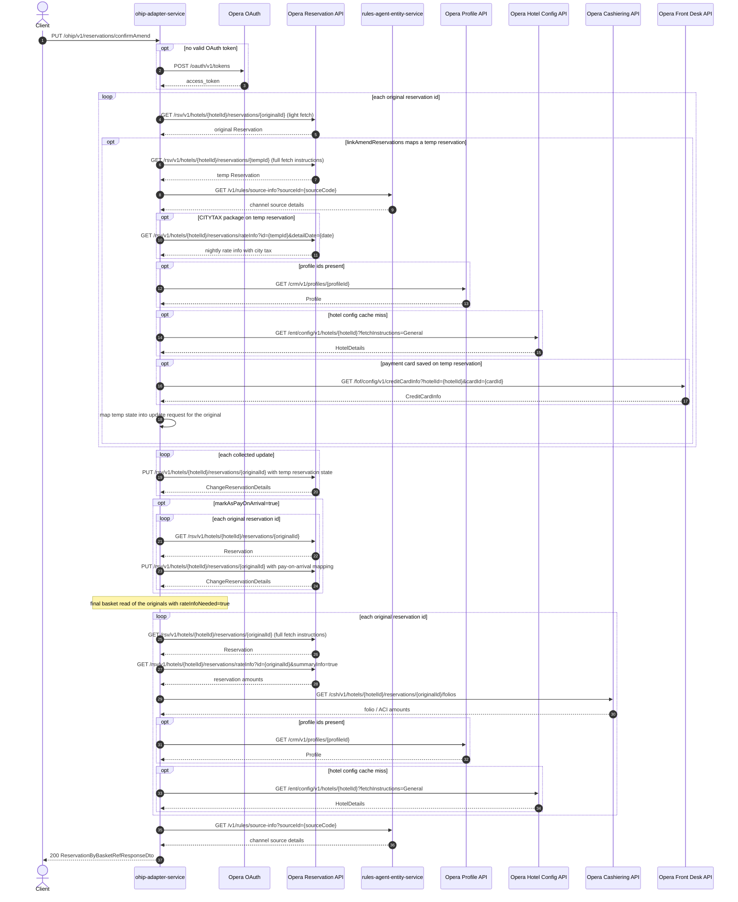

# OHIP Adapter Service: confirmAmend Flow

Confirms an amend by copying each linked temp reservation's state onto its original
reservation via change-reservation PUTs, then returns the refreshed originals as a
basket response.

```http
PUT /ohip/v1/reservations/confirmAmend
Host: ohip-adapter-service:9100
Content-Type: application/json
```

The servlet context path is `/ohip/` and `HotelReservationController` is mapped under
`/v1`, so the public path is `/ohip/v1/reservations/confirmAmend`. There is no inbound
authentication on the endpoint; Opera calls use the service OAuth client when no valid
token is present.

## Flow

For each original reservation id, ohip-adapter-service fetches the original from Opera
(light fetch, no enrichment) and, when `linkAmendReservations` maps it to a temp
reservation, loads that temp reservation through the full basket read (Opera reservation
fetch plus rules-agent source-info, city-tax rate-info when a CITYTAX package is present,
CRM profiles, cached hotel config, and front-desk card info when a card is saved — see
[GetReservationsByIds.md](GetReservationsByIds.md) for that chain). The temp state is
mapped into an update request carrying confirmation email/invoice options, language, the
original lead-guest profile, and any distribution IATA number found in the temp UDFs.

All collected updates are applied with one Opera change-reservation PUT per original
reservation (inventory check overridden, source code from the original). When
`markAsPayOnArrival` is true, each original is re-read and PUT again with pay-on-arrival
payment mapping. Finally the originals are re-read through the full basket read with
rate-info enrichment (rate amounts plus cashiering folio/ACI amounts). This read also
loads CRM profiles and the hotel configuration before it returns the response.

## Mermaid Flow



## Features

- Copies linked temp reservation state onto original reservations in one PUT each
- Confirmation email/invoice options, language, and lead-guest profile applied from the
  request and original reservation
- Distribution IATA number propagated from temp reservation UDF `UDFC_16`
- Optional pay-on-arrival conversion of the originals via `markAsPayOnArrival`
- Response is the refreshed originals with rate amount, folio/ACI, CRM profile, and
  hotel configuration enrichment
- No inbound authentication; outbound Opera OAuth bearer token per client config

## Feature Flags

No endpoint-specific flag gates this flow. The shared Opera authentication flags apply:

| Flag | Effect when enabled |
| --- | --- |
| `release_ohip_use_token_service` | Obtains Opera bearer tokens from `opera-token-service` instead of authenticating directly with Opera OAuth. |
| `release_ohip_use_token_refresh_skew` | Applies the configured early-refresh clock skew to directly acquired Opera OAuth tokens. |

## Request

Body: `ConfirmAmendOnReservationsRequestDto` — `hotelId`, `originalReservations` (ids),
`linkAmendReservations` (original id to temp id map), `bookingChannel` (channel,
language), `sendEmailConfirmation`, `sendEmailInvoice`, `markAsPayOnArrival`,
`clearCcAgentIdUdf`.

## Branches

| Trigger | Behavior |
| --- | --- |
| Original id missing from `linkAmendReservations` | Original is light-read but no update mapped for it |
| Temp reservation not found in Opera | `DIGITAL_RESERVATION_NOT_FOUND` from the basket read |
| `markAsPayOnArrival=true` | Extra read + pay-on-arrival PUT per original |
| Opera PUT fails after retries | `OHIP_CHANGE_RESERVATION_EXCEPTION` / `OHIP_RETRIES_EXHAUSTED_EXCEPTION` |
