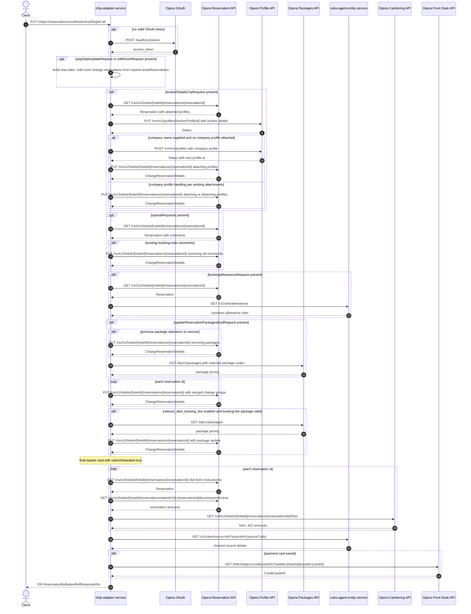

# OHIP Adapter Service: confirmAmendForSingleCall Flow

Single-call amend confirmation: merges stay-date, edit-room, package, special-request,
booking-allowance, and booker-detail changes into one Opera change-reservation PUT per
reservation, then returns the refreshed reservations as a basket response.

```http
PUT /ohip/v1/reservations/confirmAmendSingleCall
Host: ohip-adapter-service:9100
Content-Type: application/json
```

The servlet context path is `/ohip/` and `HotelReservationController` is mapped under
`/v1`, so the public path is `/ohip/v1/reservations/confirmAmendSingleCall`. There is no
inbound authentication on the endpoint; Opera calls use the service OAuth client when no
valid token is present.

## Flow

The request bundles up to six optional change groups. Stay-date and edit-room updates are
built purely from the request's own `tempReservations` (no Opera read). Package updates
first PUT away previously selected packages, then price the new selection through the
Opera packages API. Special requests read each reservation and PUT away existing
booking-note comments before their change is built. Booking allowances read the
reservations and fetch allowance rules from rules-agent. Booker details, when present,
update the booker CRM profile and company profile attachments (and this runs twice: once
in the in-port and once again inside the out-port merge).

All built change groups are merged into one final change-reservation PUT per reservation
id. When `release_distr_booking_fee` is enabled and the package selection carries a valid
booking-fee package, an additional package update round runs. Finally the affected
reservations are re-read through the full basket read with rate-info enrichment and
returned (see [GetReservationsByIds.md](GetReservationsByIds.md) for that chain).

## Mermaid Flow



## Features

- Merges stay-date, edit-room, package, special-request, booking-allowance, and
  booker-detail changes into one Opera PUT per reservation
- Stay-date and edit-room changes built from caller-supplied `tempReservations`
- Package pricing through Opera RTP packages, with removal of previous selections
- Booker CRM profile update plus company profile attach/detach (runs twice per request)
- Flag-gated distribution booking-fee package update round
- Response is the refreshed reservations with rate amount and folio/ACI enrichment
- No inbound authentication; outbound Opera OAuth bearer token per client config

## Feature Flags

| Flag | Effect when enabled |
| --- | --- |
| `release_distr_booking_fee` | After the merged PUT, runs an extra package update round when the package selection contains a valid booking-fee package; also changes package-group price zipping during package mapping |

## Request

Body: `ConfirmAmendForSingleRequestDto` — optional `stayDateUpdateRequest` (with
`reservations` and `tempReservations`), `editRoomRequest` (list of the same shape),
`updateReservationPackagesByIdRequest`, `specialRequests` (list),
`bookerDetailsCnpRequest`, `bookingAllowancesRequest`. Reservation ids and hotel id are
resolved from whichever change groups are present (package request takes precedence,
then edit-room, then stay-date).

## Branches

| Trigger | Behavior |
| --- | --- |
| Only some change groups present | Absent groups are skipped entirely |
| Existing booking-note comments on a reservation | Comment-removal PUT before the merged change |
| Previous package selections present (not HSATWN) | Package-removal PUT per reservation |
| `release_distr_booking_fee` on with valid booking-fee package | Extra package update round |
| Opera PUT fails after retries | `OHIP_CHANGE_RESERVATION_EXCEPTION` / `OHIP_RETRIES_EXHAUSTED_EXCEPTION` |
