# OHIP Adapter Service: confirmReservation Flow

Confirms an Opera reservation by applying the requested payment and guarantee state, with conditional deposit, CNP, routing, and CC-agent updates.

```http
POST /ohip/v1/reservations/confirm
Host: ohip-adapter-service:9100
Content-Type: application/json
Accept: application/json
```

The servlet context path is `/ohip/` and `HotelReservationController` is mapped under `/v1`, so the public path is `/ohip/v1/reservations/confirm`. All Opera API calls carry a bearer token plus `x-app-key` and `x-hotelid` headers. A cached access token is reused until its refresh criteria require another direct Opera OAuth or token-service request.

## Flow

ohip-adapter-service first loads the reservation from the Opera Reservation API, including its policies, packages, payment methods, routing instructions, and guarantee. For `PAY_ON_ARRIVAL`, `RESERVE_WITHOUT_CARD`, and `ACCOUNT_COMPANY`, it then sends one change-reservation request and builds the public response from Opera's updated reservation.

For `PAY_NOW`, it obtains VAT mappings from rules-agent-entity-service and summary rate information from Opera. It posts a deposit folio only when the total cost still equals the outstanding cost. When `release_deposit_folio_post_after_disable_on_hold` is enabled, the service first changes the reservation and polls Opera up to three times for the updated deposit policy before posting the folio. The legacy path rereads the reservation but posts the folio without that pre-update and polling sequence. A configured non-digital payment-method update is submitted asynchronously after a delay.

After the payment-option branch, the service reloads the reservation to detect a CNP booking from folio-window-2 routing. A CNP booking can trigger payment-card retrieval from Opera Front Desk, a payment-method split update, and a feature-gated CNP alert. An `ACCOUNT_COMPANY` request that changes an initial `NON` guarantee and had routing instructions also reloads and updates routing payee data. A non-blank `ccAgentId` schedules an asynchronous `UDFC_08` update. The HTTP response does not wait for these asynchronous non-digital-payment or CC-agent writes.

## Mermaid Flow

```mermaid
sequenceDiagram
    autonumber
    actor Client
    participant Ohip as ohip-adapter-service
    participant Token as token-service
    participant OAuth as Opera OAuth
    participant Rules as rules-agent-entity-service
    participant OperaRsv as Opera Reservation API
    participant OperaCsh as Opera Cashiering API
    participant FrontDesk as Opera Front Desk API

    Client->>Ohip: POST /ohip/v1/reservations/confirm
    opt no reusable Opera access token
        alt release_ohip_use_token_service enabled
            Ohip->>Token: GET /v1/tokens/opera/access-token
            Token-->>Ohip: Opera bearer token
        else direct Opera OAuth
            Ohip->>OAuth: POST /oauth/v1/tokens with configured client-credentials or password grant
            OAuth-->>Ohip: Opera bearer token
        end
    end

    Ohip->>OperaRsv: GET /rsv/v1/hotels/{hotelId}/reservations/{reservationId} with reservation fetch instructions
    Note over Ohip,OperaRsv: x-hotelid={hotelId}, x-app-key, bearer token
    OperaRsv-->>Ohip: reservation, guarantee, routing, policies, packages, and payments

    alt paymentOption is PAY_NOW
        alt release_deposit_folio_post_after_disable_on_hold enabled
            Ohip->>Ohip: reuse the initial reservation for deposit processing
        else legacy deposit path
            Ohip->>OperaRsv: GET /rsv/v1/hotels/{hotelId}/reservations/{reservationId} with reservation fetch instructions
            OperaRsv-->>Ohip: current reservation
        end

        Ohip->>Rules: GET /v1/rules/vat-codes?vatRegion={vatRegion}&pkgCodeArr={packageCodes}
        Rules-->>Ohip: VAT and transaction-code mappings
        Ohip->>OperaRsv: GET /rsv/v1/hotels/{hotelId}/reservations/rateInfo?idContext=OPERA&id={reservationId}&summaryInfo=true&type=Reservation
        OperaRsv-->>Ohip: total and outstanding reservation amounts

        alt total cost equals outstanding cost
            opt release_deposit_folio_post_after_disable_on_hold enabled
                Ohip->>OperaRsv: PUT /rsv/v1/hotels/{hotelId}/reservations/{reservationId} with PAY_NOW guarantee and payment update
                OperaRsv-->>Ohip: changed reservation
                loop up to 3 attempts until deposit policy changes
                    Ohip->>OperaRsv: GET /rsv/v1/hotels/{hotelId}/reservations/{reservationId} with reservation fetch instructions
                    OperaRsv-->>Ohip: reservation with current deposit policy
                end
            end

            opt CITYTAX package is scheduled
                loop each CITYTAX consumption date
                    Ohip->>OperaRsv: GET /rsv/v1/hotels/{hotelId}/reservations/rateInfo?id={reservationId}&detailDate={date}&summaryInfo=false&type=Reservation
                    OperaRsv-->>Ohip: city-tax package and VAT detail
                end
            end
            Ohip->>OperaCsh: POST /csh/v1/hotels/{hotelId}/reservations/{reservationId}/depositFolios
            OperaCsh-->>Ohip: posted deposit folio

            opt hotel is configured for non-digital payment methods
                Note over Ohip,OperaRsv: asynchronous after a configured delay and may finish after the HTTP response
                Ohip-)OperaRsv: PUT /rsv/v1/hotels/{hotelId}/reservations/{reservationId} with non-digital payment method
            end
        else amount data is absent or a deposit already reduces the outstanding cost
            Ohip->>Ohip: skip deposit-folio posting
        end

        opt first routing instruction uses folio window 3
            Ohip->>OperaRsv: GET /rsv/v1/hotels/{hotelId}/reservations/{reservationId} with reservation fetch instructions
            OperaRsv-->>Ohip: reservation for prepaid routing update
            opt payment method has a card id
                Ohip->>FrontDesk: GET /fof/config/v1/creditCardInfo?hotelId={hotelId}&cardId={cardId}&cardIdContext=OPERA&cardIdType=CreditCard
                FrontDesk-->>Ohip: credit-card details
            end
            Ohip->>OperaRsv: GET /rsv/v1/hotels/{hotelId}/reservations/rateInfo?idContext=OPERA&id={reservationId}&summaryInfo=true&type=Reservation
            OperaRsv-->>Ohip: reservation amounts
            Ohip->>OperaRsv: PUT /rsv/v1/hotels/{hotelId}/reservations/{reservationId} with prepaid routing and payment data
            OperaRsv-->>Ohip: changed reservation
        end
        Ohip->>Ohip: map response from the initial reservation snapshot
    else paymentOption is not PAY_NOW
        Ohip->>OperaRsv: PUT /rsv/v1/hotels/{hotelId}/reservations/{reservationId} with requested guarantee and payment data
        OperaRsv-->>Ohip: changed reservation
        Ohip->>Ohip: map response from the change result
    end

    Ohip->>OperaRsv: GET /rsv/v1/hotels/{hotelId}/reservations/{reservationId} with reservation fetch instructions
    OperaRsv-->>Ohip: reservation used to detect folio-window-2 CNP routing
    alt folio-window-2 CNP routing is present
        Ohip->>OperaRsv: GET /rsv/v1/hotels/{hotelId}/reservations/{reservationId} with reservation fetch instructions
        OperaRsv-->>Ohip: reservation payment methods
        opt a reservation payment card is present
            Ohip->>FrontDesk: GET /fof/config/v1/creditCardInfo?hotelId={hotelId}&cardId={cardId}&cardIdContext=OPERA&cardIdType=CreditCard
            FrontDesk-->>Ohip: credit-card details
            Ohip->>OperaRsv: PUT /rsv/v1/hotels/{hotelId}/reservations/{reservationId} with split folio payment methods
            OperaRsv-->>Ohip: changed reservation
        end
        opt release_set_cnp_booking_alerts enabled
            Ohip->>OperaRsv: PUT /rsv/v1/hotels/{hotelId}/reservations/{reservationId} with CNP check-in alert
            OperaRsv-->>Ohip: changed reservation
        end
    end

    opt initial routing exists, initial guarantee is NON, and paymentOption is ACCOUNT_COMPANY
        Ohip->>OperaRsv: GET /rsv/v1/hotels/{hotelId}/reservations/{reservationId} with reservation fetch instructions
        OperaRsv-->>Ohip: current reservation profiles and routing
        Ohip->>OperaRsv: PUT /rsv/v1/hotels/{hotelId}/reservations/{reservationId} with routing payee data
        OperaRsv-->>Ohip: changed reservation
    end

    opt ccAgentId is non-blank
        Ohip->>Ohip: schedule delayed UDFC_08 update, waiting for the non-digital update when present
    end
    Ohip-->>Client: 200 ConfirmReservationResponseDto
    opt delayed ccAgentId update was scheduled
        Ohip-)OperaRsv: PUT /rsv/v1/hotels/{hotelId}/reservations/{reservationId} with UDFC_08
    end
```



## Features

- Maps `PAY_ON_ARRIVAL`, `RESERVE_WITHOUT_CARD`, and `ACCOUNT_COMPANY` to Opera payment-method and guarantee changes.
- For `PAY_NOW`, posts a deposit folio only while the full stay cost remains outstanding and uses VAT mappings from rules-agent-entity-service.
- Includes per-day city-tax VAT in a deposit folio when the reservation has a scheduled `CITYTAX` package.
- Supports the feature-gated change-and-poll sequence before posting a `PAY_NOW` deposit folio.
- Can switch configured hotels to a non-digital payment method asynchronously after deposit posting.
- Rebuilds prepaid folio-window-3 routing and payment data, including optional Front Desk card enrichment.
- Detects folio-window-2 CNP reservations, splits payment methods across folios, and can add a CNP check-in alert.
- Updates routing payee information when `ACCOUNT_COMPANY` replaces an initial non-guaranteed booking.
- Writes a supplied CC agent id to Opera `UDFC_08` asynchronously.
- Returns the initial Opera snapshot for `PAY_NOW`; other payment options return the changed reservation from Opera.
- Acquires and caches an Opera bearer token, using either token-service or the configured direct Opera OAuth grant.

## Feature Flags

| Flag | Effect when enabled |
| --- | --- |
| `release_deposit_folio_post_after_disable_on_hold` | For `PAY_NOW`, changes the reservation first and polls up to three times for a changed deposit policy before posting the deposit folio; disabled uses the legacy reread-and-post order. |
| `release_set_cnp_booking_alerts` | Adds a CNP check-in alert after moving payment details for a folio-window-2 reservation. |
| `release_set_default_payment_method_DS` | Uses `DS` instead of `CA` as folio-window-1's default payment method while splitting CNP payment details. |
| `release_ohip_use_token_service` | Obtains Opera bearer tokens from token-service instead of authenticating directly with Opera OAuth. |
| `release_ohip_use_token_refresh_skew` | Applies the configured early-refresh clock skew to directly acquired Opera OAuth tokens. |

## Request

| Body field | Required | Purpose |
| --- | --- | --- |
| `reservationId` | Yes | Opera reservation id to confirm. |
| `hotelId` | Yes | Opera hotel id used in downstream paths and `x-hotelid`. |
| `paymentOption` | Yes | One of `PAY_NOW`, `PAY_ON_ARRIVAL`, `RESERVE_WITHOUT_CARD`, or `ACCOUNT_COMPANY`; selects the main flow and Opera guarantee code. |
| `paymentMethod` | No | Payment method used for deposit-folio posting and the later non-digital update. |
| `digitalPaymentMethod` | No | Replaces the deposit-folio payment method for a hotel configured to switch to non-digital payments. |
| `paymentType` | No | Opera payment-method code for card-backed reservation changes. |
| `paymentCard` | No | Card type, token, expiration date, optional holder name, last four digits, and optional CIT id. |
| `paymentId` | No | Deposit-folio posting reference. |
| `pibaCardPresent` | No | Accepted and mapped into the domain request but does not alter this controller method's flow. |
| `ccAgentId` | No | When non-blank, schedules an Opera `UDFC_08` update. |
| `threeDSIndicator` | No | Appended to `paymentId` with a pipe when building the deposit posting reference. |

## Branches

| Trigger | Behavior |
| --- | --- |
| Missing `reservationId`, `hotelId`, or `paymentOption` | Request validation returns `400`. |
| Empty `reservationId` or `hotelId` | Domain self-validation returns `422` with constraint-violation error code `404`. |
| `paymentOption=PAY_NOW` and total cost equals outstanding cost | Builds and posts a deposit folio; otherwise deposit posting is skipped. |
| Updated deposit policy is not observed within three reads on the feature-enabled path | Fails with `DIGITAL_FETCH_RESERVATION_DETAILS_EXCEPTION` (error code `25`). |
| Initial first routing folio is window 3 | Runs the prepaid business-item update, including another reservation read, rate-info read, optional card lookup, and reservation update. |
| Current routing contains folio window 2 | Runs the CNP payment-details flow and optional alert update. |
| Initial guarantee is `NON`, routing is non-null, and the request is `ACCOUNT_COMPANY` | Reloads the reservation and updates routing payee information. |
| `ccAgentId` is non-blank | Schedules a delayed `UDFC_08` update and does not wait for it before responding. |
| Token-service mode is disabled and no direct Opera token is reusable | Uses the configured client-credentials grant when enabled, otherwise the password grant. |
| Opera, Opera OAuth, token-service, Front Desk, or rules-agent calls fail | Propagates the mapped internal/downstream exception; the endpoint has no explicit reservation-not-found branch of its own. |
