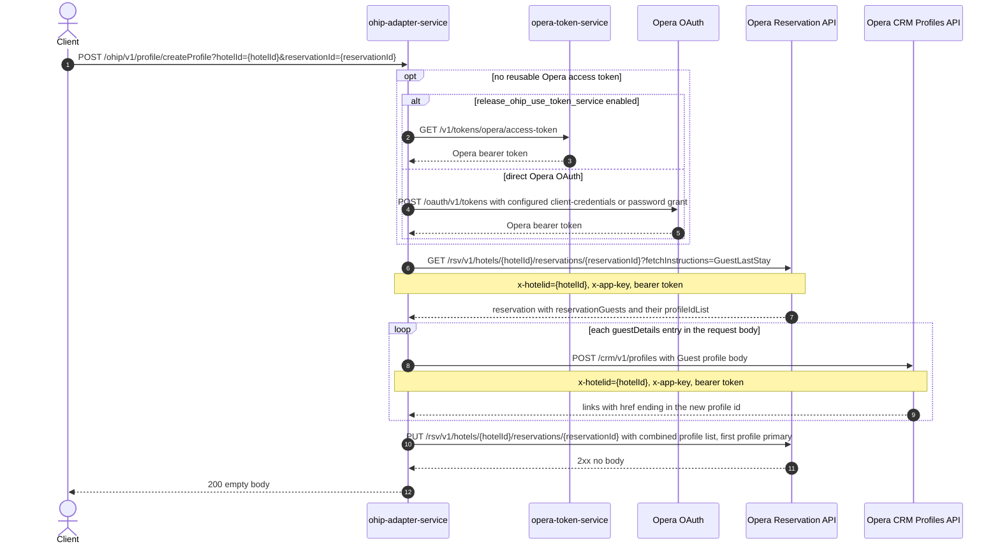

# OHIP Adapter Service: createProfileKiosk Flow

Creates an Opera guest profile per staying guest and attaches all profiles (existing plus
newly created) to the reservation, used by the kiosk check-in flow.

```http
POST /ohip/v1/profile/createProfile?hotelId={hotelId}&reservationId={reservationId}
Host: ohip-adapter-service:9100
Content-Type: application/json
```

The servlet context path is `/ohip/` and `ProfileController` is mapped under `/v1/profile`,
so the public path is `/ohip/v1/profile/createProfile`. The service excludes Spring
Security auto-configuration, so the public endpoint itself requires no caller
authentication. All Opera API calls carry a bearer token plus `x-app-key` and `x-hotelid`
headers. A cached access token is reused until its refresh criteria require another direct
Opera OAuth or token-service request.

## Flow

ohip-adapter-service first loads the reservation from Opera with
`fetchInstructions=GuestLastStay` and collects the first profile id of every existing
reservation guest. It then creates one Opera CRM profile per entry in the request's
`guestDetails` list (profile type `Guest`, primary person name, optional address, email,
phone, nationality, and passport details) and extracts each new profile id from the last
segment of the `Location`-style link in the create response. Finally it PUTs the
reservation with the combined profile id list; the first profile in the list is marked
`primary`. The endpoint returns an empty body on success (the OpenAPI annotation claims
`204`, but the handler is a plain `void` method, so the runtime status is `200`).

Any Opera error is mapped to a `ProfileException`: `OHIP_GET_PROFILEID_EXCEPTION` for the
reservation GET, `OHIP_CREATE_PROFILE_EXCEPTION` for the profile POST, and
`OHIP_ADD_PROFILE_RESERVATION_EXCEPTION` for the reservation PUT. The reservation PUT is
retried per the shared retry spec and exhaustion raises
`OHIP_RETRIES_EXHAUSTED_EXCEPTION`.

## Mermaid Flow



## Features

- Attaches profiles for kiosk staying guests to an existing Opera reservation in one call.
- Preserves the reservation's existing guest profiles: their ids are read first and lead
  the combined list, so the original primary guest stays primary.
- Creates one Opera CRM `Guest` profile per supplied guest, carrying name, nationality,
  kiosk address, email, phone, and passport details when supplied.
- No caller authentication on the public endpoint; Opera access uses the service's own
  OAuth bearer token plus `x-app-key` and `x-hotelid`/`x-hubid` headers.
- The reservation PUT (add profile) is retried on error; the reservation GET and profile
  POST are not.

## Feature Flags

| Flag | Effect when enabled |
| --- | --- |
| `release_ohip_use_token_service` | Obtains Opera bearer tokens from opera-token-service instead of authenticating directly with Opera OAuth. |
| `release_ohip_use_token_refresh_skew` | Applies the configured early-refresh clock skew to directly acquired Opera OAuth tokens. |

No other flags: the profile controller, in-port, out-port, and Opera client contain no
feature-flag checks.

## Request

| Parameter | In | Required | Purpose |
| --- | --- | --- | --- |
| `hotelId` | query | Yes | Opera hotel id used in downstream paths and the `x-hotelid` header. |
| `reservationId` | query | Yes | Opera reservation id whose guest list is read and updated. |
| `guestDetails` | body | Yes | List of staying guests; one Opera CRM profile is created per entry. |
| `guestDetails[].givenName` / `surname` / `nameTitle` / `nameType` | body | No | Person name written to the new profile. |
| `guestDetails[].nationality`, `kioskAddress`, `emailAddress`, `phoneNumber`, `passportDetails` | body | No | Optional contact and identity details written to the new profile. |

## Branches

| Trigger | Behavior |
| --- | --- |
| Reservation GET fails or returns an Opera error status | `ProfileException` `OHIP_GET_PROFILEID_EXCEPTION`; no profiles are created. |
| Profile POST returns an Opera error status | `ProfileException` `OHIP_CREATE_PROFILE_EXCEPTION`; the reservation PUT is not reached. |
| Reservation PUT returns an Opera error status | Retried per the shared retry spec; a non-retryable error maps to `OHIP_ADD_PROFILE_RESERVATION_EXCEPTION`, exhausted retries to `OHIP_RETRIES_EXHAUSTED_EXCEPTION`. |
| Empty `guestDetails` list | No profile POSTs; the reservation is still PUT with only its existing profile ids. |
