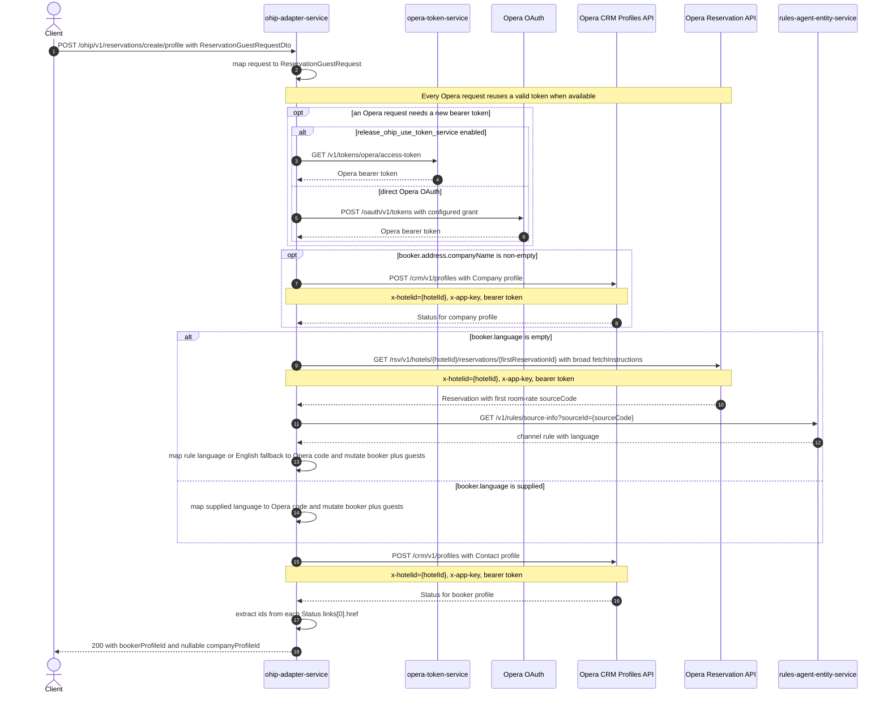

# OHIP Adapter Service: createProfiles Flow

Creates an Opera contact profile for the reservation booker and, when the booker's address
contains a company name, creates an Opera company profile first.

```http
POST /ohip/v1/reservations/create/profile
Host: ohip-adapter-service:9100
Content-Type: application/json
```

The servlet context path is `/ohip/` and `HotelReservationController` is mapped under `/v1`,
so the public path is `/ohip/v1/reservations/create/profile`. The service excludes Spring
Security auto-configuration, so this public endpoint requires no caller authentication. Opera
requests use the service's bearer token and carry `x-app-key` and `x-hotelid`; this flow does not
send `x-hubid`.

## Flow

The controller maps `ReservationGuestRequestDto` directly to `ReservationGuestRequest` and
delegates through `HotelReservationInPortImpl` without additional domain logic. The out port
first checks `booker.address.companyName`. When it is non-empty, it maps the company name and
booker address to an Opera `Company` profile and synchronously sends `POST /crm/v1/profiles`.
The returned `Status` is retained while the rest of the flow continues.

The out port next normalizes the booker's language. When `booker.language` is supplied, it maps
that key through `config.service.ohip.languages` and writes the resulting Opera code to both the
booker and every staying guest. When the language is empty, it reads the first staying guest's
reservation from Opera with the broad reservation fetch-instruction set, takes the first room
rate's `sourceCode`, and calls rules-agent `GET /v1/rules/source-info?sourceId={sourceCode}`. A
rule language of `N/A` falls back to configured English (`en`); otherwise the returned language
is lower-cased and mapped through the same language table. The resulting Opera code is written
to every staying guest and to the booker.

The normalized booker is mapped to an Opera `Contact` profile with primary name, language, and
the supplied email, address, telephone, and privacy fields, then synchronously sent to the same
`POST /crm/v1/profiles` endpoint. There is no reservation update after either create.

After the booker POST completes, the service extracts each profile id from the final path segment
of `Status.links[0].href`. A missing company response yields `companyProfileId: null`; otherwise
the response contains the extracted company and booker ids. The controller returns HTTP 200.
There is no data cache on the reservation read, rules lookup, or profile creates.

## Mermaid Flow



## Features

- Always creates exactly one Opera `Contact` profile for the booker.
- Optionally creates one Opera `Company` profile before the booker profile when
  `booker.address.companyName` is non-empty.
- Maps a supplied booker language through the configured WB-to-Opera language table and applies
  it to the booker and every staying guest.
- Resolves a missing language from the first staying guest's Opera reservation source and the
  real rules-agent service, with `N/A` falling back to English.
- Returns ids parsed from Opera response links; it does not attach either profile to a
  reservation.
- Performs calls sequentially and has no rollback. A company profile can remain created if
  later language resolution, booker creation, or response-link parsing fails.
- Opera profile POSTs have no application retry. The shared Opera WebClient only retries GETs on
  a premature-close transport failure.

## Feature Flags

| Flag | Effect when enabled |
| --- | --- |
| `release_ohip_use_token_service` | Obtains Opera bearer tokens from opera-token-service instead of authenticating directly with Opera OAuth. |
| `release_ohip_use_token_refresh_skew` | Applies the configured early-refresh clock skew to directly acquired Opera OAuth tokens. |

No endpoint-specific feature flag changes profile creation, company branching, language
resolution, or response mapping.

## Request

| Field | Required | Purpose in this flow |
| --- | --- | --- |
| `hotelId` | Yes | Sent as `x-hotelid` on every Opera call and used in the optional reservation-read path. |
| `reasonForStay` | Yes | Required by the public DTO/domain contract but not read by this operation. |
| `booker` | Yes | Supplies the contact profile's name, language, email, address, phones, and mailing preference. Its `address` is optional in the DTO but this implementation dereferences it before the company check, so a null address fails at runtime. |
| `booker.address.companyName` | No | A non-empty value enables the company-profile POST before language resolution. |
| `stayingGuests` | Yes, at least one | Receives the normalized language; the first entry's `reservationId` selects the Opera reservation when language must be resolved. |
| Remaining reservation-guest fields | No | Mapped into the domain request but not read by this operation. |

## Branches

| Trigger | Behavior |
| --- | --- |
| Address present and `booker.address.companyName` absent or empty | Skips the company POST and returns `companyProfileId: null`. |
| `booker.address.companyName` non-empty | Creates the company profile first, then continues to language resolution and booker creation. |
| `booker.address` is null | The out port dereferences the address before any downstream call and fails at runtime. |
| `booker.language` supplied | Maps it directly through `config.service.ohip.languages`; no reservation or rules-agent read. |
| `booker.language` empty | Reads the first staying guest's Opera reservation, calls rules-agent by the first room-rate source code, and maps the rule language. |
| Rules-agent language is `N/A` | Uses the configured Opera code for English. |
| Opera reservation GET returns an error status | Stops before the booker POST with `OHIP_GET_RESERVATION_EXCEPTION` (error code 960). A company POST may already have completed. |
| Either Opera profile POST returns an error status | Stops with `OHIP_POST_PROFILE_EXCEPTION` (error code 953). No later call or rollback occurs. |
| Rules-agent returns an error | Its `BookingChannelException` is propagated; the booker POST is not reached. A company POST may already have completed. |
| A profile POST has an empty success body | Its retained `Status` is null, so the corresponding public profile id is null. |
| A non-null `Status` lacks `links[0].href` | Profile-id extraction raises a runtime error after the profile creates; there is no rollback. |
