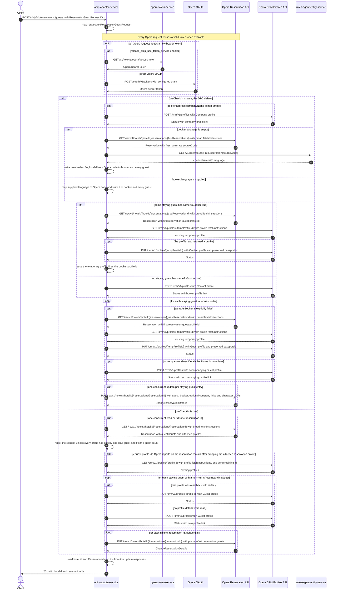

# OHIP Adapter Service: createReservationGuest Flow

Attaches staying-guest, booker, and optional company identities to reservations Opera already
holds, creating or updating the Opera profiles the attachment needs.

```http
POST /ohip/v1/reservations/guests
Host: ohip-adapter-service:9100
Content-Type: application/json
```

The servlet context path is `/ohip/` and `HotelReservationController` is mapped under `/v1`, so
the public path is `/ohip/v1/reservations/guests`. The service excludes Spring Security
auto-configuration, so this public endpoint requires no caller authentication. Every Opera request
carries the service bearer token and `x-app-key`. Reservation reads and updates and profile
creates and updates also carry `x-hotelid`; the profile read carries `x-hubid` instead of
`x-hotelid`.

## Flow

`createReservationGuest` maps `ReservationGuestRequestDto` to `ReservationGuestRequest` and
`HotelReservationInPortImpl` delegates straight to the out port with no domain logic of its own.
The out port then splits on `preCheckIn`, whose DTO default is `false`.

**Default path, `preCheckIn` false.** The out port first inspects
`booker.address.companyName` through a null-safe chain. When it is non-empty, it maps the company
name and booker address to an Opera `Company` profile and sends `POST /crm/v1/profiles`; the
returned `Status` is held for the reservation update. It then normalizes language: a supplied
`booker.language` is mapped through `config.service.ohip.languages` and written to the booker and
every staying guest, while an empty `booker.language` makes the service read the first staying
guest's reservation from Opera, take the first room rate's `sourceCode`, and ask rules-agent
`GET /v1/rules/source-info?sourceId={sourceCode}` for the channel language, with `N/A` falling
back to configured English.

Next it resolves the booker profile. If any staying guest carries `sameAsBooker` true, the service
reuses that reservation's existing temporary profile: it reads the reservation, takes the first
profile id from `reservationGuests[0].profileInfo.profileIdList`, reads that profile, and — when
the read returned a profile — sends `PUT /crm/v1/profiles/{profileId}` with the booker mapped to an
Opera `Contact` profile carrying the existing profile id list and any preserved passport
identification id. That existing id becomes the booker profile id. With no such staying guest, the
service instead sends `POST /crm/v1/profiles` with the `Contact` profile and derives the booker
profile id from the final path segment of `Status.links[0].href`.

The service then walks the staying guests in order. A guest whose `sameAsBooker` is explicitly
false has its own temporary profile reused: reservation read, profile read, then
`PUT /crm/v1/profiles/{profileId}` with a `Guest` profile carrying the temporary profile's id list,
after which the request's `stayingGuestDetails.profileId` is replaced by that temporary id. A guest
whose `accompanyingGuestDetails.lastName` is non-blank additionally gets a brand-new
`POST /crm/v1/profiles` `Guest` profile, and the created id is stored on the accompanying-guest
details. A guest whose `sameAsBooker` is null gets neither leg and keeps the profile id the caller
sent.

Finally the service fans out one `PUT /rsv/v1/hotels/{hotelId}/reservations/{reservationId}` per
staying-guest entry, concurrently and in no guaranteed order. Each body carries the reservation id,
hotel id, `additionalGuestInfo.purposeOfStay` from `reasonForStay`, the guest profile link (the
booker profile id when `sameAsBooker` is true, otherwise the staying guest's profile id), a
non-primary accompanying-guest entry when that profile id was set, a `ReservationContact`
reservation profile for the booker, a `Company` reservation profile when the company create
produced an id, and the character UDFs `UDFC14` (email confirmation and invoice flags), `UDFC36`
(employee account id), `UDFC10` (company account id), `UDFC35` (user account id), and `UDFC09`
(booking type) for the fields the request supplies.

**Pre-check-in path, `preCheckIn` true.** The out port groups the staying guests by
`reservationId`, reads every distinct reservation from Opera concurrently, and derives each
reservation's total guest count from `roomStay.guestCounts` adults plus children. Each group is
then validated: exactly one entry with `isAccompanyingGuest` false, and no more accompanying
entries than total guests minus one. It collects the request profile ids that Opera also reports on
the reservation, drops the id Opera reports as an attached reservation profile, and reads the
remaining profiles from Opera. For each staying guest carrying a non-null `isAccompanyingGuest` it
maps a `Guest` profile and either sends `PUT /crm/v1/profiles/{profileId}` when that profile was
read back with details, or `POST /crm/v1/profiles` when it was not, recording the resulting id
against the lead or accompanying role. It closes with one sequential
`PUT /rsv/v1/hotels/{hotelId}/reservations/{reservationId}` per distinct reservation id, whose
`reservationGuests` list is ordered primary first. No company profile is created and no language is
resolved on this path.

Both paths build the response from the reservation-update bodies: the hotel id from the first
response and every `reservationIdList` entry typed `Reservation` across all responses. The
controller returns HTTP 201 with that body. Nothing is cached and nothing is rolled back.

## Mermaid Flow



## Features

- Two materially different orchestrations behind one route, selected by `preCheckIn`, whose
  public DTO default is `false`.
- On the default path, links each staying guest, the booker as `ReservationContact`, and an
  optional `Company` to reservations Opera already holds, in one reservation update per
  staying-guest entry.
- Reuses an existing Opera temporary profile wherever the reservation already carries one: the
  booker reuses it when a staying guest is `sameAsBooker`, and each explicitly non-booker staying
  guest reuses its own. A reused profile is updated in place, never recreated, and an existing
  passport identification id is carried over so Opera treats the passport as an update.
- Creates a fresh Opera `Guest` profile for an accompanying guest named in the request, and links
  it to the reservation as a non-primary reservation guest.
- Optionally creates one Opera `Company` profile first, before language resolution and before any
  booker work, when `booker.address.companyName` is non-empty.
- Maps a supplied booker language through the configured WB-to-Opera language table, or resolves a
  missing one from the reservation source code and the real rules-agent service.
- Carries request-supplied administrative fields onto the reservation as character UDFs: `UDFC14`
  for the email confirmation and invoice flags, `UDFC36` for the staying guest's employee account
  id, `UDFC10` for the company account id, `UDFC35` for the user account id, and `UDFC09` for the
  booking type.
- On the pre-check-in path, enforces one lead guest per reservation and an accompanying-guest count
  within the reservation's Opera guest count before touching any profile.
- Fans reservation updates out concurrently and unordered on the default path, and runs them
  sequentially one per distinct reservation id on the pre-check-in path.
- Has no cache and no rollback. Profiles created or updated earlier in the sequence stay as they
  are when a later call fails.
- Reservation updates and profile updates retry up to three times on an Opera error body typed
  `BadRequest` or a premature transport close, then surface error code 971. Profile creates have no
  application retry beyond the shared GET-only premature-close retry.

## Feature Flags

| Flag | Effect when enabled |
| --- | --- |
| `release_ohip_use_token_service` | Obtains Opera bearer tokens from opera-token-service instead of authenticating directly with Opera OAuth. |
| `release_ohip_use_token_refresh_skew` | Applies the configured early-refresh clock skew to directly acquired Opera OAuth tokens. |

Both are evaluated per Opera request inside the shared OHIP `WebClient` filter chain, outside this
endpoint's request scope. No endpoint-specific feature flag changes branch selection, profile
creation or update, company handling, language resolution, fan-out, or response mapping.

## Request

| Field | Required | Purpose in this flow |
| --- | --- | --- |
| `hotelId` | Yes | Six alphabetic characters. Sent as `x-hotelid` on every reservation and profile create/update call, used in every reservation path, and written into the default-path update body. |
| `preCheckIn` | No, DTO default `false` | Selects the orchestration. `false` runs the booker/company/language and per-guest-entry update path. Any other value, including an explicit `null`, runs the pre-check-in path. |
| `reasonForStay` | Yes | Written to `additionalGuestInfo.purposeOfStay` on the default path. Not read on the pre-check-in path. |
| `booker` | Yes | Supplies the `Contact` profile name, language, email, address, phones, and mailing preference. Not read on the pre-check-in path. |
| `booker.language` | No | Supplied, it is mapped through `config.service.ohip.languages` and applied to the booker and every guest. Empty, it triggers the reservation read plus rules-agent lookup. |
| `booker.address.companyName` | No | Non-empty, it creates the `Company` profile first and adds a `Company` reservation profile to every default-path update. |
| `stayingGuests` | Yes, at least one | Drives every per-guest branch and the number of reservation updates. Duplicated reservation ids produce one update each on the default path and are collapsed to one on the pre-check-in path. |
| `stayingGuests[].reservationId` | Yes | The reservation read and updated for that entry. The first entry's id is also the reservation read for language resolution. |
| `stayingGuests[].sameAsBooker` | No | `true` reuses that reservation's temporary profile as the booker profile and links the booker profile as the reservation guest. `false` reuses and updates that guest's own temporary profile. Null skips both profile legs and links the caller-supplied `stayingGuestDetails.profileId` unchanged. |
| `stayingGuests[].stayingGuestDetails` | Effectively yes on the default path | Supplies the `Guest` profile content and, when `sameAsBooker` is null, the profile id linked to the reservation. Its `employeeAccountId` becomes `UDFC36`. |
| `stayingGuests[].stayingGuestDetails.profileId` | No | On the pre-check-in path, only ids Opera also reports on the reservation are read back, which decides profile update versus create. |
| `stayingGuests[].accompanyingGuestDetails` | No | A non-blank `lastName` creates an extra `Guest` profile on the default path, and the created id adds a non-primary reservation guest to that entry's update. |
| `stayingGuests[].isAccompanyingGuest` | Required in practice on the pre-check-in path | Non-null values are validated per reservation group, decide the primary flag written to Opera, and gate the profile create/update leg. A null value is skipped entirely. |
| `stayingGuests[].language` | No | Overwritten by language normalization on the default path before any profile is written. |
| `sendEmailConfirmation`, `sendEmailInvoice` | No | Encoded as `Y`/`N` in the two positions of `UDFC14` on the default-path update. |
| `companyAccountId`, `userAccountId`, `bookingType` | No | Written to `UDFC10`, `UDFC35`, and `UDFC09` respectively on the default-path update. |
| `bookerProfileId`, `companyProfileId` | No | Mapped into the domain request but not read by this operation, which always resolves both ids from Opera. |

## Branches

| Trigger | Behavior |
| --- | --- |
| `preCheckIn` absent or `false` | Runs the company, language, booker, per-guest profile, and concurrent per-entry reservation-update path. |
| `preCheckIn` `true` | Runs the grouped read, validation, profile create-or-update, and sequential per-reservation update path. No company profile and no language resolution. |
| `preCheckIn` explicitly `null` in the body | Overrides the DTO default and takes the pre-check-in path, because the branch tests `Boolean.FALSE.equals(preCheckIn)`. |
| `booker.address` null, or `companyName` absent or empty | Skips the company create through a null-safe chain and adds no `Company` reservation profile. |
| `booker.language` supplied | Maps it directly; no reservation read and no rules-agent call for language. |
| `booker.language` empty | Reads the first staying guest's reservation, calls rules-agent by the first room-rate source code, and applies the result, or configured English when the rule language is `N/A`. |
| Language key absent from `config.service.ohip.languages` | Maps to an empty Opera language code, which is then written to the booker and every guest. |
| Some staying guest has `sameAsBooker` true | Reads that reservation and its first reservation-guest profile, updates that profile as the booker `Contact`, and reuses its id as the booker profile id. No booker create happens. |
| No staying guest has `sameAsBooker` true | Creates the booker `Contact` profile and takes its id from the created `Status` link. |
| `sameAsBooker` true but the profile read returns no profile | Skips the profile update and still reuses the reservation's profile id as the booker profile id. |
| Staying guest with `sameAsBooker` explicitly false | Reads that reservation and profile, updates the profile as a `Guest`, and replaces the request's `stayingGuestDetails.profileId` with the reservation's profile id. |
| Staying guest with `sameAsBooker` null | No reservation read, no profile read, and no profile write for that guest; the reservation update links the caller-supplied profile id as-is. |
| `accompanyingGuestDetails` null or `lastName` blank | Creates no accompanying profile and adds no second reservation guest for that entry. |
| `accompanyingGuestDetails.lastName` non-blank | Creates an accompanying `Guest` profile and links it as a non-primary reservation guest on that entry's update. |
| Repeated `reservationId` across staying guests, default path | One reservation update per entry, so the same reservation is updated more than once, concurrently and in no guaranteed order. |
| Pre-check-in group without exactly one `isAccompanyingGuest` false entry | Rejected with error code 952 after the reservation reads and before any profile call. |
| Pre-check-in group whose accompanying entries exceed Opera's adults plus children minus one | Rejected with error code 952 after the reservation reads and before any profile call. A reservation Opera reports with no guest counts allows zero accompanying guests. |
| Pre-check-in request profile ids that Opera does not report on the reservation, or that match the attached reservation profile | Not read back, so their staying guests take the profile-create leg rather than the update leg. |
| Pre-check-in group where every entry has a null `isAccompanyingGuest` | No profile call at all, and the reservation update is still sent, carrying an empty `reservations` list. |
| Opera reservation read returns an error status | Fails with `OHIP_GET_RESERVATION_EXCEPTION`, error code 960. Earlier company or profile work is not undone. |
| Opera reservation read returns the no-reservation envelope | The out port dereferences the missing reservation and fails with an unmapped HTTP 500. |
| Opera profile read returns an error status | Fails with `OHIP_GET_PROFILES_EXCEPTION`, error code 912. |
| Opera profile create returns an error status | Fails with `OHIP_POST_PROFILE_EXCEPTION`, error code 953, with no retry and no rollback. |
| Opera profile update returns an error status | Fails with `OHIP_SEND_UPDATE_PROFILE_EXCEPTION`, error code 961, or 971 once the shared `BadRequest` retry is exhausted. |
| Opera reservation update returns an error status | Fails with `OHIP_PUT_RESERVATIONS_GUEST_EXCEPTION`, error code 952, or 971 once the shared `BadRequest` retry is exhausted. Updates already sent for other staying guests stand. |
| Default path where every Opera reservation update answers with an empty body | Returns HTTP 201 with a null `hotelId` and null `reservationIds`. |
| Pre-check-in path where an Opera reservation update answers with an empty body | The response mapper dereferences the missing body and fails with an unmapped HTTP 500. |
| A profile-create `Status` lacking `links[0].href` | Profile-id extraction fails at runtime after the profile was created, with no rollback. |
