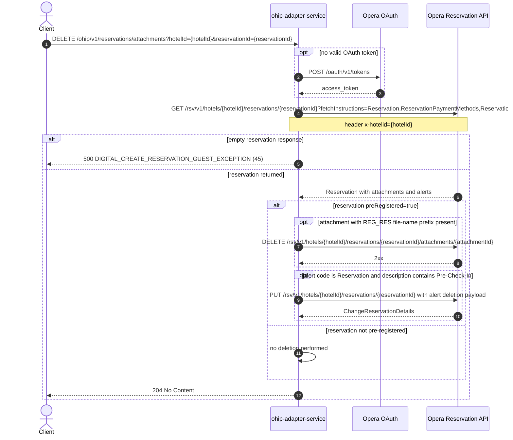

# OHIP Adapter Service: deleteRegCardAttachment Flow

Deletes the registration-card attachment (file name prefixed `REG_RES`) of a pre-registered Opera reservation and removes its pre-check-in alert.

```http
DELETE /ohip/v1/reservations/attachments?hotelId={hotelId}&reservationId={reservationId}
Host: ohip-adapter-service:9100
Accept: application/json
```

The servlet context path is `/ohip/` and the reservation controller is mapped under `/v1`, so the public path is `/ohip/v1/reservations/attachments`. The endpoint itself requires no caller authentication; Opera calls use the service OAuth client when no valid token is present.

## Flow

ohip-adapter-service first fetches the reservation from Opera with fetch instructions `Reservation`, `ReservationPaymentMethods`, `ReservationPolicies`, `Attachments`, and `Alerts`. An empty result maps to a 500 (`DIGITAL_CREATE_RESERVATION_GUEST_EXCEPTION`, code 45, "Reservation attachment not found").

If the first reservation in the response has `preRegistered=true`, the service looks for the first attachment whose file name starts with `REG_RES`. When found, it deletes that attachment via the Opera reservation attachments API; when absent, it only logs a warning. It then selects the first alert whose code equals `Reservation` and whose description contains `Pre-Check-In`. If that alert exists, the service sends a PUT change-reservation request that removes it.

If the reservation is not pre-registered, nothing is deleted and the endpoint still returns 204. The response is always 204 No Content on success.

## Mermaid Flow



## Features

- Deletes the registration-card (`REG_RES`-prefixed) attachment of a reservation
- Only acts when the reservation is pre-registered; otherwise a silent no-op returning 204
- Also removes the first alert whose code is `Reservation` and whose description contains `Pre-Check-In` via a change-reservation PUT
- Missing `REG_RES` attachment is tolerated (logged, alert cleanup still runs)
- Always 204 No Content on success, even when nothing was deleted
- No caller authentication on the public endpoint

## Feature Flags

No endpoint-specific flag gates this flow. The shared Opera authentication flags apply:

| Flag | Effect when enabled |
| --- | --- |
| `release_ohip_use_token_service` | Global OAuth mode for Opera token acquisition (infrastructure flag, evaluated outside request context) |
| `release_ohip_use_token_refresh_skew` | Applies the configured early-refresh clock skew to directly acquired Opera OAuth tokens. |

## Request

| Query parameter | Required | Purpose |
| --- | --- | --- |
| `hotelId` | Yes | Opera hotel id, also sent as `x-hotelid` header on Opera calls |
| `reservationId` | Yes | Opera reservation id whose reg-card attachment is deleted |

## Branches

| Trigger | Behavior |
| --- | --- |
| Opera returns empty reservation | 500 `DIGITAL_CREATE_RESERVATION_GUEST_EXCEPTION` (45), "Reservation attachment not found" |
| Opera get-reservation error status | 500 `OHIP_GET_RESERVATION_BY_RESID_EXCEPTION` (948) |
| Reservation not pre-registered | No attachment or alert deletion, 204 |
| No `REG_RES`-prefixed attachment | Attachment delete skipped with a warning, alert cleanup still runs, 204 |
| No alert matches code `Reservation` and description `Pre-Check-In` | Alert-deletion PUT skipped, 204 |
| Opera attachment delete error | 500 `OHIP_DELETE_RESERVATION_EXCEPTION` (938) |
| Opera alert-deletion PUT error | 500 `OHIP_PUT_RESERVATIONS_GUEST_EXCEPTION` (952) after retries |
