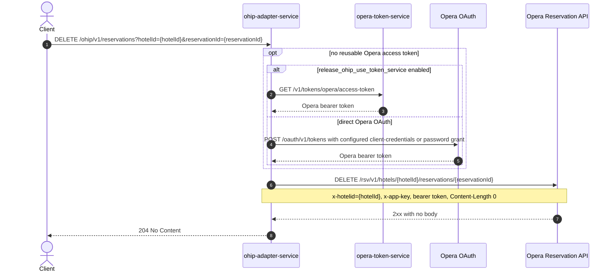

# OHIP Adapter Service: deleteReservation Flow

Deletes a single Opera reservation at a hotel with one Opera DELETE call and returns no body.

```http
DELETE /ohip/v1/reservations?hotelId={hotelId}&reservationId={reservationId}
Host: ohip-adapter-service:9100
Accept: application/json
```

The servlet context path is `/ohip/` and `HotelReservationController` is mapped under `/v1`, so the public path is `/ohip/v1/reservations`. All Opera API calls carry a bearer token plus `x-app-key` and `x-hotelid` headers. A cached access token is reused until its refresh criteria require another direct Opera OAuth or token-service request.

## Flow

ohip-adapter-service passes `hotelId` and `reservationId` straight through the reservation in-port and out-port to the Opera reservation API: `DELETE /rsv/v1/hotels/{hotelId}/reservations/{reservationId}` with an `x-hotelid` header and an explicit `Content-Length: 0`. There is no request or response body mapping and no other downstream call. On Opera success the endpoint returns `204 No Content`; on any Opera error status the client maps it to `OHIP_DELETE_RESERVATION_EXCEPTION` (code `938`, HTTP `500`).

## Mermaid Flow



## Features

- Deletes exactly one reservation id at one hotel with a single Opera DELETE call.
- Straight pass-through: no request body, no response body, no enrichment from other services.
- Sends an explicit `Content-Length: 0` header on the Opera DELETE (required after the Spring Boot upgrade).
- Acquires and caches an Opera bearer token, using either opera-token-service or the configured direct Opera OAuth grant. The public endpoint itself requires no caller authentication.
- Maps any Opera error status to `OHIP_DELETE_RESERVATION_EXCEPTION` (`938`) as an internal server error.

## Feature Flags

| Flag | Effect when enabled |
| --- | --- |
| `release_ohip_use_token_service` | Obtains Opera bearer tokens from opera-token-service instead of authenticating directly with Opera OAuth. |
| `release_ohip_use_token_refresh_skew` | Applies the configured early-refresh clock skew to directly acquired Opera OAuth tokens. |

No other flag gates this endpoint's behavior.

## Request

| Query parameter | Required | Purpose |
| --- | --- | --- |
| `hotelId` | Yes | Opera hotel id used in the downstream path and the `x-hotelid` header. |
| `reservationId` | Yes | Opera reservation id to delete. |

## Branches

| Trigger | Behavior |
| --- | --- |
| Missing `hotelId` or `reservationId` | Spring rejects the request with `400` before the in-port runs. |
| Opera DELETE returns any error status | The client raises `HotelReservationException` with `OHIP_DELETE_RESERVATION_EXCEPTION` (`938`), surfaced as HTTP `500`. |
| Token-service mode is disabled and no direct Opera token is reusable | Uses the configured client-credentials grant when enabled, otherwise the password grant. |
