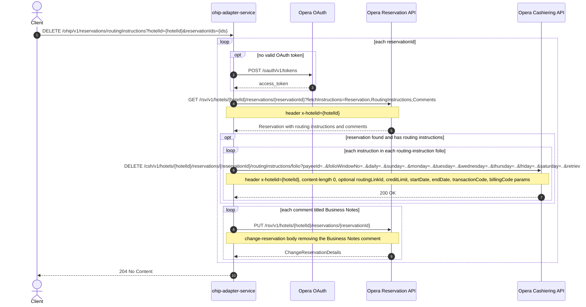

# OHIP Adapter Service: deleteRoutingInstructions Flow

Deletes all routing instructions and Business Notes comments from one or more Opera
reservations at a hotel.

```http
DELETE /ohip/v1/reservations/routingInstructions?hotelId={hotelId}&reservationIds={reservationId[,reservationId...]}
Host: ohip-adapter-service:9100
Accept: application/json
```

The servlet context path is `/ohip/` and the reservation controller is mapped under
`/v1`, so the public path is `/ohip/v1/reservations/routingInstructions`. The service
itself performs no inbound authentication (Spring Security auto-configuration is
excluded); Opera calls use the service OAuth client when no valid token is present.

## Flow

For each reservation id in turn, ohip-adapter-service fetches the reservation from the
Opera reservation API with fetch instructions `Reservation`, `RoutingInstructions`, and
`Comments`. If the reservation exists and carries routing instructions, then for every
routing instruction folio and every instruction inside it, the service issues one Opera
cashiering DELETE on the routing-instructions `/folio` sub-resource, passing the folio's
payee id, folio window number, and the instruction's duration, dates, credit limit,
routing link id, transaction codes, and billing codes as query parameters.

After the routing-instruction deletes (or immediately, when the reservation has none),
the service removes any comments titled `Business Notes` from the same reservation by
sending an Opera change-reservation PUT per matching comment.

The in-port is a pure delegate: there is no validation, business rule, or flag check
between the controller and the Opera calls. On success the endpoint returns
`204 No Content` with no body. Any Opera error is wrapped in a
`HotelReservationException` (`OHIP_GET_RESERVATION_ROUTING_INSTRUCTION_EXCEPTION`,
`OHIP_DELETE_ROUTING_INSTRUCTIONS_EXCEPTION`, or `OHIP_CHANGE_RESERVATION_EXCEPTION`)
and surfaces as a 5xx.

## Mermaid Flow



## Features

- Batch operation: `reservationIds` is a set; each reservation is processed
  independently and sequentially.
- Removes both routing instructions (Opera cashiering API) and `Business Notes`
  comments (Opera change-reservation PUT) in one call.
- No inbound auth on the service; outbound Opera calls carry a bearer token obtained
  from Opera OAuth (`POST /oauth/v1/tokens`) when none is cached.
- No request body; the response is always an empty `204 No Content` on success.

## Feature Flags

No endpoint-specific flags: the in-port delegates straight to the out-port with no
`unleashWrapper` checks anywhere in this chain. Only the global Opera token-acquisition
flags apply:

| Flag | Effect when enabled |
| --- | --- |
| `release_ohip_use_token_service` | Obtains Opera bearer tokens from opera-token-service instead of authenticating directly with Opera OAuth. |
| `release_ohip_use_token_refresh_skew` | Applies the configured early-refresh clock skew to directly acquired Opera OAuth tokens. |

## Request

| Query parameter | Required | Purpose |
| --- | --- | --- |
| `hotelId` | Yes | Opera hotel id used in downstream paths and the `x-hotelid` header. |
| `reservationIds` | Yes | Comma-separated reservation ids bound as a `Set<String>`; each is processed in turn. |

## Branches

- **Reservation not found (empty reservation list from Opera):** the
  routing-instruction block is skipped, but `deleteBusinessNotes` still runs and calls
  `.get(0)` on the empty reservation list, so an Opera 200 with an empty
  `reservations.reservation` array produces an unhandled `IndexOutOfBoundsException`
  (500) rather than a 404.
- **Reservation with no comments:** `deleteBusinessNotes` iterates the comments list
  directly; a reservation payload with a null `comments` field throws an NPE. The happy
  path expects Opera to return at least an empty comments array.
- **Reservation with routing instructions but none matching:** each folio's
  instructions drive the DELETE fan-out; a reservation whose routing-instruction list
  is empty issues no cashiering calls and proceeds straight to Business Notes removal.
- **Opera error on any downstream call:** mapped to `HotelReservationException` and
  surfaced as a 5xx; remaining reservation ids in the set are not processed.
