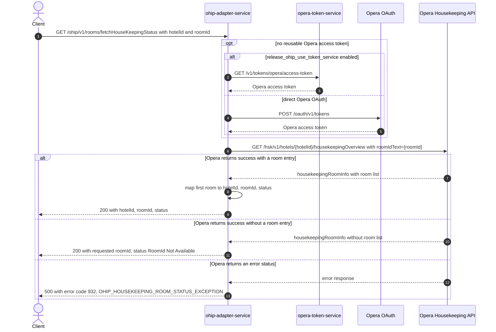

# OHIP Adapter Service: fetchHouseKeepingRoomStatus Flow

Returns the housekeeping status of one Opera room in one hotel, for kiosk room
allocation checks.

```http
GET /ohip/v1/rooms/fetchHouseKeepingStatus?hotelId={hotelId}&roomId={roomId}
Host: ohip-adapter-service:9100
Accept: application/json
```

The servlet context path is `/ohip/`. The endpoint itself requires no inbound
authentication; the outbound Opera request carries an OAuth bearer token, the configured
`x-app-key`, and the requested hotel id in the `x-hotelid` header.

## Flow

The controller takes the two required query parameters `hotelId` and `roomId` and passes
them straight through the room-allocation domain port; there is no business logic in
between. The out-port implementation makes one Opera Housekeeping API request,
`GET /hsk/v1/hotels/{hotelId}/housekeepingOverview?roomIdText={roomId}`.

The response mapper reads the first room from
`housekeepingRoomInfo.housekeepingRooms.room` and returns a flat DTO of `hotelId`,
`roomId`, and `status` (the room's `housekeeping.housekeepingRoomStatus`
`housekeepingRoomStatusText`). When Opera returns no `room` array for the requested
room id, the endpoint still responds 200 with the caller's `roomId` echoed back and the
literal status `RoomId Not Available`.

Every Opera request reuses a valid OAuth token when one is available. Otherwise,
authentication obtains a token either from `opera-token-service` or directly from Opera
OAuth according to `release_ohip_use_token_service`.

Any Opera error status is mapped to a `RoomAllocationException`
(`OHIP_HOUSEKEEPING_ROOM_STATUS_EXCEPTION`, code 932), which the shared business
exception handler returns as HTTP 500.

## Mermaid Flow



## Features

- Looks up the housekeeping status of exactly one room in one hotel per call; the Opera
  call filters the housekeeping overview to the requested room with `roomIdText`.
- No inbound authentication or authorization on the endpoint.
- Response is a flat object of `hotelId`, `roomId`, and `status` only; Opera's
  housekeeping overview structure (counts, paging, room condition detail) is not
  returned.
- An unknown room id is not a 404: the endpoint returns 200 with the requested `roomId`
  and the status text `RoomId Not Available`.

## Feature Flags

| Flag | Effect when enabled |
| --- | --- |
| `release_ohip_use_token_service` | Opera access tokens are fetched from `opera-token-service` instead of directly from Opera OAuth. Infrastructure-level flag on the shared `ohipWebClient`, evaluated outside the request context. |
| `release_ohip_use_token_refresh_skew` | Applies the configured early-refresh clock skew to directly acquired Opera OAuth tokens. |

No other flag gates this endpoint's behavior.

## Request

| Parameter | In | Required | Effect |
| --- | --- | --- | --- |
| `hotelId` | query | yes | Hotel whose housekeeping overview is queried; also sent to Opera as the `{hotelId}` path segment and the `x-hotelid` header. |
| `roomId` | query | yes | Room the overview is filtered to (`roomIdText` query parameter on the Opera call); echoed back in the response when Opera returns no matching room. |
