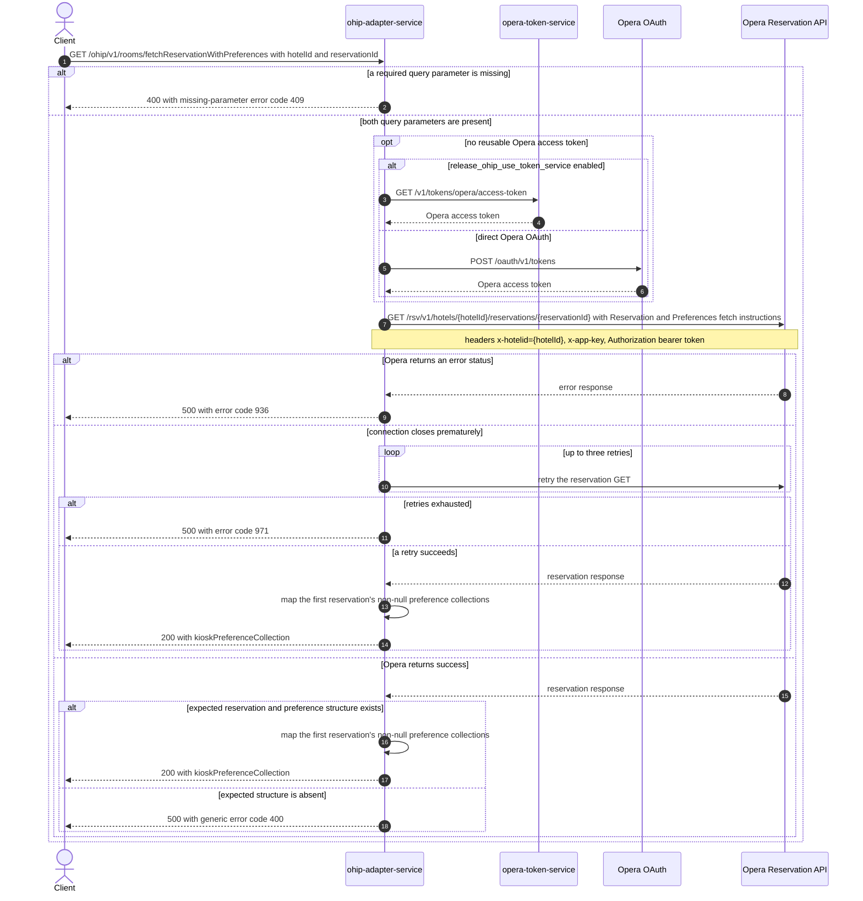

# OHIP Adapter Service: fetchReservationWithPreference Flow

Returns the Opera preference collections attached to the first reservation in a reservation lookup.

```http
GET /ohip/v1/rooms/fetchReservationWithPreferences?hotelId={hotelId}&reservationId={reservationId}
Host: ohip-adapter-service:9100
Accept: application/json
```

The servlet context path is `/ohip/` and `RoomAllocationController` is mapped under
`/v1/rooms`. The endpoint has no endpoint-specific inbound authentication. Its outbound Opera
request carries an OAuth bearer token, the configured `x-app-key`, and the requested hotel id in
the `x-hotelid` header.

## Flow

`RoomAllocationController.fetchReservationWithPreference` passes the required `hotelId` and
`reservationId` query parameters through `RoomAllocationInPortImpl` without validation or other
business logic. `RoomAllocationOutPortImpl` then asks `OhipReservationClient` for the reservation
and its preferences.

The client makes one Opera Reservation API call:
`GET /rsv/v1/hotels/{hotelId}/reservations/{reservationId}`, with repeated
`fetchInstructions=Reservation` and `fetchInstructions=Preferences` query parameters. There is no
business-data cache on this path. A premature connection close is retried up to three times by the
shared Opera `WebClient`.

On success, `ReservationPreferenceMapper` reads the first reservation in the Opera response. It
drops preference collections whose `preference` list is null, drops null entries within each
remaining list, and returns each collection's `preferenceType`, `preferenceTypeDescription`, and
the remaining preferences' `preferenceValue` and `description`. All other reservation data is
discarded.

Every Opera request reuses a valid OAuth token when one is available. Otherwise, authentication
obtains a token either from `opera-token-service` or directly from Opera OAuth according to
`release_ohip_use_token_service`.

Any Opera error status becomes `HotelReservationException` with error code 936
(`OHIP_RETRIVE_RESERVATION_PREFERENCES_EXCEPTION`) and is returned as HTTP 500. A successful Opera
payload that lacks the expected reservation wrapper, first reservation, or preference collection
fails during mapping and is returned by the global handler as HTTP 500 with generic error code
400.

## Mermaid Flow



## Features

- Reads one reservation from one Opera hotel per request, requesting only the `Reservation` and
  `Preferences` instruction groups.
- Returns only preference collection type metadata and each preference's value and description.
- Preserves Opera's preference collection order and the order of non-null preference entries.
- Returns an empty `kioskPreferenceCollection` when Opera supplies an empty preference collection.
- Has no endpoint-specific inbound authentication, feature flags, or business-data caching.
- Retries the Opera GET up to three times only for a premature connection close.

## Feature Flags

| Flag | Effect when enabled |
| --- | --- |
| `release_ohip_use_token_service` | Fetches Opera access tokens from `opera-token-service` instead of directly from Opera OAuth. This infrastructure flag is evaluated by the shared Opera `WebClient`. |
| `release_ohip_use_token_refresh_skew` | Applies the configured early-refresh clock skew to directly acquired Opera OAuth tokens. |

No other flag gates this endpoint's behavior.

## Request

| Parameter | In | Required | Effect |
| --- | --- | --- | --- |
| `hotelId` | query | yes | Supplies Opera's `{hotelId}` path segment and the `x-hotelid` header. |
| `reservationId` | query | yes | Selects the Opera reservation whose preference collections are returned. |

There is no request body. Presence is enforced by Spring, but neither query parameter has
content or format validation in the controller or domain layer.

The response body is `KioskReservationPreferencesDto`, containing
`kioskPreferenceCollection[]`. Each collection contains `preferenceType`,
`preferenceTypeDescription`, and `kioskPreference[]`; each preference contains
`preferenceValue` and `description`.

## Branches

| Trigger | Behavior |
| --- | --- |
| A required query parameter is absent | HTTP 400 with missing-parameter error code 409; no Opera call. |
| `release_ohip_use_token_service` is enabled and no reusable token exists | Calls `GET /v1/tokens/opera/access-token` before the Opera reservation request. |
| Token-service flag is disabled and no reusable token exists | Calls Opera OAuth directly; `config.service.ohip.isClientCredentialsEnabled` selects client-credentials or password grant. |
| Opera returns any error status | HTTP 500 with error code 936. |
| The Opera GET repeatedly ends with a premature connection close | Three retries, then HTTP 500 with retries-exhausted error code 971. |
| A collection's `preference` list is null | The collection is omitted from the response. |
| An entry within a non-null `preference` list is null | The entry is omitted from the collection. |
| Opera returns an empty `preferenceCollection` | HTTP 200 with an empty `kioskPreferenceCollection`. |
| Opera returns a successful payload without the expected first reservation or preference collection | Mapping fails and the global handler returns HTTP 500 with generic error code 400. |
