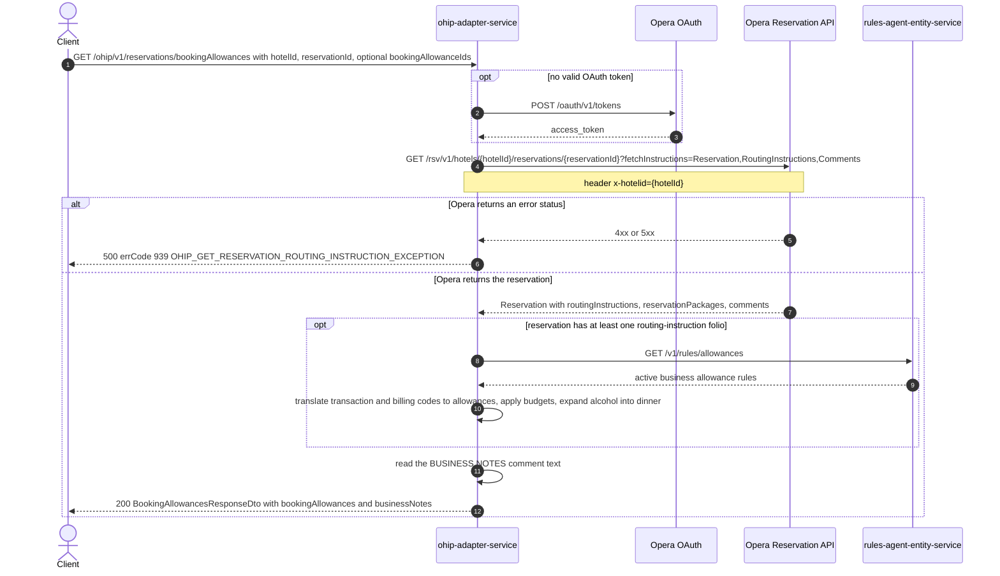

# OHIP Adapter Service: getBookingAllowances Flow

Returns the business booking allowances (and the Business Notes comment) held on one Opera reservation, translated from Opera routing-instruction charge codes into digital allowance names.

```http
GET /ohip/v1/reservations/bookingAllowances?hotelId={hotelId}&reservationId={reservationId}&bookingAllowanceIds={id[,id...]}
Host: ohip-adapter-service:9100
Accept: application/json
```

The servlet context path is `/ohip/` and the reservation controller is mapped under `/v1`, so the public path is `/ohip/v1/reservations/bookingAllowances`. Opera calls use the service OAuth client when no valid token is present.

## Flow

ohip-adapter-service reads the single reservation from Opera with `fetchInstructions=Reservation,RoutingInstructions,Comments`, sending the hotel id both in the path and in the `x-hotelid` header. The in-port adds nothing but logging; all behavior lives in the out-port.

From the first reservation in the Opera payload the adapter takes the **first** routing-instruction folio and its charge instructions. Only when that folio list is non-empty does it call rules-agent-entity-service for the active business-allowance rules; with no routing instructions it never calls rules-agent and the allowance list stays empty.

For the retained instructions - the ones whose duration carries no time span, or whose time span start date equals the first instruction's start date - every transaction code and every billing code is translated to an allowance name against the rules (PMS `OP`, rule `targetId` equal to the code). A code that matches a rule whose `sourceId` is one of the reservation's packages (packages with a schedule quantity greater than zero) resolves as that package allowance; otherwise the adapter falls back to non-package rules, taking the first match when no `bookingAllowanceIds` were supplied and every match restricted to the supplied ids when they were. Each resolved allowance carries the instruction's `creditLimit` as its budget. Finally, an alcohol allowance is expanded into an extra dinner allowance which takes over the budget, leaving alcohol at zero.

Independently of routing, the adapter scans the reservation comments for the one titled `BUSINESS NOTES` and returns its text as `businessNotes`.

An Opera error status on the reservation read is mapped to `OHIP_GET_RESERVATION_ROUTING_INSTRUCTION_EXCEPTION` (errCode 939) and surfaces as HTTP 500. The Opera payload is dereferenced unguarded, so an empty Opera success body fails inside the adapter rather than mapping to a domain error.

## Mermaid Flow



## Features

- Single-reservation read scoped by `hotelId` and `reservationId`
- Allowance translation of Opera routing-instruction transaction codes and billing codes via rules-agent business allowance rules
- Package-aware resolution: a code matching a rule whose source is a package present on the reservation resolves to that package allowance first
- Optional narrowing of non-package allowances to the ids supplied in `bookingAllowanceIds`
- Budget per allowance taken from the routing instruction's `creditLimit`
- Alcohol allowance expanded into a paired dinner allowance that carries the budget
- Business Notes comment returned alongside the allowances
- Only the first routing-instruction folio of the first reservation is considered

## Integration-test observability note

rules-agent-entity-service is a **live deployed collaborator**, not one of the four
WireMock upstreams, so journeys cannot stub-force it, count its calls, or prove its
absence (`callCount` does not exist for it). This is an accepted architectural boundary
(workflow rule W4), not a queued gap. Consequences for coverage:

- The happy path is covered implicitly and against real behavior: rules-agent serves its
  Liquibase-seeded rules live (verified 2026-08-27: 27 ACTIVE `pms=OP` rules), and a
  broken or unreachable rules-agent fails the allowance scenarios on their response
  assertions.
- A rules-agent failure-mapping journey is out of scope (no error stub can be installed).
- The "no routing folio never calls rules-agent" branch is proven indirectly: empty
  `bookingAllowances` with `businessNotes` still resolved and exactly one Opera call.

Revisit (a fifth WireMock upstream in the framework) only if several endpoints acquire
load-bearing rules-agent branches.

## Feature Flags

None. This endpoint does not gate behavior on feature flags.

Global OAuth may still use `release_ohip_use_token_service` for Opera token acquisition, and the token-refresh skew flag is read once at client-provider construction; neither is request-scoped and neither changes this endpoint's behavior.

## Request

| Query parameter | Required | Default | Purpose |
| --- | --- | --- | --- |
| `hotelId` | Yes | n/a | Opera hotel id, used in the reservation path and the `x-hotelid` header |
| `reservationId` | Yes | n/a | Opera reservation id read for routing instructions and comments |
| `bookingAllowanceIds` | No | absent | Restricts non-package allowance resolution to these allowance ids; when absent the first matching non-package rule per code wins |

Example:

```http
GET /ohip/v1/reservations/bookingAllowances?hotelId=HEAPTI&reservationId=6001001&bookingAllowanceIds=breakfast,dinner
Accept: application/json
```

## Branches

| Trigger | Behavior |
| --- | --- |
| Reservation has no routing-instruction folio | rules-agent is never called; `bookingAllowances` is empty, `businessNotes` still resolved |
| Reservation has no `BUSINESS NOTES` comment | `businessNotes` is null |
| `bookingAllowanceIds` supplied | Non-package codes resolve to every matching rule whose source is in the supplied ids, instead of the single first match |
| Routing code matches a package on the reservation | Resolves as the package allowance and the non-package fallback is skipped |
| Alcohol allowance resolved | An extra dinner allowance is appended with the alcohol budget and alcohol is set to zero |
| Opera reservation read returns an error status | HTTP 500 with errCode 939 |
| Opera returns an empty success body | Unhandled dereference of the missing payload inside the adapter, surfaced as a generic 500 |
