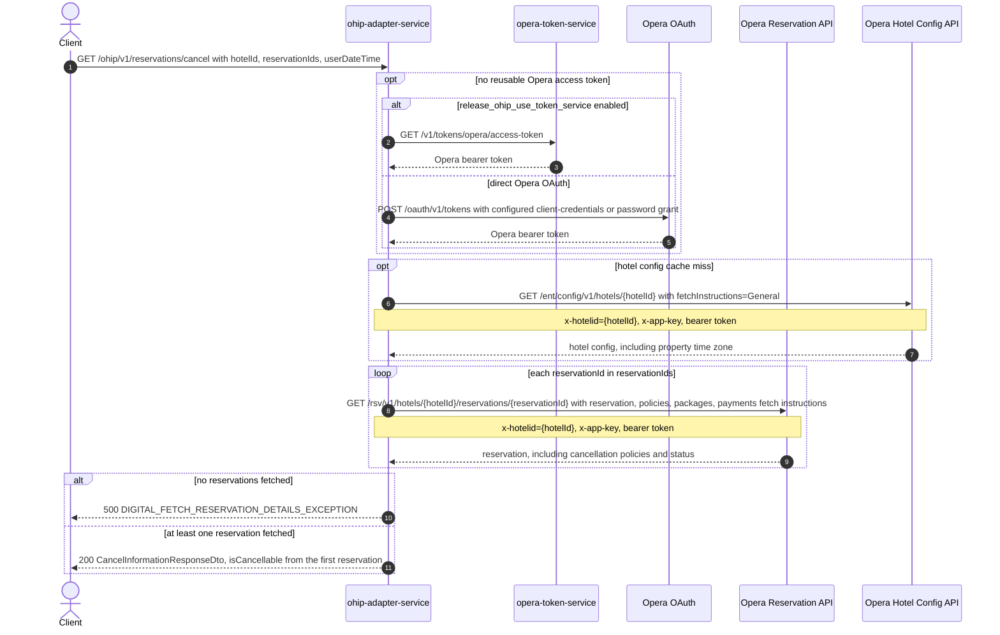

# OHIP Adapter Service: getCancelInformation Flow

Tells the caller whether a reservation can still be cancelled, based on the Opera cancellation-policy deadline and the reservation's current status.

```http
GET /ohip/v1/reservations/cancel?hotelId={hotelId}&reservationIds={reservationIds}&userDateTime={userDateTime}
Host: ohip-adapter-service:9100
Accept: application/json
```

The servlet context path is `/ohip/` and `HotelReservationController` is mapped under `/v1`, so the public path is `/ohip/v1/reservations/cancel`. All Opera API calls carry a bearer token plus `x-app-key` and `x-hotelid` headers. A cached access token is reused until its refresh criteria require another direct Opera OAuth or token-service request.

## Flow

ohip-adapter-service fetches, for every id in `reservationIds`, the full Opera reservation (including reservation policies) and, in parallel, the hotel's Opera configuration to read its IANA time zone. Only the first fetched reservation is used: its first cancellation policy's absolute deadline is converted into the hotel's time zone and compared against `userDateTime` (also interpreted in the hotel's time zone). The endpoint reports the reservation cancellable when that deadline is still in the future and the reservation status does not contain `"Cancelled"`. If no reservation policies exist, or none of the requested reservations could be fetched, the endpoint reports it as not cancellable (or errors, respectively) without evaluating dates.

## Mermaid Flow



## Features

- Reports a single `isCancellable` boolean for the request, derived from the first reservation returned by Opera even when multiple `reservationIds` are supplied.
- Compares Opera's cancellation-policy absolute deadline against the caller-supplied `userDateTime`, both interpreted in the hotel's configured Opera time zone.
- Treats any reservation status containing `"Cancelled"` as not cancellable regardless of the deadline.
- Caches the hotel's Opera config (including time zone) for one day per hotel id, avoiding a repeat Opera config call.
- Acquires and caches an Opera bearer token, using either opera-token-service or the configured direct Opera OAuth grant.

## Feature Flags

| Flag | Effect when enabled |
| --- | --- |
| `release_ohip_use_token_service` | Obtains Opera bearer tokens from opera-token-service instead of authenticating directly with Opera OAuth. |

## Request

| Query param | Required | Purpose |
| --- | --- | --- |
| `hotelId` | Yes | Opera hotel id used in downstream paths and `x-hotelid`. |
| `reservationIds` | Yes | Set of Opera reservation ids to fetch; each is requested from Opera individually, but only the first result in fetch order is evaluated. |
| `userDateTime` | Yes | Caller's current date-time, parsed and compared in the hotel's Opera time zone. |

## Branches

| Trigger | Behavior |
| --- | --- |
| `reservationIds` has more than one id | All ids are fetched from Opera concurrently, but only the first reservation returned is used to compute `isCancellable`; the rest are discarded. |
| No reservations could be fetched (Opera returns none for any id) | Throws `DIGITAL_FETCH_RESERVATION_DETAILS_EXCEPTION`, mapped to an internal server error. |
| Reservation has no cancellation policies | Returns `isCancellable=false` without checking dates or status. |
| Reservation's cancellation deadline (hotel time zone) is after `userDateTime` and status does not contain `"Cancelled"` | Returns `isCancellable=true`. |
| Reservation's cancellation deadline has passed, or its status contains `"Cancelled"` | Returns `isCancellable=false`. |
| Hotel config already cached for this hotel id | Skips the Opera hotel-config call and reuses the cached time zone. |
| Token-service mode is disabled and no direct Opera token is reusable | Uses the configured client-credentials grant when enabled, otherwise the password grant. |
| Opera reservation, Opera hotel-config, Opera OAuth, or opera-token-service calls fail | Propagates the mapped internal/downstream exception. |
