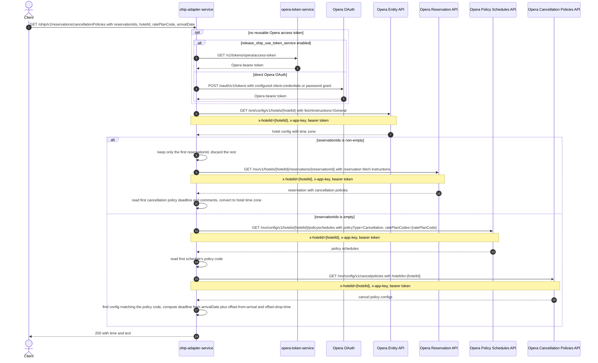

# OHIP Adapter Service: getCancellationPolicies Flow

Returns the cancellation deadline and description for a reservation, looked up either by
reservation id or by rate plan code and arrival date.

```http
GET /ohip/v1/reservations/cancellationPolicies?reservationIds={reservationIds}&hotelId={hotelId}&ratePlanCode={ratePlanCode}&arrivalDate={arrivalDate}
Host: ohip-adapter-service:9100
Accept: application/json
```

The servlet context path is `/ohip/` and `HotelReservationController` is mapped under
`/v1`, so the public path is `/ohip/v1/reservations/cancellationPolicies`. All Opera API
calls carry a bearer token plus `x-app-key` and `x-hotelid` headers. A cached access token
is reused until its refresh criteria require another direct Opera OAuth or
opera-token-service request.

## Flow

ohip-adapter-service always first loads the hotel's config from the Opera Entity API to
read the hotel's time zone. It then branches on `reservationIds`: when the set is
non-empty (the normal case, since `reservationIds` is a required query parameter), it
takes only the **first** id in the set, ignoring any others, and loads that single
reservation from the Opera Reservation API with cancellation policies included. It reads
the first cancellation policy's absolute deadline and comment text off that reservation,
converts the deadline into the hotel's time zone, and returns it.

When `reservationIds` is empty, it instead looks up policy schedules for the hotel and
`ratePlanCode` from the Opera Policy Schedules API, takes the first schedule's policy
code, then looks up cancellation policy configs for the hotel from the Opera Cancellation
Policies API and finds the entry matching that policy code. It computes the deadline from
`arrivalDate` combined with that policy's offset-from-arrival and offset-drop-time, in the
hotel's time zone, and returns the deadline with the policy's penalty description.

The controller returns HTTP 200 with `time` and `text` fields from whichever branch ran.

## Mermaid Flow



## Features

- Resolves the reservation's cancellation deadline and its description either by
  reservation id or by rate plan code plus arrival date, in the same endpoint.
- Always resolves the hotel's time zone first from the Opera Entity API, and expresses
  the returned deadline in that time zone.
- Acquires and caches an Opera bearer token, using either opera-token-service or the
  configured direct Opera OAuth grant.

## Feature Flags

| Flag | Effect when enabled |
| --- | --- |
| `release_ohip_use_token_service` | Obtains Opera bearer tokens from opera-token-service instead of authenticating directly with Opera OAuth. |
| `release_ohip_use_token_refresh_skew` | Applies the configured early-refresh clock skew to directly acquired Opera OAuth tokens. |

This method does not read any other Unleash flags.

## Request

| Parameter | Required | Purpose |
| --- | --- | --- |
| `reservationIds` | Yes | Set of reservation ids; only the first id is used. A non-empty set selects the by-reservation branch. |
| `hotelId` | Yes | Opera hotel id used in downstream paths and `x-hotelid`. |
| `ratePlanCode` | Yes | Rate plan code used only when `reservationIds` is empty, to look up policy schedules. |
| `arrivalDate` | Yes | Arrival date used only when `reservationIds` is empty, combined with the matched policy's offsets to compute the deadline. |

## Branches

| Trigger | Behavior |
| --- | --- |
| `reservationIds` non-empty | Uses the by-reservation-id branch; `ratePlanCode` and `arrivalDate` are not used. |
| `reservationIds` empty | Uses the by-rate-plan branch, calling the Policy Schedules and Cancellation Policies APIs instead of the Reservation API. |
| Reservation lookup returns no reservation (by-reservation branch) | Fails with `DIGITAL_NO_CANCELLATION_POLICIES_EXCEPTION`. |
| Policy schedules lookup returns no schedules (by-rate-plan branch) | Returns an empty `CancellationPoliciesResponse` (`time` and `text` both null) with HTTP 200. |
| No cancel policy config matches the schedule's policy code (by-rate-plan branch) | Fails with `OHIP_GET_CANCELLATION_POLICY_EXCEPTION`. |
| Opera hotel config, reservation, policy schedules, or cancel policies call fails | Propagates the mapped internal/downstream exception. |
| Token-service mode is disabled and no direct Opera token is reusable | Uses the configured client-credentials grant when enabled, otherwise the password grant. |
