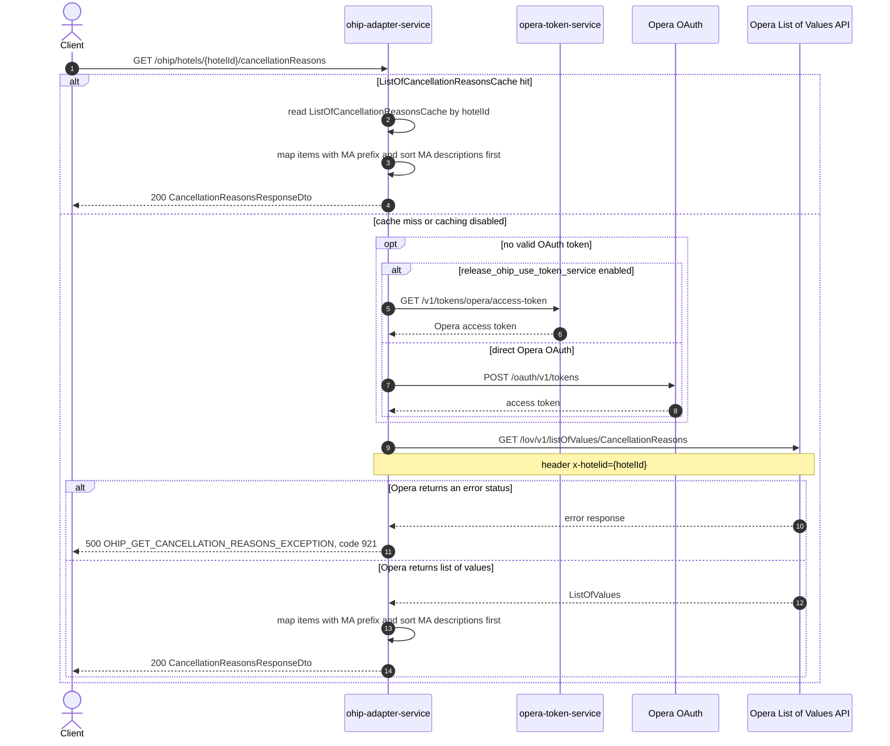

# OHIP Adapter Service: getCancellationReasons Flow

Returns Opera cancellation reasons for one hotel, including whether manager approval is required.

```http
GET /ohip/hotels/{hotelId}/cancellationReasons
Host: ohip-adapter-service:9100
Accept: application/json
```

The servlet context path is `/ohip/`. There is no class-level request mapping, so the public path is `/ohip/hotels/{hotelId}/cancellationReasons`.

## Flow

The controller passes `hotelId` to the list-of-values in-port, which delegates to the Opera LOV client. When Redis cache is enabled, a hit on `ListOfCancellationReasonsCache` for that hotel id skips Opera. On a cache miss, ohip-adapter-service calls the Opera List of Values API for the `CancellationReasons` list, sending the hotel id in the `x-hotelid` header.

Every Opera request reuses a valid OAuth token when one is available. Otherwise authentication obtains a token either from `opera-token-service` or directly from Opera OAuth according to `release_ohip_use_token_service`.

The service maps each Opera item to code, name, description, and active. `managerApprovalNeeded` is true when the item name or description starts with `MA`. Reasons whose description starts with `MA` are sorted first. A downstream Opera error status becomes internal error `OHIP_GET_CANCELLATION_REASONS_EXCEPTION` with code `921`.

## Mermaid Flow



## Features

- Cancellation-reason lookup by Opera hotel id
- One Opera LOV request for the `CancellationReasons` list
- Redis cache by hotel id (`ListOfCancellationReasonsCache`, 1-day manager)
- Marks `managerApprovalNeeded` when name or description starts with `MA`
- Sorts reasons whose description starts with `MA` ahead of the rest
- Reuses cached OAuth credentials while they remain valid
- Returns internal error code `921` when Opera rejects the LOV lookup

## Feature Flags

| Flag | Effect when enabled |
| --- | --- |
| `release_ohip_use_token_service` | Acquires the Opera access token from opera-token-service instead of the direct Opera OAuth flow |
| `release_ohip_use_token_refresh_skew` | Refreshes direct Opera OAuth tokens using the configured clock-skew window before expiry |

## Request

Path only:

| Parameter | Required | Notes |
| --- | --- | --- |
| `hotelId` | Yes (path) | Supplies the Opera `x-hotelid` header and the cache key |

No query parameters or body.

Example:

```http
GET /ohip/hotels/HEAPTI/cancellationReasons
Accept: application/json
```

## Branches

| Trigger | Behavior |
| --- | --- |
| `ListOfCancellationReasonsCache` hit | Skips token acquisition and the Opera LOV call, then maps the cached list |
| Cache miss or caching disabled | Calls Opera LOV after obtaining a token if none is reusable |
| Valid OAuth token is cached | Skips token acquisition |
| `release_ohip_use_token_service` enabled and no valid token | Gets the token from opera-token-service |
| `release_ohip_use_token_service` disabled and no valid token | Gets the token directly from Opera OAuth |
| Opera returns an error status | Returns `OHIP_GET_CANCELLATION_REASONS_EXCEPTION` with code `921` |
