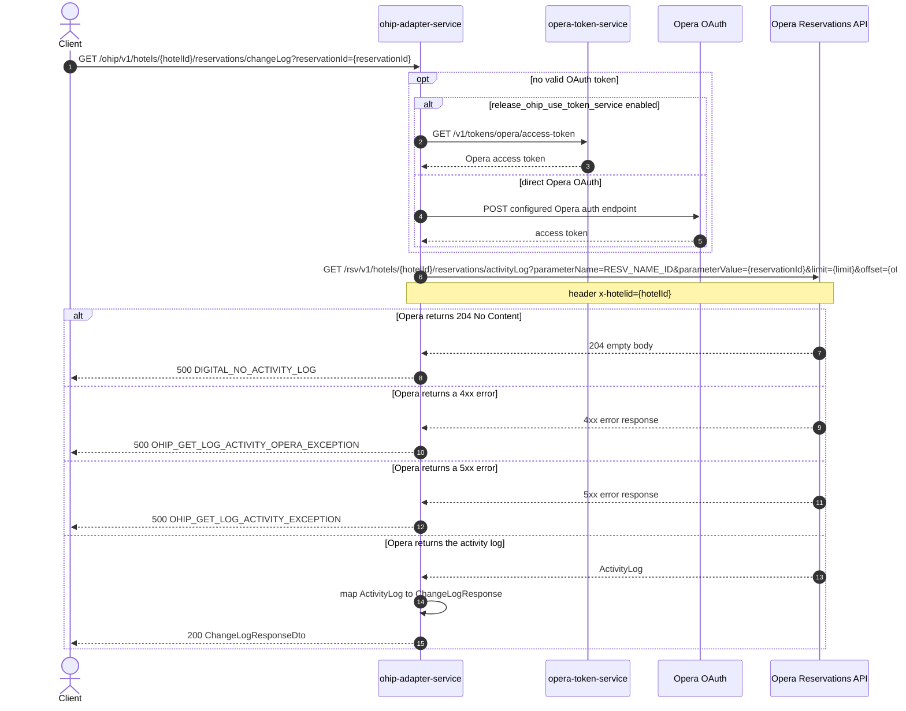

# OHIP Adapter Service: getChangeLog Flow

Returns the Opera activity/change log entries for one reservation.

```http
GET /ohip/v1/hotels/{hotelId}/reservations/changeLog?reservationId={reservationId}
Host: ohip-adapter-service:9100
Accept: application/json
```

The servlet context path is `/ohip/` and the change log controller is mapped under `/v1`, so the public path is `/ohip/v1/hotels/{hotelId}/reservations/changeLog`.

## Flow

ohip-adapter-service passes the hotel id, reservation id, and the optional `limit`/`offset` paging values straight through its change log in-port and out-port to a single Opera Reservations API call for the reservation's activity log. The Opera request carries the hotel id in the path and the `x-hotelid` header, and identifies the reservation via `parameterName=RESV_NAME_ID`/`parameterValue={reservationId}` query parameters.

If Opera returns no activity log (HTTP 204), the out-port raises an internal error instead of a 404. Any other Opera 4xx or 5xx status is likewise translated into an internal error. On success, the Opera `ActivityLog` payload is mapped to the service's change log response model and returned as-is.

## Mermaid Flow



## Features

- Single-reservation change log lookup by hotel id and Opera reservation id
- Optional `limit`/`offset` paging passed straight through to Opera
- One Opera Reservations API request with the required hotel header
- Reuses cached OAuth credentials while they remain valid
- Maps the Opera `ActivityLog` payload directly to the response model with no additional enrichment

## Feature Flags

| Flag | Effect when enabled |
| --- | --- |
| `release_ohip_use_token_service` | Acquires the Opera access token from opera-token-service instead of the direct Opera OAuth flow |
| `release_ohip_use_token_refresh_skew` | Refreshes direct Opera OAuth tokens using the configured clock-skew window before expiry |

## Request

| Parameter | Location | Required | Purpose |
| --- | --- | --- | --- |
| `hotelId` | path | Yes | Supplies the Opera hotel path value and `x-hotelid` header |
| `reservationId` | query | Yes | Supplies the Opera `parameterValue` for the `RESV_NAME_ID` lookup |
| `limit` | query | No | Passed through as the Opera `limit` query parameter |
| `offset` | query | No | Passed through as the Opera `offset` query parameter |

Example:

```http
GET /ohip/v1/hotels/HEAPTI/reservations/changeLog?reservationId=6004202&limit=20&offset=0
Accept: application/json
```

## Branches

| Trigger | Behavior |
| --- | --- |
| Valid OAuth token is cached | Skips token acquisition |
| `release_ohip_use_token_service` enabled and no valid token | Gets the token from opera-token-service |
| `release_ohip_use_token_service` disabled and no valid token | Gets the token directly from the configured Opera OAuth endpoint |
| Opera returns 204 for the activity log | Returns `DIGITAL_NO_ACTIVITY_LOG` |
| Opera returns a 4xx status | Returns `OHIP_GET_LOG_ACTIVITY_OPERA_EXCEPTION` |
| Opera returns a 5xx status | Returns `OHIP_GET_LOG_ACTIVITY_EXCEPTION` |
