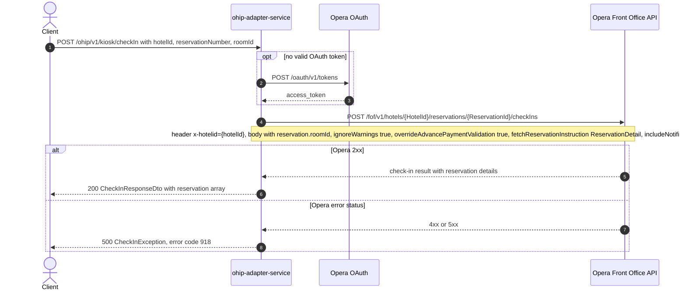

# OHIP Adapter Service: getCheckIn Flow

Checks a kiosk guest into their assigned room by posting a check-in request to the Opera
front-office API and returning the checked-in reservation details.

```http
POST /ohip/v1/kiosk/checkIn
Host: ohip-adapter-service:9100
Content-Type: application/json
Accept: application/json
```

The servlet context path is `/ohip/` and the kiosk controller is mapped under
`/v1/kiosk`, so the public path is `/ohip/v1/kiosk/checkIn`. The service itself performs
no inbound authentication (Spring Security auto-configuration is excluded); Opera calls
use the service OAuth client when no valid token is present.

## Flow

The controller maps the request body (`hotelId`, `reservationNumber`, `roomId`) into an
Opera check-in request: a `reservation` object carrying the `roomId` with
`ignoreWarnings=true` and `overrideAdvancePaymentValidation=true` hard-coded,
`fetchReservationInstruction=["ReservationDetail"]`, and `includeNotifications=false`.
The false notification value is a known service defect caused by Lombok builder behavior;
see [check-in-include-notifications-false.md](../../bug/check-in-include-notifications-false.md).
The in-port is a pure delegate: there is no validation, business rule, or flag check
between the controller and the Opera call.

The out-port posts that body to the Opera front-office check-ins endpoint
`POST /fof/v1/hotels/{HotelId}/reservations/{ReservationId}/checkIns` (path from
`config.service.ohip.checkInEndpoint`), with the `x-hotelid` header set to the request's
`hotelId`. Opera's response body is mapped one-to-one to the public response: a
`reservation` array of checked-in reservation details (profiles, room stay, rates,
payment methods, registration numbers, and so on).

Any Opera error status is wrapped in a `CheckInException`
(`OHIP_GET_CHECKIN_DETAILS_EXCEPTION`, internal code 918) and surfaces as a 500. The
check-in call has no retry; unlike the sibling `/updateComments` operation on the same
controller, a failing Opera response fails the request immediately.

## Mermaid Flow



## Features

- Performs the actual Opera check-in for a kiosk guest and returns the resulting
  reservation snapshot in one call.
- The Opera request always ignores Opera warnings and overrides advance-payment
  validation; the caller cannot opt out.
- The Opera request currently sends `includeNotifications=false` because of a known
  builder defect.
- No inbound auth on the service; outbound Opera calls carry a bearer token obtained
  from Opera OAuth (`POST /oauth/v1/tokens`) when none is cached.
- Response is Opera's check-in payload mapped one-to-one: a `reservation` list with
  profile, room-stay, rate, payment-method, and registration-number detail.

## Feature Flags

No endpoint-specific flags: the in-port delegates straight to the out-port with no
`unleashWrapper` checks anywhere in this chain. Only the global Opera token-acquisition
flags apply:

| Flag | Effect when enabled |
| --- | --- |
| `release_ohip_use_token_service` | Obtains Opera bearer tokens from opera-token-service instead of authenticating directly with Opera OAuth. |
| `release_ohip_use_token_refresh_skew` | Applies the configured early-refresh clock skew to directly acquired Opera OAuth tokens. |

## Request

JSON body (`CheckInDetailsDto`); no path or query parameters. The DTO carries `@Valid`
but declares no constraint annotations, so no field is Bean-Validation enforced.

| Body field | Purpose |
| --- | --- |
| `hotelId` | Opera hotel id used in the downstream path and the `x-hotelid` header. |
| `reservationNumber` | Opera reservation id used in the downstream path. |
| `roomId` | Room to check the guest into; sent as `reservation.roomId` in the Opera body. |

## Branches

- **Opera error on the check-in call:** any non-2xx from Opera is mapped to
  `CheckInException` (`OHIP_GET_CHECKIN_DETAILS_EXCEPTION`, code 918) and surfaces as a
  500. There is no 404 mapping: an unknown reservation is whatever Opera returns,
  wrapped the same way.
- **Sibling operation:** `POST /ohip/v1/kiosk/updateComments` on the same controller
  updates car-registration comments via an Opera change-reservation PUT with retries;
  it is a separate endpoint and not part of this flow.
