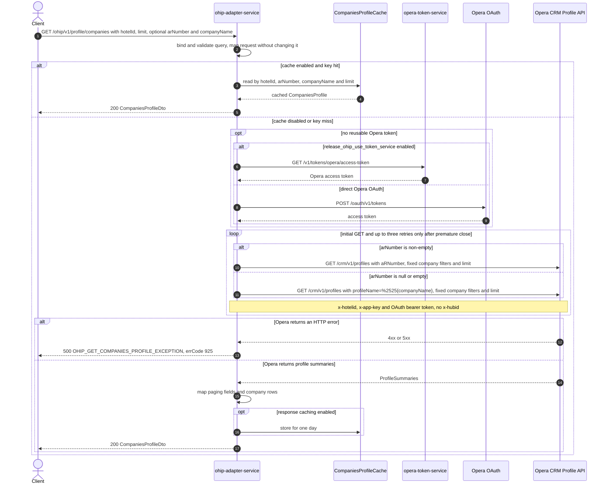

# OHIP Adapter Service: getCompaniesProfile Flow

Searches Opera CRM company profile summaries for one hotel by accounts-receivable number or
company name.

```http
GET /ohip/v1/profile/companies?hotelId={hotelId}&limit={limit}[&arNumber={arNumber}][&companyName={companyName}]
Host: ohip-adapter-service:9100
Accept: application/json
```

The public endpoint has no caller-authentication requirement. Its Opera call uses the shared
service OAuth client.

## Flow

Spring binds and validates the four query fields, then the controller maps them without changing
their values through `ProfileInPort` and `ProfileOutPort`. The domain path is synchronous and has
no business guard, fan-out, or fallback.

When response caching is enabled, the client first checks the one-day `CompaniesProfileCache`
using all four method arguments (`hotelId`, `arNumber`, `companyName`, and `limit`) as the cache
key. On a miss, it obtains or reuses an Opera access token and makes one
`GET /crm/v1/profiles` request. A non-empty `arNumber` produces an `aRNumber` query and takes
precedence even when `companyName` is also supplied. Otherwise, the client constructs a
`profileName` value of `%25{companyName}`. Spring WebClient percent-encodes that value, so the raw
wire URI contains `profileName=%2525{encoded companyName}`.

Both search forms also send `profileType=Company`, `includePurgeProfiles=false`,
`accountsReceivables=true`, `excludeInactive=true`, `includeAnonymized=true`,
`fetchInstructions=SalesInfo`, and the requested `limit`. The request carries `x-hotelid`, the
shared `x-app-key`, and the OAuth bearer token. It does not carry `x-hubid`.

The Opera `ProfileSummaries` paging fields and company rows are mapped to `CompaniesProfileDto`.
Any Opera HTTP error is collapsed to HTTP 500 with errCode `925`. Ordinary HTTP errors are not
retried; the shared GET transport retries only a prematurely closed connection, up to three
retries after the initial call.

## Mermaid Flow



## Features

- Hotel-scoped Opera CRM profile-summary search
- AR-number search through `aRNumber`, with precedence over company-name search
- Company-name search using a client-constructed `%25` prefix that appears as `%2525` in the raw
  wire URI
- Fixed filtering to company profiles, active records, accounts-receivable data, anonymized
  records, and `SalesInfo`
- Caller-supplied result limit forwarded unchanged; this endpoint applies no maximum
- One-day response caching when caching is enabled; the integration environment sets
  `CACHE_TYPE=none`, so every integration call reaches Opera
- Response mapping for paging metadata plus company ids, name, AR number, address, telephone,
  language, active state, and restriction state
- No public caller authentication, asynchronous work, or secondary collaborator

## Feature Flags

| Flag | Effect when enabled |
| --- | --- |
| `release_ohip_use_token_service` | Selects `opera-token-service` for Opera token acquisition instead of direct Opera OAuth. It changes shared authentication, not the company-search request. |
| `release_ohip_use_token_refresh_skew` | At OAuth-provider construction, applies the configured early-refresh clock skew to directly acquired Opera tokens. It is not evaluated per endpoint request. |

## Request

| Query parameter | Required | Behavior |
| --- | --- | --- |
| `hotelId` | Yes, non-empty | Sent to Opera as `x-hotelid`; whitespace is not rejected by `@NotEmpty` |
| `limit` | Yes, integer at least 1 | Forwarded unchanged as Opera `limit`; omission binds to `0` and fails validation |
| `arNumber` | No | When non-null and non-empty, sent as Opera `aRNumber` and suppresses `profileName` |
| `companyName` | No | Used only when `arNumber` is null or empty; no validation requires it to be present |

Invalid `hotelId` or `limit` is rejected before the controller body runs with HTTP 422. There is
no validation requiring exactly one search criterion. If both criteria are absent, current code
therefore sends raw `profileName=%2525null`; if `companyName` is empty, it sends
`profileName=%2525`.

## Branches

| Trigger | Behavior |
| --- | --- |
| `arNumber` is non-empty, including whitespace | Sends `aRNumber`; ignores `companyName` even when both are supplied |
| `arNumber` is null or empty | Sends the percent-prefixed `profileName` form |
| Cache hit when response caching is enabled | Returns the cached mapped response without token acquisition or an Opera call |
| Empty or absent Opera `profileInfo` | Returns 200 with an empty `companies` list and the mapped paging values |
| Successful Opera response has no body | The nullable mapping chain returns 200 with no response body |
| Opera returns any HTTP 4xx or 5xx | Returns 500 with errCode `925` and does not retry |
| Opera connection closes prematurely | Retries the GET up to three times; exhaustion returns 500 with errCode `971` |
| OAuth, other transport, decoding, or mapper failure | Falls through the shared uncaught-exception handler as HTTP 500 with generic errCode `400` |

