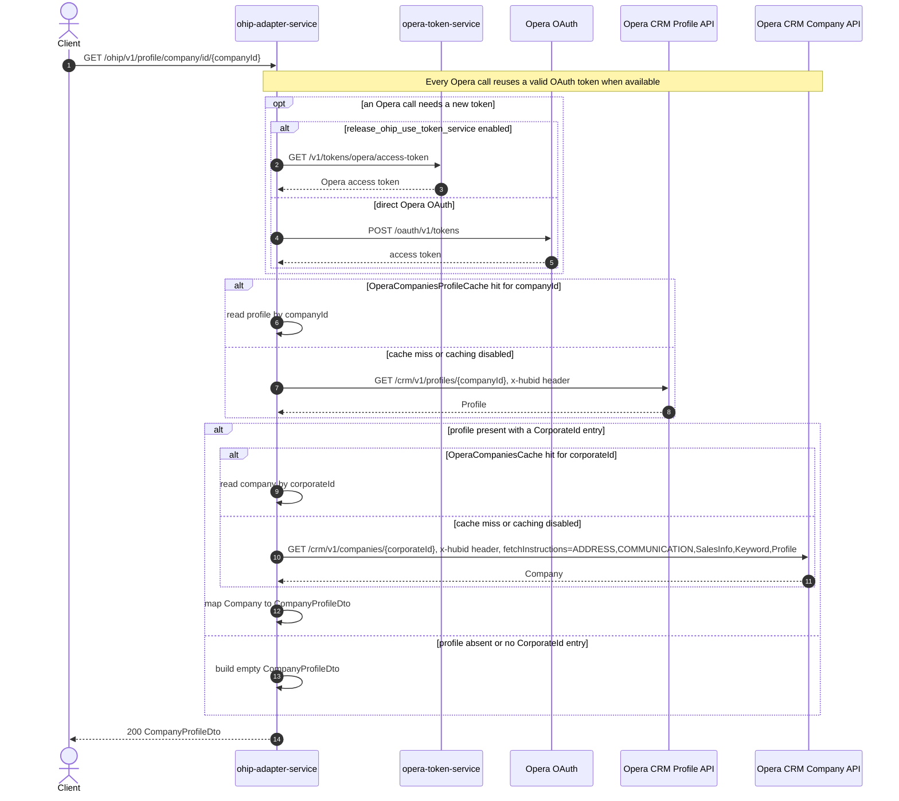

# OHIP Adapter Service: getCompanyProfileByCompanyId Flow

Looks up a company profile by its Opera company profile id, resolving it through the
company's linked corporate id.

```http
GET /ohip/v1/profile/company/id/{companyId}
Host: ohip-adapter-service:9100
Accept: application/json
```

## Flow

The controller passes `companyId` straight through to the domain layer, which calls
Opera CRM for the profile at that company id. If the profile is returned and carries a
`ProfileIdList` entry of type `CorporateId`, the service makes a second Opera CRM call to
fetch the full company record by that corporate id, and maps the response to
`CompanyProfileDto`. If the initial profile lookup returns `null`, or it has no
`CorporateId` entry, the service skips the second call and returns an empty
`CompanyProfileDto` instead of a 404.

Both Opera calls are one-day cached per key (`companyId` for the first call, the resolved
corporate id for the second) when caching is enabled, and both carry the `x-hubid` header.
Every Opera outbound request reuses the shared Opera OAuth client used across the service.

## Mermaid Flow



## Features

- Resolves an Opera company profile by Opera company profile id, not by corporate id
  directly (compare `GET /v1/profile/company/{corporateId}`, served by
  `getCompanyProfileByCorporateId`, which calls Opera CRM company lookup directly)
- Falls back to an empty `CompanyProfileDto` rather than a 404 when the company id does
  not resolve to a corporate id
- Independently cacheable lookups: `OperaCompaniesProfileCache` keyed by `companyId` and
  `OperaCompaniesCache` keyed by the resolved corporate id, both with a one-day TTL

## Feature Flags

| Flag | Effect when enabled |
| --- | --- |
| `release_ohip_use_token_service` | Obtains Opera tokens from `opera-token-service` instead of calling Opera OAuth directly; this applies to every Opera outbound call, including both calls in this flow |

## Request

| Parameter | Required | Notes |
| --- | --- | --- |
| `companyId` | Yes (path) | Opera company profile id used to look up the profile via `GET /crm/v1/profiles/{companyId}` |

## Branches

| Trigger | Behavior |
| --- | --- |
| Profile lookup returns a `CorporateId` entry | Makes a second Opera call, `GET /crm/v1/companies/{corporateId}`, and maps that `Company` into the response |
| Profile lookup returns `null`, or has no `CorporateId` entry | Skips the corporate-id call and returns an empty `CompanyProfileDto` |
| `OperaCompaniesProfileCache` hit for `companyId` | Skips the `GET /crm/v1/profiles/{companyId}` call |
| `OperaCompaniesCache` hit for the resolved corporate id | Skips the `GET /crm/v1/companies/{corporateId}` call |
