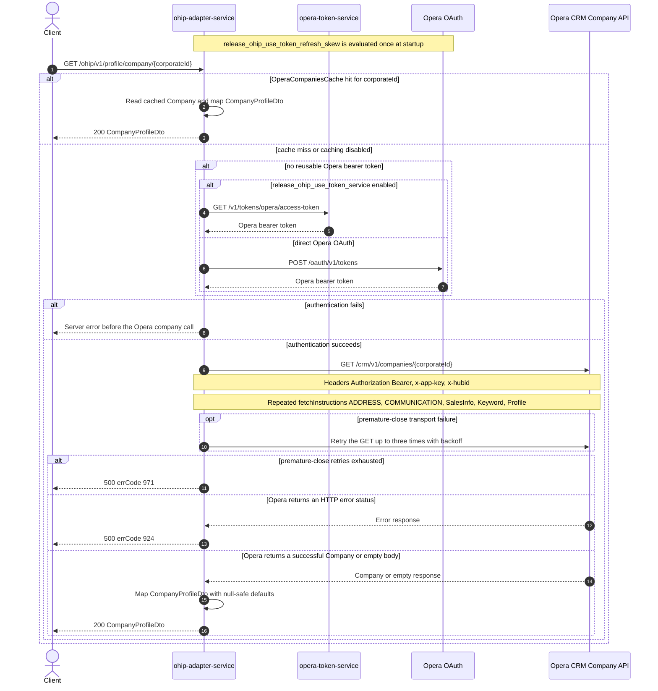

# OHIP Adapter Service: getCompanyProfileByCorporateId Flow

Returns one Opera company profile identified directly by its corporate id.

```http
GET /ohip/v1/profile/company/{corporateId}
Host: ohip-adapter-service:9100
Accept: application/json
```

## Flow

The controller passes `corporateId` unchanged through `ProfileInPortImpl` to
`ProfileOutPortImpl`. This route does not first read `/crm/v1/profiles/{companyId}` and does not
fall back to another identifier: that two-step behavior belongs to the distinct
`GET /ohip/v1/profile/company/id/{companyId}` route.

When caching is enabled, `OhipProfileClient.getCompanyByCorporateId` checks the one-day
`OperaCompaniesCache` under the supplied corporate id. A cache hit skips authentication and the
Opera call. On a miss, or when caching is disabled, the shared Opera WebClient obtains or reuses a
bearer token and sends:

```http
GET /crm/v1/companies/{corporateId}?fetchInstructions=ADDRESS&fetchInstructions=COMMUNICATION&fetchInstructions=SalesInfo&fetchInstructions=Keyword&fetchInstructions=Profile
Authorization: Bearer <token>
x-app-key: <configured Opera application key>
x-hubid: <config.service.ohip.hubId>
```

There is no `x-hotelid` or `x-channel` header on this hub-scoped company lookup. The response is
mapped from Opera `Company` through `OhipProfileTransformer` to `CompanyProfileDto`. The mapper
selects identifiers whose types are exactly `CorporateId` and `Profile`, and selects the first
`BUSINESS` telephone and address. Missing data is defaulted rather than treated as not found, so a
successful empty or structurally sparse Opera response still produces HTTP 200 with an empty-like
company profile.

Any Opera HTTP error status is translated to HTTP 500 with errCode `924`
(`OHIP_GET_COMPANY_PROFILE_EXCEPTION`); an Opera 404 is not a public 404 branch. The shared GET
filter retries only premature-close transport failures, up to three retries after the initial
attempt. Exhaustion produces HTTP 500 with errCode `971`. Other transport and decode failures are
logged and propagated rather than normalized to errCode `924`.

## Mermaid Flow



## Features

- Direct lookup by Opera corporate id with exactly one Opera CRM business call on a cache miss
- Five repeated `fetchInstructions` values: `ADDRESS`, `COMMUNICATION`, `SalesInfo`, `Keyword`,
  and `Profile`
- Hub-scoped Opera headers (`x-hubid`) plus shared bearer authorization and `x-app-key`; no hotel
  or channel header
- One-day `OperaCompaniesCache`, keyed by `corporateId`; null client results are not cached
- Null-safe response shaping, including empty identifiers and contact/address defaults when Opera
  omits fields
- Case-insensitive `Active` status recognition, with exact-type selection for identifiers and
  `BUSINESS` contact data
- No profile-id lookup, fan-out, asynchronous work, or endpoint-specific business feature flag
- Shared Opera OAuth selection and premature-close retry handling

## Feature Flags

No endpoint-specific business flag changes the lookup or response mapping. The shared Opera
authentication path evaluates these flags in `ohip-adapter-service`:

| Flag | Effect when enabled |
| --- | --- |
| `release_ohip_use_token_service` | For each outbound Opera request, selects `opera-token-service` (`GET /v1/tokens/opera/access-token`) instead of direct Opera OAuth when a bearer token is required. |
| `release_ohip_use_token_refresh_skew` | When the direct OAuth provider is constructed, applies `config.service.ohip.tokenRefreshClockSkew` so directly acquired Opera OAuth tokens refresh early. It does not change the company request or response. |

## Request

Path only; there is no public query string or body.

| Parameter | Required | Effect |
| --- | --- | --- |
| `corporateId` | Yes (path) | Used unchanged as the `OperaCompaniesCache` key and the `{corporateId}` segment of `GET /crm/v1/companies/{corporateId}`. The controller applies no endpoint-specific validation. |

## Branches

| Trigger | Behavior |
| --- | --- |
| `OperaCompaniesCache` hit | Skips token acquisition and Opera, then maps the cached `Company`. |
| Cache miss or caching disabled | Obtains or reuses a token and makes one Opera company GET. |
| Reusable bearer token exists | Skips token acquisition and sends the Opera company GET with that token. |
| No reusable token and `release_ohip_use_token_service` is enabled | Gets a token from `opera-token-service` before Opera. |
| No reusable token and `release_ohip_use_token_service` is disabled | Gets a token directly from Opera OAuth before Opera. |
| Opera returns HTTP 2xx with a populated company | Maps identifiers, company data, `BUSINESS` contact data, status, language, and address into `CompanyProfileDto`. |
| Opera returns HTTP 2xx with an empty body or missing company fields | Returns HTTP 200 with null-safe empty/default profile fields; it does not return 404. |
| Opera returns any HTTP error status | Returns HTTP 500 with errCode `924`; these responses are not retried. |
| Opera GET ends with a premature close | Retries up to three times with backoff; exhaustion returns HTTP 500 with errCode `971`. |
