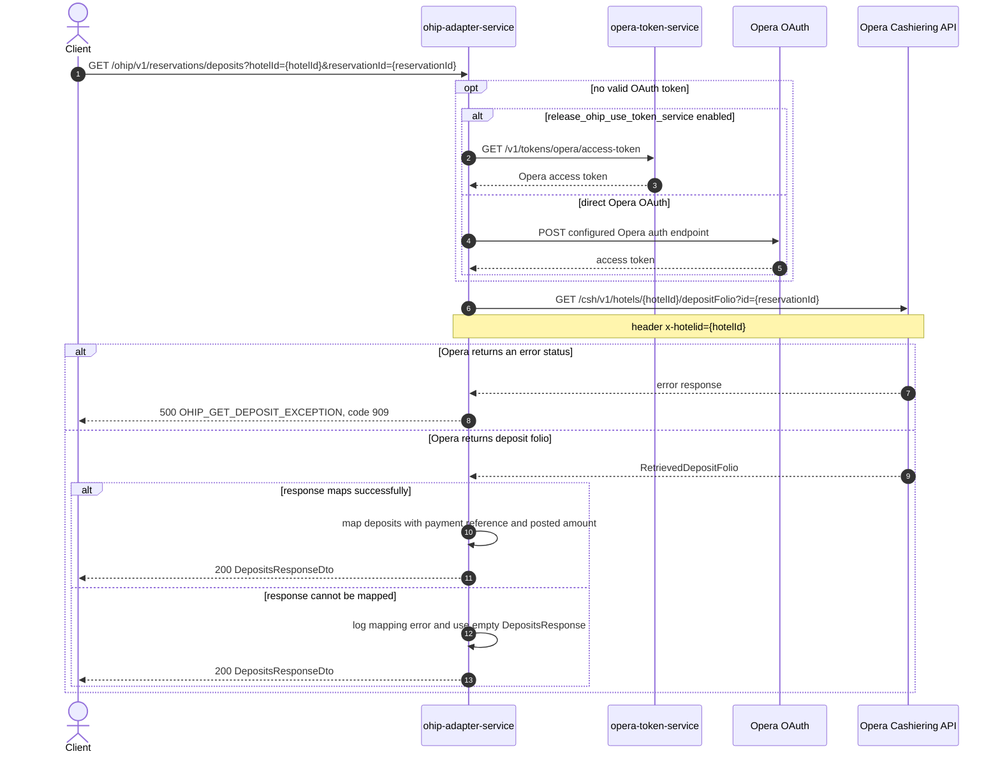

# OHIP Adapter Service: getDepositsForReservationId Flow

Returns the deposits posted against one Opera reservation.

```http
GET /ohip/v1/reservations/deposits?hotelId={hotelId}&reservationId={reservationId}
Host: ohip-adapter-service:9100
Accept: application/json
```

The servlet context path is `/ohip/` and the reservation controller is mapped under `/v1`, so the public path is `/ohip/v1/reservations/deposits`.

## Flow

ohip-adapter-service passes the required hotel and reservation ids through its reservation in-port and loads the matching deposit folio from the Opera Cashiering API. The Opera request uses the hotel id in both the path and `x-hotelid` header, and sends the reservation id as the `id` query parameter.

The service maps every returned deposit to its payment reference, posted amount, and currency. A downstream Opera error becomes internal error `OHIP_GET_DEPOSIT_EXCEPTION` with code `909`. If the Opera response succeeds but cannot be mapped, the out-port logs the mapping error and returns an empty response model rather than propagating the mapping exception.

## Mermaid Flow



## Features

- Single-reservation deposit lookup by hotel id and Opera reservation id
- One Opera Cashiering request with the required hotel header
- Maps each deposit's reference, amount, and currency
- Reuses cached OAuth credentials while they remain valid
- Returns internal error code `909` when Opera rejects the deposit lookup
- Logs response-mapping failures and falls back to an empty response model

## Feature Flags

| Flag | Effect when enabled |
| --- | --- |
| `release_ohip_use_token_service` | Acquires the Opera access token from opera-token-service instead of the direct Opera OAuth flow |
| `release_ohip_use_token_refresh_skew` | Refreshes direct Opera OAuth tokens using the configured clock-skew window before expiry |

## Request

| Query parameter | Required | Purpose |
| --- | --- | --- |
| `hotelId` | Yes | Supplies the Opera hotel path value and `x-hotelid` header |
| `reservationId` | Yes | Supplies the Cashiering API `id` query parameter |

Example:

```http
GET /ohip/v1/reservations/deposits?hotelId=HEAPTI&reservationId=6004202
Accept: application/json
```

## Branches

| Trigger | Behavior |
| --- | --- |
| Valid OAuth token is cached | Skips token acquisition |
| `release_ohip_use_token_service` enabled and no valid token | Gets the token from opera-token-service |
| `release_ohip_use_token_service` disabled and no valid token | Gets the token directly from the configured Opera OAuth endpoint |
| Opera returns an error status | Returns `OHIP_GET_DEPOSIT_EXCEPTION` with code `909` |
| Opera response cannot be mapped | Logs the error and returns a 200 response from an empty deposit model |
