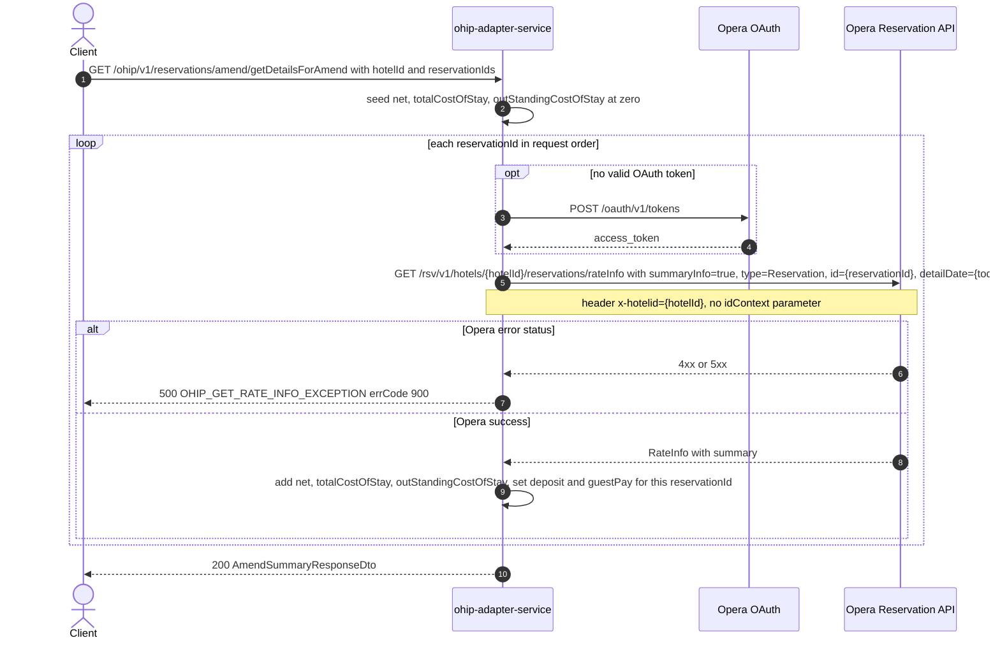

# OHIP Adapter Service: getReservationDetailsForAmend Flow

Returns the aggregated amend summary for one or more Opera reservations at a hotel: the combined net, total and outstanding stay cost, plus per-reservation deposit and guest-pay amounts, all read from Opera's reservation-scoped `rateInfo` summary.

```http
GET /ohip/v1/reservations/amend/getDetailsForAmend?hotelId={hotelId}&reservationIds={reservationId}&reservationIds={reservationId}
Host: ohip-adapter-service:9100
Accept: application/json
```

The servlet context path is `/ohip/` and `AmendController` is mapped under `/v1`, so the public path is `/ohip/v1/reservations/amend/getDetailsForAmend`. The controller method is `getReservationDetailsForAmend`. Opera calls use the service OAuth client when no valid token is present.

## Flow

`AmendController` binds the query string into `AmendSummaryRequestDto` (`hotelId`, `reservationIds`), maps it to `AmendSummaryRequest` and hands it to `AmendInPort`. `AmendInPortImpl.getAmendSummary` adds no business rules at all — it delegates straight to `AmendOutPort.getRateInfoSummary`.

`AmendOutPortImpl` seeds a zeroed `AmendSummaryResponse` and then loops over `reservationIds` in request order, issuing one Opera call per id through `OhipReservationClient.getRateInfo(hotelId, reservationId, LocalDate.now().toString(), "true")`. That resolves to `GET /rsv/v1/hotels/{hotelId}/reservations/rateInfo` (`config.service.ohip.rateInfoEndpoint`, reached here through `AvailabilityOhipProperties`, which binds the same key as `ReservationOhipProperties`) with query parameters `summaryInfo=true`, `type=Reservation`, `id={reservationId}` and `detailDate={today}`, and the `x-hotelid: {hotelId}` header. `summaryInfo` and `type` are hardcoded by the out-port; `detailDate` is always the service's current date.

That Opera URL is reached by three materially different request shapes across the service, and this endpoint uses the second:

| Shape | Parameters | Used by |
| --- | --- | --- |
| Stay criteria | `criteriaStartDate`, `criteriaEndDate`, `adults`, `children`, `ratePlanCode`, `roomType` (with or without `summaryInfo`) | availability price breakdown, rate-code pricing |
| Reservation summary | `id`, `summaryInfo=true`, `type=Reservation`, optionally `idContext=OPERA` (basket flows) or `detailDate={today}` (**this endpoint**) | `getReservationAmounts`, `getDetailsForAmend` |
| Reservation detail | `id`, `type=Reservation`, `summaryInfo=false`, `detailDate={consumption date}` | CITYTAX package reads |

This endpoint's call carries **no `idContext`**; the basket-side `getReservationAmounts` call sends `idContext=OPERA` and no `detailDate`. Both are reservation-summary reads and Opera answers them from the same summary projection, so the fields this reduction needs (`net`, `deposit`, `totalCostOfStay`, `outStandingCostOfStay`) are the same fields that call reads.

For each response the out-port reduces `summary` into the accumulator: `summary.net` is added to `net`, `summary.totalCostOfStay` to `totalCostOfStay`, `summary.outStandingCostOfStay` to `outStandingCostOfStay`, while `summary.deposit` is stored under `deposit[reservationId]` and `summary.outStandingCostOfStay` is also stored under `guestPay[reservationId]`. Deposit is stored as Opera reports it, without the negation the reservation-amounts reduction elsewhere in the service applies. The accumulated model is mapped one-to-one to `AmendSummaryResponseDto` and returned with `200`.

No other collaborator is touched: no reservation read, no profile, no folios, no deposits, no hotel config, no rules-agent, no CDH, no AEM. The loop is sequential and blocking (`RateInfo` is fetched with `.block()`), so N reservation ids cost exactly N Opera `rateInfo` calls.

If an Opera `rateInfo` read returns any error status the client raises `HotelReservationException` with `ErrorCode.OHIP_GET_RATE_INFO_EXCEPTION` (`errCode` 900, internal-server class) and the caller sees a 500; the remaining ids in the list are never read. A `200` whose body lacks `summary`, or whose `summary` omits any of `net`, `totalCostOfStay` or `outStandingCostOfStay`, fails inside the reduction with a `NullPointerException` and also surfaces as a 500 — the endpoint has no partial-data or not-found branch, and no 404 path at all.

## Mermaid Flow



## Features

- Multi-reservation amend summary by hotel id and reservation id list, one Opera `rateInfo` call per id, in request order
- Aggregated scalars across all requested reservations: `net`, `totalCostOfStay`, `outStandingCostOfStay`
- Per-reservation maps keyed by reservation id: `deposit` (Opera's value, not negated) and `guestPay` (that reservation's `outStandingCostOfStay`)
- `detailDate` is always the service's current date, never a request parameter
- `summaryInfo` is hardcoded `true` and `type` is hardcoded `Reservation`
- The same reservation id repeated in `reservationIds` is read again and double-counted into the scalars, while the maps keep only the last value
- No reservation, profile, folio, deposit, hotel-config, rules-agent, CDH or AEM enrichment

## Feature Flags

None. This endpoint does not gate behavior on feature flags. `AmendController`, `AmendInPortImpl`, `AmendOutPortImpl` and `OhipReservationClient.getRateInfo` contain no `unleashWrapper` evaluation.

Global Opera OAuth still consults `FeatureFlag.getUseTokenService()` inside the `ohipWebClient` filter in `WebClientConfig` when choosing the client registration; it is evaluated outside the request context and changes no behavior of this endpoint.

## Request

| Query parameter | Required | Default | Purpose |
| --- | --- | --- | --- |
| `hotelId` | Yes (`@NotNull`) | n/a | Opera hotel id used in the `rateInfo` path and the `x-hotelid` header |
| `reservationIds` | Effectively yes | n/a | `List<String>` of Opera reservation ids; one Opera `rateInfo` read per entry, in order. Not annotated `@NotNull`, so an absent value reaches the out-port as `null` and fails the loop with a 500 |

Example:

```http
GET /ohip/v1/reservations/amend/getDetailsForAmend?hotelId=HEAPTI&reservationIds=6001001
Accept: application/json
```

## Branches

| Trigger | Behavior |
| --- | --- |
| Several `reservationIds` | One Opera `rateInfo` call per id; scalars summed, `deposit`/`guestPay` keyed per id |
| Opera returns an error status for a read | `OHIP_GET_RATE_INFO_EXCEPTION` (`errCode` 900) surfaced as HTTP 500; later ids are never read |
| Opera `200` without `summary`, or with a null `net`/`totalCostOfStay`/`outStandingCostOfStay` | `NullPointerException` in the reduction, surfaced as HTTP 500 |
| Opera `summary.deposit` null | `deposit[reservationId]` is `null` in the response; the scalars are unaffected |
| `reservationIds` absent from the query | `null` list dereferenced in the out-port, HTTP 500 (no Opera call) |
