# OHIP Adapter Service: getHotelAvailability Flow

Returns one hotel's available rates and room options, including inventory-derived room counts and per-night price breakdowns, by combining rules-agent room substitutions with Opera Cloud room-type, inventory, availability, and rate-info APIs.

```http
GET /ohip/hotels/{hotelId}/availabilities?arrivalDate={arrival}&departureDate={departure}&roomTypes=DB&adults=1&children=0&cotsRequired=false&channel=PI&subchannel=WEB&language=EN
Host: ohip-adapter-service:9100
Accept: application/json
```

The servlet context path is `/ohip/`. Every Opera outbound request uses the service OAuth client. When no reusable token exists, direct mode calls `POST /oauth/v1/tokens`; token-service mode calls `GET /v1/tokens/opera/access-token` instead.

## Flow

The controller maps the path and query parameters into availability search criteria. The service then calls `rules-agent-entity-service` once for each aligned room tuple (room type, adults, children, and cot requirement); the cot value is attached locally because the room-substitution request itself sends only room type, adults, children, channel, and PMS `OP`.

The standard availability path loads the hotel's physical Opera room types, using `OperaRoomTypesCache` when caching is enabled, and removes substitution types that the hotel does not expose. It obtains rate-plan sets from rules-agent, appending `NEGOTIATED` when `companyId` is present, then combines Opera hotel inventory with availability for each set. A rate is retained only when the substitutions, inventory, and rate response can satisfy every requested room. By default, options are also restricted to room classes shared by all requested rooms unless a room-class feature flag relaxes that rule.

A nonblank `promotionCode` starts a second, complete availability path in parallel with the standard path only when `channel` is exactly `PI`, `CCUI`, or `BB`. The promotion path sends the code directly to one Opera availability call instead of loading rate-plan sets from rules-agent. It independently loads room types and inventory, and its resulting room rates are appended to the standard rates. For other channels, the promotion code is ignored and only the standard path runs.

The service then loads an Opera rate-info price breakdown for every returned rate and room, preserving daily effective-rate values from the availability response. It optionally applies BB flex-rate strikethrough amounts, promotional dynamic-base-rate amounts, cot availability, and distribution meals configuration. The response includes the room substitutions used, while `limitedAvailability` is currently forced to `false`. The top-level `available` value reflects Opera house-level inventory and can therefore be `true` even when no complete room-rate option survives filtering.

## Mermaid Flow

```mermaid
sequenceDiagram
    autonumber
    actor Client
    participant Ohip as ohip-adapter-service
    participant Rules as rules-agent-entity-service
    participant Token as opera-token-service
    participant OAuth as Opera OAuth
    participant OperaRoom as Opera Room Types API
    participant OperaInv as Opera Inventory API
    participant OperaAvail as Opera Availability API
    participant OperaRate as Opera Rate Info API
    participant OperaRtp as Opera Rate Plans API

    Client->>Ohip: GET /ohip/hotels/{hotelId}/availabilities
    Ohip->>Ohip: map and validate AvailabilityRequestDto

    loop each aligned requested room tuple
        Ohip->>Rules: GET /v1/rules/room-substitutions?adults={n}&children={n}&pms=OP&roomType={roomType}&channel={channel}
        Rules-->>Ohip: ordered PMS substitutions
        Ohip->>Ohip: attach the tuple's cotsRequired value
    end

    Note over Ohip,OperaRtp: Every Opera call reuses a valid OAuth token when available
    opt an Opera call needs a new token
        alt release_ohip_use_token_service enabled
            Ohip->>Token: GET /v1/tokens/opera/access-token
            Token-->>Ohip: Opera access token
        else direct Opera OAuth
            Ohip->>OAuth: POST /oauth/v1/tokens
            OAuth-->>Ohip: access token
        end
    end

    alt promotionCode nonblank and channel is PI, CCUI, or BB
        par public rates
            Ohip->>Ohip: start standard availability path
        and promotion rates
            Ohip->>Ohip: start promotion availability path
        end
    else no eligible promotion
        Ohip->>Ohip: run standard availability path only
    end

    loop each started availability path (two execute concurrently for an eligible promotion)
        alt OperaRoomTypesCache hit
            Ohip->>Ohip: read room types by hotelId
        else cache miss or caching disabled
            Ohip->>OperaRoom: GET /rm/config/v1/hotels/{hotelId}/roomTypes?summaryInfo=true&limit=50&physical=true
            OperaRoom-->>Ohip: RoomTypesResponseDto
        end
        Ohip->>Ohip: keep substitutions configured as hotel PMS room types

        alt promotion path
            Ohip->>OperaAvail: GET /par/v1/hotels/{hotelId}/availability?...&promotionCode={promotionCode}&limit=20&reservationGuestIdType=Profile (+ reservationGuestId when companyId is present)
            OperaAvail-->>Ohip: HotelAvailabilityDetailsDto
            Ohip->>OperaInv: GET /inv/v1/hotels/{hotelId}/hotelInventory?...&roomTypes={pmsRoomTypes}
            OperaInv-->>Ohip: HotelInventoryDto
        else standard path
            Ohip->>Rules: GET /v1/rules/channel-info?channel={channel}&subchannel={subchannel}&language={language|N/A for DISTR}&pms=OP
            Rules-->>Ohip: ratePlanSets
            opt companyId present
                Ohip->>Ohip: append NEGOTIATED rate-plan set
            end
            par hotel inventory
                Ohip->>OperaInv: GET /inv/v1/hotels/{hotelId}/hotelInventory?dateRangeStart={arrival}&dateRangeEnd={departure}&roomCountRequested={requestedRooms}&dailyInventory=false&houseLevel=true&roomTypes={pmsRoomTypes}
                OperaInv-->>Ohip: HotelInventoryDto
            and rate-plan availability
                loop each ratePlanSet (calls dispatched concurrently)
                    Ohip->>OperaAvail: GET /par/v1/hotels/{hotelId}/availability?...&ratePlanSet={ratePlanSet}&limit=20&reservationGuestIdType=Profile (+ reservationGuestId when companyId is present)
                    OperaAvail-->>Ohip: HotelAvailabilityDetailsDto
                end
            end
        end

        Ohip->>Ohip: match every requested room against rates, substitutions, and inventory
        alt release_availability_from_different_room_classes enabled
            Ohip->>Ohip: keep options from different room classes
        else DISTR and release_availability_from_different_room_classes_distr enabled
            Ohip->>Ohip: keep DISTR options from different room classes
        else
            Ohip->>Ohip: retain room classes shared by all requested rooms
        end
        Ohip->>Ohip: derive numberOfRoomsAvailable from same-class substitution inventory
    end

    Ohip->>Ohip: append promotion rates to standard rates
    Ohip->>Ohip: set limitedAvailability=false

    loop each returned rate and room (calls dispatched concurrently)
        Ohip->>OperaRate: GET /rsv/v1/hotels/{hotelId}/reservations/rateInfo?criteriaStartDate={arrival}&criteriaEndDate={departure}&ratePlanCode={ratePlanCode}&roomType={pmsRoomType}&adults={adults}&children={children}&summaryInfo=true
        OperaRate-->>Ohip: PriceBreakdownDto
        Ohip->>Ohip: preserve matching daily effectiveRate values
    end

    opt channel is BB, room rates were found, and release_bb_flex_rate_strikethrough enabled
        Ohip->>Rules: GET /v1/rules/baseRate?ratePlanCode=BUSIFLEX
        Rules-->>Ohip: base rate-plan code
        Ohip->>Ohip: set cheaper BUSIFLEX rooms' baseRateAmount
    end

    opt promotion result contains a rate tagged with the supplied promotionCode
        alt RatePlansInfoPromoCacheOhip hit
            Ohip->>Ohip: read rate-plan info by ratePlanCode and hotelId
        else cache miss or caching disabled
            Ohip->>OperaRtp: GET /rtp/v1/hotels/{hotelId}/ratePlans/{ratePlanCode}
            OperaRtp-->>Ohip: RatePlanInfo
        end
        opt a dynamic base rate-plan code is returned
            Ohip->>Ohip: set cheaper promo rooms' baseRateAmount and remove the base rate entry
        end
    end

    opt one or more cots requested and room rates were found
        Ohip->>OperaInv: GET /inv/v1/hotels/{hotelId}/itemInventory?welcomeOffer=false&sellInReservation=true&startDate={start}&endDate={end}
        OperaInv-->>Ohip: item inventory
        Ohip->>Ohip: mark requested-cot rooms when minimum stock covers total cot demand
    end

    opt channel is DISTR and subchannel is AGENCY, BOOKING, AMADEUS, or TRAVELPORT
        Ohip->>Ohip: apply meals config by rate-plan set
    end

    Ohip->>Ohip: attach substitutions and map AvailabilityResponseDto
    Ohip-->>Client: 200 AvailabilityResponseDto
```



## Features

- Single-hotel availability by dates, room types, occupancy, channel, and subchannel
- Ordered room-type substitution through rules-agent, filtered to physical room types configured for the hotel
- Inventory-aware rate filtering: every requested room must be satisfiable for a rate plan
- Same-room-class filtering across requested rooms, with feature-flagged cross-class modes
- Parallel standard and promotion searches for eligible `PI`, `CCUI`, and `BB` requests
- Company negotiated rates via `companyId` (`NEGOTIATED` rate-plan set plus Opera `reservationGuestId` with type `Profile`)
- Optional Redis-backed `OperaRoomTypesCache` by hotel id with a seven-day TTL
- Concurrent Opera rate-info price breakdowns for every returned rate and room
- Preservation and aggregation of daily effective rates returned by Opera availability
- Optional cot availability from item inventory
- Distribution-only meals mapping by configured rate-plan set (currently `BDB` and `BMD`)
- Optional BB flex-rate strikethrough from a rules-agent base-rate lookup
- Special response handling for `TWIN` alternatives and `DIS` accessible-room variants

## Feature Flags

| Flag | Effect when enabled |
| --- | --- |
| `release_availability_from_different_room_classes` | Allows returned room options to span different Opera room classes for all channels |
| `release_availability_from_different_room_classes_distr` | When the global cross-class flag is off, allows different Opera room classes only for `DISTR`; other channels retain the common-class restriction |
| `release_bb_flex_rate_strikethrough` | For channel `BB`, asks rules-agent for the base rate of `BUSIFLEX` and sets `baseRateAmount` when a BUSIFLEX room is cheaper |
| `release_ohip_use_token_service` | Obtains Opera tokens from `opera-token-service` instead of calling Opera OAuth directly; this applies to every Opera outbound call |
| `release_ohip_use_token_refresh_skew` | In direct OAuth mode, treats cached Opera tokens as expiring by the configured clock-skew interval before their actual expiry |

## Request

| Parameter | Required | Notes |
| --- | --- | --- |
| `hotelId` | Yes (path) | Opera hotel id |
| `arrivalDate` | Yes | `yyyy-MM-dd` |
| `departureDate` | Yes | `yyyy-MM-dd` |
| `roomTypes` | Yes | Comma-separated or repeated Whitbread room types such as `DB` |
| `adults` | Yes | Comma-separated or repeated adult counts aligned with `roomTypes` |
| `children` | Declared optional | Current orchestration iterates this list with `roomTypes`; callers must supply one value per room |
| `cotsRequired` | Declared optional | Current orchestration iterates this list with `roomTypes`; callers must supply one boolean per room. Each `true` contributes to cot demand |
| `channel` | Yes | Used for substitutions and channel-info; only exact `PI`, `CCUI`, and `BB` values enable promotion processing |
| `subchannel` | Yes | Used for channel-info and distribution meals enrichment |
| `language` | No | Upper-cased for channel-info; forced to `N/A` when channel is `DISTR` |
| `companyId` | No | Adds `NEGOTIATED` and sends `reservationGuestId={companyId}` with `reservationGuestIdType=Profile` to Opera availability |
| `promotionCode` | No | Runs a parallel promotion path only for `PI`, `CCUI`, or `BB`; ignored for other channels |

## Branches

| Trigger | Behavior |
| --- | --- |
| Eligible `promotionCode` | Runs complete standard and promotion availability paths concurrently; a promotion response with no room rates simply contributes no promotion rates |
| Promotion code on another channel | Runs only the standard path and does not send the promotion code to Opera |
| Promo rate plan has a dynamic base rate | Loads one-day cached/Opera rate-plan info, uses the matching base rate as `baseRateAmount` when the promo is cheaper, then removes that base rate-plan entry; a returned base code that is absent from the merged rates raises an unavailable-rates error |
| `companyId` present | Adds `NEGOTIATED` to channel-info rate-plan sets and sends the company id as an Opera reservation guest profile id |
| Room-types cache hit | Skips the Opera room-types call; when caching is disabled, every availability path calls Opera |
| Date range over an API limit | Hotel inventory, availability, rate-info, and item-inventory calls are split into supported intervals and recombined |
| Multiple requested rooms | By default only room classes represented across all requested rooms remain; either cross-class feature flag can relax this as described above |
| Channel `BB` plus flex strikethrough flag | Looks up the base rate-plan code for `BUSIFLEX` and sets strikethrough amounts where BUSIFLEX is cheaper |
| Cots requested | If room rates exist, checks item inventory and marks cot-requesting rooms available only when the lowest stock across the stay covers total demand |
| Distribution meals channel/subchannel | For `DISTR` with `AGENCY`, `BOOKING`, `AMADEUS`, or `TRAVELPORT`, maps the room's rate-plan set through local meals configuration |
| `TWIN` or `DIS` room type | Keeps multiple twin substitution choices and distinct accessible variants instead of stopping at the first matching substitution |
