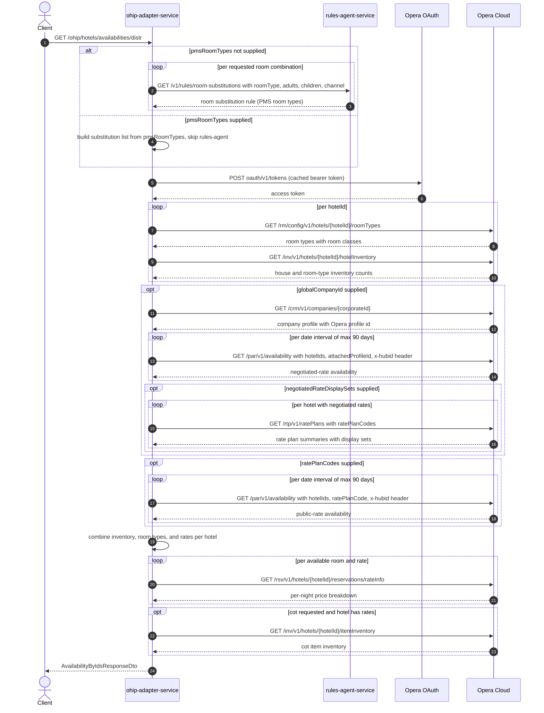

# OHIP Adapter Service: getHotelAvailabilityByIds Flow

Retrieves availability for a list of hotels for the distribution channel, combining
Opera room-type config, hotel inventory, negotiated (company) rates and/or public rate
plan codes, per-night price breakdowns, and cot availability.

```http
GET /ohip/hotels/availabilities/distr
Host: ohip-adapter-service
```

No inbound authentication: the service excludes Spring Security auto-configuration, so
the endpoint accepts anonymous requests (callers are trusted upstream services).
Outbound calls to Opera are authenticated with an OAuth bearer token obtained from
`POST {OPERA_HOST}/oauth/v1/tokens` (enterprise credentials); the multi-hotel
availability call carries the `x-hubid` header (default `DFLT_WHBOC001`) while the
per-hotel calls carry `x-hotelid`.

## Flow

The controller (`HotelAvailabilityController.getHotelAvailabilityByIds`) maps the query
parameters and calls `HotelAvailabilityInPortImpl.getHotelAvailabilityByIds`. The
in-port validates that `roomTypes`, `adults`, `children`, and `cotsRequired` have equal
lengths (else 400, `DIGITAL_INVALID_PARAMS_EXCEPTION`) and that at least one of
`globalCompanyId` or `ratePlanCodes` is present (else
`DIGITAL_NO_GOLBAL_COMPANY_ID_EXCEPTION`). Unless `pmsRoomTypes` is supplied, it
resolves room substitutions through rules-agent, one call per requested room
combination; with `pmsRoomTypes` it builds the substitution list locally and skips
rules-agent.

`HotelAvailabilityOutPortImpl.getHotelAvailabilityByIds` then orchestrates, per hotel:
Opera room types (`GET /rm/config/v1/hotels/{hotelId}/roomTypes`, `@Cacheable` but
caching is disabled in the integration environment) and hotel inventory
(`GET /inv/v1/hotels/{hotelId}/hotelInventory`). If `globalCompanyId` is supplied it
resolves the Opera company profile (`GET /crm/v1/companies/{corporateId}`; a profile
without a `Profile`-type id fails with `DIGITAL_NO_PROFILE`) and runs a negotiated-rate
availability search (`GET /par/v1/availability` with `reservationProfileType=Company`
and `attachedProfileId`); when `negotiatedRateDisplaySets` is also present it fetches
rate plan summaries (`GET /rtp/v1/ratePlans`) per hotel to filter negotiated rates by
display set. If `ratePlanCodes` is supplied it runs a second public-rate availability
search (`GET /par/v1/availability` with `ratePlanCode`). Availability searches longer
than 90 days are split into concurrent interval requests.

The results are combined per hotel: house-level availability comes from the hotel
inventory, and for each rate plan code a room is picked from the substitution list that
is available in both inventory and availability responses. Back in the in-port, a hotel
with no room rates is marked unavailable; for each returned room and rate a per-night
price breakdown is fetched from Opera rate info
(`GET /rsv/v1/hotels/{hotelId}/reservations/rateInfo`), and when any cot was requested
and the hotel has rates, cot stock is checked via
`GET /inv/v1/hotels/{hotelId}/itemInventory`.

## Mermaid Flow



## Features

- Multi-hotel negotiated-rate availability for distribution callers: searches by company
  profile (`globalCompanyId`) and/or by explicit `ratePlanCodes`; at least one is
  required.
- Room substitution via rules-agent, or caller-supplied `pmsRoomTypes` to bypass it.
- Negotiated rates can be filtered by `negotiatedRateDisplaySets` using rate plan
  classification display sets.
- House-level availability from hotel inventory decides `available`; room picks require
  availability in both the inventory and availability responses.
- Per-night price breakdown attached to every returned room from Opera rate info,
  preserving effective rates from the availability response.
- Cot availability is confirmed against item inventory when `cotsRequired` contains
  `true` and the hotel has rates.
- Room-class consistency: rooms whose room class is not available for all requested
  rooms are removed, unless the channel is DISTRIBUTION or the room-classes flag is
  enabled (see Feature Flags).
- No inbound auth; Opera calls use the enterprise OAuth token.

## Feature Flags

| Flag | Effect when enabled |
| --- | --- |
| `release_availability_from_different_room_classes` | Skips the room-class consistency filter, allowing the rooms answering one request to come from different room classes. When disabled, for non-DISTRIBUTION channels, rooms whose room class does not appear for every requested room are removed from the response. |
| `release_ohip_use_token_service` | Infrastructure only: Opera bearer tokens are fetched from opera-token-service instead of Opera OAuth. Permanently OFF in the integration environment; evaluated outside the request context. |
| `release_ohip_use_token_refresh_skew` | Infrastructure only: applies a clock-skew margin when refreshing the Opera token. Permanently OFF in the integration environment. |

## Request

Query parameters (`AvailabilityByIdsRequestDto`):

| Parameter | Required | Effect |
| --- | --- | --- |
| `hotelIds` | yes | Hotels to search. |
| `arrivalDate` | yes | Stay start (yyyy-MM-dd). |
| `departureDate` | yes | Stay end; ranges over 90 days split into concurrent interval searches. |
| `roomTypes` | yes | WB room types; must be same length as `adults`, `children`, `cotsRequired`. |
| `adults` | yes | Adults per room entry. |
| `children` | no | Children per room entry (length-validated with the others). |
| `cotsRequired` | no | Cot request per room entry; any `true` triggers the item-inventory check. |
| `ratePlanCodes` | conditional | Public rates to search; required when `globalCompanyId` is absent. |
| `channel` | yes | Booking channel; DISTRIBUTION skips the room-class consistency filter. |
| `subchannel` | yes | Booking subchannel, forwarded to Opera search criteria. |
| `language` | yes | Language for the Opera search. |
| `globalCompanyId` | conditional | Corporate id resolved to an Opera company profile for negotiated rates; required when `ratePlanCodes` is absent. |
| `negotiatedRateDisplaySets` | no | Filters negotiated rates by rate plan display set (triggers rate-plans lookups). |
| `pmsRoomTypes` | no | PMS room types to search directly, bypassing rules-agent substitution. |

## Branches

- `pmsRoomTypes` present: no rules-agent calls; substitutions are synthesized locally.
- `globalCompanyId` only: negotiated-rate search only.
- `ratePlanCodes` only: public-rate search only.
- Both supplied: both searches run and results are merged.
- `negotiatedRateDisplaySets` present (with `globalCompanyId`): extra
  `GET /rtp/v1/ratePlans` calls per hotel that returned negotiated rates.
- No availability found at all: an empty result is returned without price-breakdown or
  item-inventory calls.
